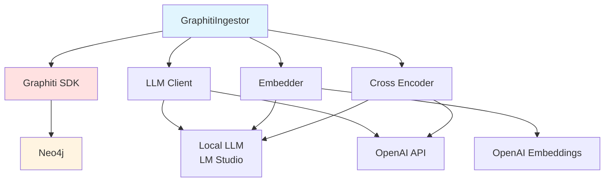
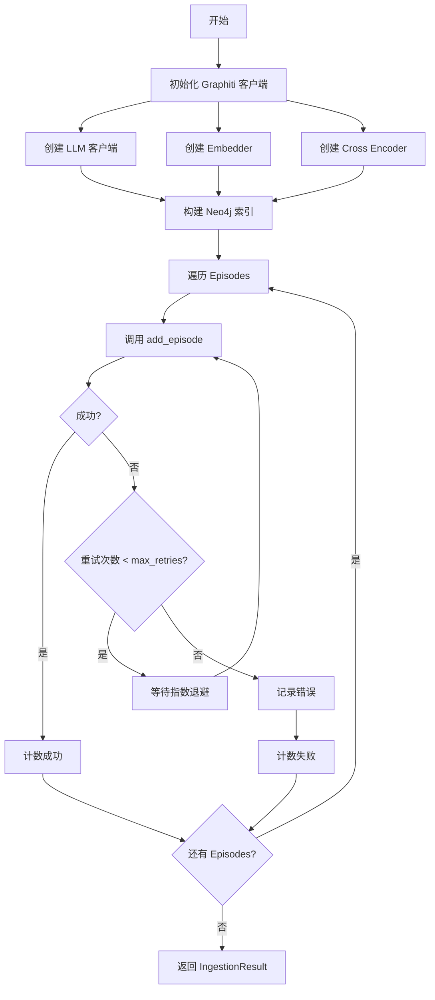

# GraphitiIngestor 模块文档（Python）

## 1. 模块背景

### 业务背景

在数字取证分析中，构建知识图谱是发现数据关联的关键步骤。GraphitiIngestor 模块负责将取证数据批量摄入到 Graphiti 知识图谱中。

**核心需求**：
- **批量摄取**：高效处理数十万文件记录
- **实体提取**：从文件元数据中提取实体
- **关系发现**：自动发现文件间的关联关系
- **进度跟踪**：长时间操作的状态反馈

**解决挑战**：
- **网络容错**：处理 Neo4j 连接中断
- **内存优化**：批处理避免内存溢出
- **错误恢复**：单条记录失败不影响整体
- **本地 LLM**：支持本地模型进行嵌入和重排序

### 技术背景

**Graphiti SDK**：
- 基于事件（episodes）的知识图谱构建
- 自动实体识别和关系抽取
- 支持本地和云端 LLM
- Neo4j 图数据库后端

**本地 LLM 支持**：
- 通过 OpenAI 兼容 API 连接本地模型（LM Studio）
- 使用相同的本地模型进行嵌入、生成和重排序
- 支持自定义 embedding 模型配置

## 2. 模块功能

### 核心功能

#### 1. 摄取器初始化

**本地 LLM 配置**：
```python
from graphiti_integration import GraphitiConfig, GraphitiIngestor

# 配置本地 LLM
config = GraphitiConfig(
    neo4j_uri="neo4j://localhost:7687",
    neo4j_user="neo4j",
    neo4j_password="password",

    # 本地 LLM 配置
    use_local_llm=True,
    llm_base_url="http://localhost:1234",
    llm_model="qwen2.5:7b",
    llm_api_key="local",  # 本地模式不需要真实 API key

    # Embedding 配置
    embedder_model="qwen2.5:7b",
    embedder_dim=1536,

    # 摄取配置
    group_id="forensics_case_001",
    batch_size=50,
    max_retries=3,
)

# 创建摄取器
ingestor = GraphitiIngestor(config)
await ingestor.initialize()
```

**云端 LLM 配置**：
```python
# 使用 OpenAI（默认）
config = GraphitiConfig.from_env()
ingestor = GraphitiIngestor(config)
await ingestor.initialize()
```

#### 2. 单条记录摄取

```python
from graphiti_integration.toon_transformer import EpisodeData

# 创建 Episode
episode = EpisodeData(
    name="document:/evidence/contract.pdf",
    episode_body='{"file_name": "contract.pdf", "category": "documents"}',
    source_description="forensics_file_analysis",
    reference_time=datetime.now(timezone.utc),
    file_path="/evidence/contract.pdf",
    file_id=123,
    category="documents"
)

# 摄取到图谱
success = await ingestor.ingest_episode(episode, group_id="case_001")
```

#### 3. 批量摄取

```python
# 批量摄取
episodes = [episode1, episode2, episode3, ...]

# 带进度回调
async def progress_callback(current, total):
    print(f"Progress: {current}/{total} ({current/total*100:.1f}%)")

result = await ingestor.batch_ingest(
    episodes,
    group_id="case_001",
    progress_callback=progress_callback
)

print(f"成功: {result.successful}")
print(f"失败: {result.failed}")
print(f"成功率: {result.success_rate:.1f}%")
```

#### 4. 错误处理

```python
# 查看错误详情
if result.failed > 0:
    print("摄取失败记录:")
    for error in result.errors:
        print(f"  - {error['file_path']}: {error['error']}")
```

### 边界与限制

**功能边界**：
- ❌ 不支持增量更新（全量重建）
- ❌ 不支持实体编辑（只能新增）
- ❌ 不支持图谱导出（需通过 Neo4j）
- ❌ 不支持实时摄取（异步批处理）

**已知限制**：
| 限制 | 影响 | 缓解方法 |
|------|------|----------|
| Neo4j 单点 | Neo4j 故障导致摄取失败 | 使用 Neo4j 集群 |
| LLM 调用延迟 | 摄取速度受 LLM 响应影响 | 使用更快的本地模型 |
| 内存占用 | 大批次可能导致 OOM | 减小 batch_size |

**性能指标**：
- **摄取速度**：10-50 记录/分钟（取决于 LLM）
- **重试次数**：默认 3 次，可配置
- **批大小**：推荐 50（平衡速度和内存）

## 3. 模块使用的库

### 依赖库清单

| 库名称 | 版本 | 用途 | 许可证 |
|--------|------|------|--------|
| **graphiti-core** | latest | 知识图谱 SDK | MIT |
| **neo4j** | 5.0+ | 图数据库驱动 | Apache 2.0 |
| **openai** | 1.0+ | OpenAI API 兼容客户端 | MIT |
| **httpx** | 0.24+ | 异步 HTTP 客户端 | BSD |

### 架构图



## 4. 模块实现方式

### 核心类

```python
@dataclass
class IngestionResult:
    """摄取结果统计"""
    total_episodes: int = 0
    successful: int = 0
    failed: int = 0
    errors: list = None

    @property
    def success_rate(self) -> float:
        """成功率百分比"""
        if self.total_episodes == 0:
            return 0.0
        return (self.successful / self.total_episodes) * 100


class GraphitiIngestor:
    """Graphiti 知识图谱摄取器"""

    def __init__(
        self,
        config: GraphitiConfig,
        graphiti_client: Optional[Graphiti] = None,
    ):
        self.config = config
        self._client = graphiti_client
        self._initialized = False

    async def initialize(self) -> None:
        """初始化 Graphiti 客户端和索引"""

    async def ingest_episode(
        self,
        episode: EpisodeData,
        group_id: Optional[str] = None,
    ) -> bool:
        """摄取单条记录"""

    async def batch_ingest(
        self,
        episodes: list[EpisodeData],
        group_id: Optional[str] = None,
        progress_callback: Optional[callable] = None,
    ) -> IngestionResult:
        """批量摄取"""

    async def close(self) -> None:
        """关闭连接"""
```

### 本地 LLM 配置实现

```python
def _create_llm_client(self) -> OpenAIGenericClient:
    """创建兼容 OpenAI API 的本地 LLM 客户端"""
    llm_config = LLMConfig(
        api_key=self.config.llm_api_key,
        model=self.config.llm_model,
        small_model=self.config.llm_model,
        base_url=self.config.llm_base_url,  # http://localhost:1234
    )
    return OpenAIGenericClient(config=llm_config)

def _create_embedder(self) -> OpenAIEmbedder:
    """创建本地 embedding 客户端"""
    if self.config.use_local_llm:
        embedder_config = OpenAIEmbedderConfig(
            api_key=self.config.llm_api_key or "local",
            embedding_model=self.config.embedder_model,
            embedding_dim=self.config.embedder_dim,
            base_url=self.config.llm_base_url,
        )
    else:
        embedder_config = OpenAIEmbedderConfig(
            api_key=self.config.embedder_api_key,
            embedding_model=self.config.embedder_model,
            embedding_dim=self.config.embedder_dim,
        )
    return OpenAIEmbedder(config=embedder_config)
```

### 摄取流程



### 重试逻辑

```python
async def ingest_episode(self, episode: EpisodeData, group_id: Optional[str] = None):
    if not self._initialized:
        await self.initialize()

    group_id = group_id or self.config.group_id
    last_error = None

    # 重试循环
    for attempt in range(self.config.max_retries):
        try:
            await self._client.add_episode(
                name=episode.name,
                episode_body=episode.episode_body,
                source_description=episode.source_description,
                reference_time=episode.reference_time,
                source=EpisodeType.json,
                group_id=group_id,
            )
            return True

        except Exception as e:
            last_error = e
            logger.warning(
                f"Ingestion attempt {attempt + 1}/{self.config.max_retries} "
                f"failed for {episode.name}: {e}"
            )

            # 指数退避
            if attempt < self.config.max_retries - 1:
                await asyncio.sleep(self.config.retry_delay * (attempt + 1))

    raise IngestionError(
        f"Failed to ingest episode {episode.name} after "
        f"{self.config.max_retries} attempts: {last_error}"
    )
```

## 5. API 调用

### Python API

```python
import asyncio
from graphiti_integration import GraphitiConfig, GraphitiIngestor
from graphiti_integration.toon_transformer import TOONTransformer, EpisodeData
from datetime import datetime, timezone

async def main():
    # 1. 配置
    config = GraphitiConfig(
        neo4j_uri="neo4j://localhost:7687",
        neo4j_user="neo4j",
        neo4j_password="password",
        use_local_llm=True,
        llm_base_url="http://localhost:1234",
        llm_model="qwen2.5:7b",
        embedder_model="qwen2.5:7b",
        embedder_dim=1536,
        group_id="forensics_case_001",
    )

    # 2. 创建摄取器
    ingestor = GraphitiIngestor(config)
    await ingestor.initialize()

    # 3. 准备数据
    episodes = [
        EpisodeData(
            name="document:/evidence/file1.pdf",
            episode_body='{"file_name": "file1.pdf", "category": "documents"}',
            source_description="forensics_analysis",
            reference_time=datetime.now(timezone.utc),
            file_path="/evidence/file1.pdf",
            file_id=1,
        ),
        EpisodeData(
            name="image:/evidence/photo.jpg",
            episode_body='{"file_name": "photo.jpg", "category": "images"}',
            source_description="forensics_analysis",
            reference_time=datetime.now(timezone.utc),
            file_path="/evidence/photo.jpg",
            file_id=2,
        ),
    ]

    # 4. 批量摄取
    async def on_progress(current, total):
        print(f"Progress: {current}/{total}")

    result = await ingestor.batch_ingest(
        episodes,
        progress_callback=on_progress
    )

    # 5. 查看结果
    print(f"Total: {result.total_episodes}")
    print(f"Successful: {result.successful}")
    print(f"Failed: {result.failed}")
    print(f"Success Rate: {result.success_rate:.1f}%")

    # 6. 清理
    await ingestor.close()

asyncio.run(main())
```

### 与 Pipeline 集成

```python
from graphiti_integration.pipeline import GraphitiPipeline

# 使用 Pipeline 自动化整个流程
config = GraphitiConfig.from_env()

pipeline = GraphitiPipeline(config)

result = await pipeline.run(
    db_path="/output/evidence_files.db",
    dry_run=False,  # 设置为 True 只做转换，不摄取
)

print(result.summary())
```

### 多源摄取

```python
from graphiti_integration.pipeline import MultiSourcePipeline

# 摄取所有数据库
pipeline = MultiSourcePipeline(config)

result = await pipeline.run(
    base_name="Server",
    output_dir="/output",
    group_id="case_001",
)

print(result.summary())
```

## 6. 二次开发

### 扩展点

#### 1. 自定义重试策略

```python
class CustomGraphitiIngestor(GraphitiIngestor):
    async def ingest_episode(self, episode, group_id=None):
        """自定义重试策略：根据错误类型决定是否重试"""
        if not self._initialized:
            await self.initialize()

        group_id = group_id or self.config.group_id

        for attempt in range(self.config.max_retries):
            try:
                await self._client.add_episode(
                    name=episode.name,
                    episode_body=episode.episode_body,
                    source_description=episode.source_description,
                    reference_time=episode.reference_time,
                    source=EpisodeType.json,
                    group_id=group_id,
                )
                return True

            except ConnectionError as e:
                # 连接错误：重试
                if attempt < self.config.max_retries - 1:
                    await asyncio.sleep(2 ** attempt)  # 指数退避
                    continue
                raise

            except ValueError as e:
                # 数据错误：不重试
                raise IngestionError(f"Invalid data: {e}")
```

#### 2. 添加数据验证

```python
class ValidatingGraphitiIngestor(GraphitiIngestor):
    def validate_episode(self, episode: EpisodeData) -> bool:
        """验证 Episode 数据"""
        # 检查必需字段
        if not episode.name or not episode.name.strip():
            return False

        if not episode.episode_body:
            return False

        # 检查 JSON 格式
        try:
            json.loads(episode.episode_body)
        except json.JSONDecodeError:
            return False

        # 检查时间戳
        if episode.reference_time > datetime.now(timezone.utc):
            logger.warning(f"Future timestamp detected: {episode.name}")

        return True

    async def batch_ingest(self, episodes, group_id=None, progress_callback=None):
        """带验证的批量摄取"""
        valid_episodes = []

        for episode in episodes:
            if self.validate_episode(episode):
                valid_episodes.append(episode)
            else:
                logger.error(f"Invalid episode: {episode.name}")

        return await super().batch_ingest(valid_episodes, group_id, progress_callback)
```

#### 3. 添加缓存机制

```python
class CachedGraphitiIngestor(GraphitiIngestor):
    def __init__(self, config):
        super().__init__(config)
        self._cache = {}
        self._cache_hits = 0

    async def ingest_episode(self, episode, group_id=None):
        """带缓存的摄取"""
        # 生成缓存键
        cache_key = f"{episode.file_path}:{episode.file_id}"

        # 检查缓存
        if cache_key in self._cache:
            self._cache_hits += 1
            logger.debug(f"Cache hit: {cache_key}")
            return True

        # 执行摄取
        result = await super().ingest_episode(episode, group_id)

        # 更新缓存
        if result:
            self._cache[cache_key] = datetime.now()

        return result

    @property
    def cache_stats(self):
        """缓存统计"""
        return {
            "size": len(self._cache),
            "hits": self._cache_hits,
            "hit_rate": self._cache_hits / max(1, self._cache_hits + len(self._cache))
        }
```

### 添加新功能的步骤

#### 完整示例：添加摄取监控

```python
from prometheus_client import Counter, Histogram

class MonitoredGraphitiIngestor(GraphitiIngestor):
    """带 Prometheus 监控的摄取器"""

    def __init__(self, config):
        super().__init__(config)

        # 定义指标
        self.ingest_total = Counter(
            'graphiti_ingest_total',
            'Total ingestion attempts',
            ['status']  # success or failure
        )

        self.ingest_duration = Histogram(
            'graphiti_ingest_duration_seconds',
            'Ingestion duration',
            buckets=[0.1, 0.5, 1.0, 2.0, 5.0, 10.0]
        )

        self.batch_size = Histogram(
            'graphiti_batch_size',
            'Batch size',
            buckets=[10, 50, 100, 500, 1000]
        )

    async def ingest_episode(self, episode, group_id=None):
        """带监控的摄取"""
        import time
        start_time = time.time()

        try:
            result = await super().ingest_episode(episode, group_id)

            # 记录成功
            self.ingest_total.labels(status='success').inc()
            self.ingest_duration.observe(time.time() - start_time)

            return result

        except Exception as e:
            # 记录失败
            self.ingest_total.labels(status='failure').inc()
            self.ingest_duration.observe(time.time() - start_time)
            raise

    async def batch_ingest(self, episodes, group_id=None, progress_callback=None):
        """带监控的批量摄取"""
        # 记录批大小
        self.batch_size.observe(len(episodes))

        # 调用父类方法
        return await super().batch_ingest(episodes, group_id, progress_callback)
```

## 7. 其他

### 测试

```bash
cd python_service/graphiti_integration

# 运行测试
pytest tests/test_graphiti_ingestor.py -v

# 运行特定测试
pytest tests/test_graphiti_ingestor.py::test_ingest_episode -v

# 带覆盖率
pytest --cov=graphiti_ingestor tests/
```

### 配置

**环境变量** (`.env`):
```env
# Neo4j 配置
NEO4J_URI=neo4j://localhost:7687
NEO4J_USER=neo4j
NEO4J_PASSWORD=password

# 本地 LLM 配置
GRAPHITI_USE_LOCAL_LLM=true
LLM_BASE_URL=http://localhost:1234
LLM_MODEL=qwen2.5:7b
LLM_API_KEY=local

# Embedding 配置
EMBEDDER_MODEL=qwen2.5:7b
EMBEDDER_DIM=1536

# 摄取配置
GRAPHITI_GROUP_ID=forensics_case
GRAPHITI_BATCH_SIZE=50
GRAPHITI_MAX_RETRIES=3
GRAPHITI_RETRY_DELAY=1
```

### 故障排查

| 问题 | 可能原因 | 解决方法 |
|------|----------|----------|
| **Neo4j 连接失败** | Neo4j 未启动 | 检查 Neo4j 服务状态 |
| **LLM 调用超时** | 本地模型响应慢 | 增加 timeout 或使用更快的模型 |
| **内存溢出** | batch_size 过大 | 减小 batch_size 到 20-30 |
| **摄取速度慢** | LLM 延迟 | 使用更快的本地模型或云端 API |

### 最佳实践

1. **测试模式**：使用 `dry_run=True` 先验证转换
2. **分批摄取**：大批量数据分多次摄取
3. **监控进度**：使用 `progress_callback` 跟踪进度
4. **错误日志**：检查 `errors` 列表了解失败原因
5. **本地优先**：优先使用本地 LLM 降低成本

### 相关模块

- **[TOONTransformer](./TOONTransformer.md)** - 数据转换器
- **[DatabaseReader](./DatabaseReader.md)** - 数据库读取器
- **[Pipeline](./Pipeline.md)** - 管道编排

### 参考资源

- [Graphiti 文档](https://github.com/getpointai/graphiti)
- [Neo4j 文档](https://neo4j.com/docs/)
- [OpenAI API 文档](https://platform.openai.com/docs/)

---

**最后更新**: 2026-03-11
**维护者**: ymj68520
