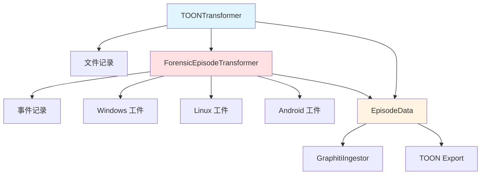

# TOONTransformer 模块文档（Python）

## 1. 模块背景

### 业务背景

TOON（Token-Oriented Object Notation）是专为 LLM 优化的数据格式，相比 JSON 可节省 30-60% 的 token。TOONTransformer 模块负责将取证数据库记录转换为 Graphiti 知识图谱可摄入的格式。

**核心需求**：
- **格式转换**：将数据库记录转换为结构化 JSON
- **元数据保留**：保留文件时间戳、哈希等关键信息
- **LLM 分析集成**：包含 LLM 生成的摘要和关键词
- **多源支持**：支持文件、事件、Windows/Linux/Android 数据源

**解决挑战**：
- **数据结构差异**：不同数据库表结构不同
- **时间戳处理**：Unix 时间戳转换为 datetime
- **关键词解析**：支持多种关键词存储格式
- **TOON 导出**：提供可读性强的表格格式

### 技术背景

**TOON 格式优势**：
```
# JSON: ~50 tokens
{"name": "file.pdf", "size": 1024, "mtime": 1705420123}

# TOON: ~10 tokens
file.pdf | 1024 | 1705420123
```

**Episode 数据结构**：
- `name`: 唯一标识符
- `episode_body`: JSON 格式的详细数据
- `source_description`: 数据来源描述
- `reference_time`: 参考时间戳

## 2. 模块功能

### 核心功能

#### 1. 文件记录转换

**基本转换**：
```python
from graphiti_integration.toon_transformer import TOONTransformer, EpisodeData
from graphiti_integration.database_reader import FileRecord

# 创建转换器
transformer = TOONTransformer(
    include_metadata=True,
    include_analysis=True,
    source_description="forensics_file_analysis"
)

# 准备文件记录
record = FileRecord(
    id=1,
    inode=12345,
    name="document.pdf",
    path="/evidence/document.pdf",
    size=2048576,
    extension=".pdf",
    category="documents",
    file_type="REG",
    mtime=1705420123,
    ctime=1705420000,
    is_deleted=False,
    md5="abc123...",
    llm_summary="保密协议文档",
    llm_description="这是一份甲方与乙方的保密协议...",
    llm_keywords="保密,协议,合同",
    llm_analyzed_at=1705420123,
    llm_model_used="qwen2.5:7b"
)

# 转换为 Episode
episode = transformer.transform(record)

print(episode.name)  # "documents:document.pdf"
print(episode.category)  # "documents"
print(episode.episode_body)  # JSON 字符串
```

**生成的 Episode Body**：
```json
{
  "file_name": "document.pdf",
  "file_path": "/evidence/document.pdf",
  "category": "documents",
  "file_extension": ".pdf",
  "metadata": {
    "size_bytes": 2048576,
    "md5_hash": "abc123...",
    "is_deleted": false,
    "file_type": "REG",
    "modified_at": "2024-01-16T10:02:03Z",
    "created_at": "2024-01-16T10:00:00Z"
  },
  "analysis": {
    "summary": "保密协议文档",
    "description": "这是一份甲方与乙方的保密协议...",
    "keywords": ["保密", "协议", "合同"],
    "model": "qwen2.5:7b"
  }
}
```

#### 2. 批量转换

```python
# 批量转换
records = [record1, record2, record3, ...]

episodes, errors = transformer.transform_batch(records, skip_errors=True)

print(f"成功: {len(episodes)}")
print(f"失败: {len(errors)}")

# 处理错误
for record, error in errors:
    print(f"转换失败: {record.path} - {error}")
```

#### 3. TOON 格式导出

```python
# 导出为 TOON 文本格式
toon_data = transformer.to_toon_format(records)

print(toon_data)
```

**输出示例**：
```
TOON.schema: name | path | category | size | llm_summary | llm_keywords
# records[3]
document.pdf | /evidence/document.pdf | documents | 2048576 | 保密协议文档 | 保密,协议,合同
photo.jpg | /evidence/photo.jpg | images | 1024000 | 现场照片 | 现场,照片,证据
report.docx | /evidence/report.docx | documents | 512000 | 分析报告 | 报告,分析,总结
```

#### 4. 事件记录转换

```python
from graphiti_integration.toon_transformer import ForensicEpisodeTransformer

transformer = ForensicEpisodeTransformer()

# 转换时间线事件
event = TimelineEvent(
    id=1,
    timestamp=1705420123,
    event_type="MODIFIED",
    file_path="/evidence/document.pdf",
    inode=12345,
    description="文件被修改",
    file_size=2048576,
    file_type="REG"
)

episode = transformer.transform_event(event)
```

#### 5. Windows 工件转换

```python
# 注册表值
registry_episode = transformer.transform_windows_artifact(
    "registry_values", registry_record
)

# 事件日志
eventlog_episode = transformer.transform_windows_artifact(
    "event_logs", eventlog_record
)

# Prefetch
prefetch_episode = transformer.transform_windows_artifact(
    "prefetch_files", prefetch_record
)
```

#### 6. Linux 工件转换

```python
# 日志条目
log_episode = transformer.transform_linux_artifact(
    "log_entries", log_record
)

# 用户账号
user_episode = transformer.transform_linux_artifact(
    "user_accounts", user_record
)

# Shell 历史
shell_episode = transformer.transform_linux_artifact(
    "shell_history", shell_record
)
```

#### 7. Android 工件转换

```python
# 联系人
contact_episode = transformer.transform_android_artifact(
    "contacts", contact_record
)

# SMS 消息
sms_episode = transformer.transform_android_artifact(
    "sms_messages", sms_record
)

# 通话记录
call_episode = transformer.transform_android_artifact(
    "call_logs", call_record
)
```

### 边界与限制

**功能边界**：
- ❌ 不支持嵌套对象（仅平面结构）
- ❌ 不支持二进制数据（需 Base64 编码）
- ❌ 不支持循环引用

**已知限制**：
| 限制 | 影响 | 缓解方法 |
|------|------|----------|
| 关键词格式 | 解析可能失败 | 使用统一的逗号分隔格式 |
| 时间戳精度 | 仅秒级精度 | 使用 Unix 时间戳 |
| 字段长度 | Episode name 有长度限制 | 截断过长的名称 |

**性能指标**：
- **转换速度**：10,000+ 记录/秒
- **内存占用**：约 100MB/10万记录
- **TOON 压缩率**：30-60% token 节省

## 3. 模块使用的库

### 依赖库清单

| 库名称 | 版本 | 用途 | 许可证 |
|--------|------|------|--------|
| **标准库** | - | 数据类、类型提示 | PSF |
| **database_reader** | local | 数据库记录读取 | - |

### 架构图



## 4. 模块实现方式

### 核心类

```python
@dataclass
class EpisodeData:
    """Graphiti Episode 数据"""
    name: str
    episode_body: str  # JSON 字符串
    source_description: str
    reference_time: datetime
    file_path: str
    file_id: int
    category: Optional[str] = None


class TOONTransformer:
    """文件记录转换为 EpisodeData"""

    def __init__(
        self,
        include_metadata: bool = True,
        include_analysis: bool = True,
        source_description: str = "forensics_file_analysis",
    ):
        self.include_metadata = include_metadata
        self.include_analysis = include_analysis
        self.source_description = source_description

    def transform(self, record: FileRecord) -> EpisodeData:
        """转换单条记录"""

    def transform_batch(
        self,
        records: list[FileRecord],
        skip_errors: bool = True,
    ) -> tuple[list[EpisodeData], list[tuple]]:
        """批量转换"""

    def to_toon_format(self, records: list[FileRecord]) -> str:
        """导出 TOON 文本格式"""


class ForensicEpisodeTransformer:
    """扩展转换器：支持所有取证数据源"""

    def transform_event(self, event) -> EpisodeData:
        """转换时间线事件"""

    def transform_windows_artifact(self, artifact_type: str, record) -> EpisodeData:
        """转换 Windows 工件"""

    def transform_linux_artifact(self, artifact_type: str, record) -> EpisodeData:
        """转换 Linux 工件"""

    def transform_android_artifact(self, artifact_type: str, record) -> EpisodeData:
        """转换 Android 工件"""
```

### 转换实现

```python
def transform(self, record: FileRecord) -> EpisodeData:
    """转换文件记录为 EpisodeData"""
    try:
        # 构建 Episode Body
        body = self._build_episode_body(record)

        # 创建 Episode 名称
        name = self._create_episode_name(record)

        # 确定参考时间
        if record.llm_analyzed_at and record.llm_analyzed_at > 0:
            reference_time = datetime.fromtimestamp(
                record.llm_analyzed_at, tz=timezone.utc
            )
        else:
            reference_time = datetime.now(timezone.utc)

        return EpisodeData(
            name=name,
            episode_body=json.dumps(body, ensure_ascii=False),
            source_description=self.source_description,
            reference_time=reference_time,
            file_path=record.path,
            file_id=record.id,
            category=record.category,
        )

    except Exception as e:
        raise TransformationError(
            f"Failed to transform record {record.path}: {e}"
        ) from e


def _build_episode_body(self, record: FileRecord) -> dict:
    """构建 Episode Body"""
    body = {
        "file_name": record.name,
        "file_path": record.path,
        "category": record.category,
        "file_extension": record.extension,
    }

    # 添加元数据
    if self.include_metadata:
        body["metadata"] = {
            "size_bytes": record.size,
            "md5_hash": record.md5,
            "is_deleted": record.is_deleted,
            "file_type": record.file_type,
        }

        # 时间戳
        if record.mtime_datetime:
            body["metadata"]["modified_at"] = record.mtime_datetime.isoformat()
        if record.ctime_datetime:
            body["metadata"]["created_at"] = record.ctime_datetime.isoformat()

    # 添加 LLM 分析
    if self.include_analysis and record.has_llm_analysis:
        body["analysis"] = {}

        if record.llm_summary:
            body["analysis"]["summary"] = record.llm_summary

        if record.llm_description:
            body["analysis"]["description"] = record.llm_description

        if record.llm_keywords:
            body["analysis"]["keywords"] = record.keywords_list

        if record.llm_model_used:
            body["analysis"]["model"] = record.llm_model_used

    return body
```

### TOON 导出实现

```python
def to_toon_format(self, records: list[FileRecord]) -> str:
    """导出 TOON 文本格式"""
    lines = []

    # Schema 头部
    fields = ["name", "path", "category", "size", "llm_summary", "llm_keywords"]
    lines.append(f"TOON.schema: {' | '.join(fields)}")
    lines.append(f"# records[{len(records)}]")

    # 数据行
    for record in records:
        values = [
            self._escape_value(record.name),
            self._escape_value(record.path),
            self._escape_value(record.category),
            str(record.size),
            self._escape_value(record.llm_summary or ""),
            self._escape_value(record.llm_keywords or ""),
        ]
        lines.append(" | ".join(values))

    return "\n".join(lines)


@staticmethod
def _escape_value(value: str) -> str:
    """转义 TOON 值"""
    if not value:
        return '""'

    # 检查是否需要引号
    needs_quoting = any(c in value for c in '|"\n\r,')
    needs_quoting = needs_quoting or value[0].isspace() or value[-1].isspace()

    if not needs_quoting:
        return value

    # 转义特殊字符
    escaped = value.replace('"', '""').replace('\n', '\\n').replace('\r', '\\r')
    return f'"{escaped}"'
```

### Windows 工件转换

```python
def transform_windows_artifact(self, artifact_type: str, record) -> EpisodeData:
    """转换 Windows 工件"""
    body = self._windows_to_body(artifact_type, record)

    # 提取时间戳
    ref_time = self._extract_timestamp(record, [
        "last_modified", "timestamp", "last_run_time",
        "last_login", "first_connected", "last_visit"
    ])

    return EpisodeData(
        name=f"windows:{artifact_type}:{self._windows_name(artifact_type, record)}",
        episode_body=json.dumps(body, ensure_ascii=False),
        source_description=f"{self.source_description}:windows",
        reference_time=ref_time,
        file_path=getattr(record, "file_path", getattr(record, "key_path", "")),
        file_id=record.id,
        category=f"windows_{artifact_type}",
    )


def _windows_to_body(self, artifact_type: str, r) -> dict:
    """构建 Windows 工件 Body"""
    if artifact_type == "registry_values":
        return {
            "key_path": r.key_path,
            "value_name": r.value_name,
            "value_type": r.value_type,
            "value_data": r.value_data,
            "last_modified": r.last_modified
        }
    elif artifact_type == "event_logs":
        return {
            "log_name": r.log_name,
            "event_id": r.event_id,
            "level": r.level,
            "source": r.source,
            "timestamp": r.timestamp,
            "computer": r.computer,
            "message": r.message,
            "user_sid": r.user_sid
        }
    # ... 其他类型

    return {k: v for k, v in vars(r).items() if not k.startswith("_")}
```

## 5. API 调用

### Python API

```python
from graphiti_integration.toon_transformer import (
    TOONTransformer,
    ForensicEpisodeTransformer
)
from graphiti_integration.database_reader import ForensicsDatabase

# 1. 文件记录转换
transformer = TOONTransformer()

database = ForensicsDatabase("/output/evidence_files.db")
records = database.get_files(analyzed_only=True, limit=100)

episodes, errors = transformer.transform_batch(records)

# 2. 事件记录转换
event_transformer = ForensicEpisodeTransformer()

from graphiti_integration.database_reader import EventsDatabase
events_db = EventsDatabase("/output/evidence_events.db")

events = events_db.get_events(limit=100)
event_episodes, event_errors = event_transformer.transform_events_batch(events)

# 3. Windows 工件转换
from graphiti_integration.database_reader import WindowsDatabase
windows_db = WindowsDatabase("/output/evidence_windows.db")

registry_records = windows_db.get_registry_values(limit=100)
registry_episodes = [
    event_transformer.transform_windows_artifact("registry_values", r)
    for r in registry_records
]

# 4. TOON 导出
toon_data = transformer.to_toon_format(records)

with open("export.toon", "w") as f:
    f.write(toon_data)
```

### 与 Pipeline 集成

```python
from graphiti_integration.pipeline import GraphitiPipeline

config = GraphitiConfig.from_env()
pipeline = GraphitiPipeline(config)

# Pipeline 自动使用 TOONTransformer
result = await pipeline.run(
    db_path="/output/evidence_files.db",
    dry_run=True  # 只转换，不摄取
)

# result.transformed 包含转换后的 Episode 数量
```

## 6. 二次开发

### 扩展点

#### 1. 自定义字段选择

```python
class CustomTOONTransformer(TOONTransformer):
    def _build_episode_body(self, record: FileRecord) -> dict:
        """自定义字段选择"""
        body = {
            "file_name": record.name,
            "file_path": record.path,
        }

        # 仅包含特定元数据
        if record.size > 1048576:  # 大于 1MB
            body["large_file"] = True
            body["size_mb"] = round(record.size / 1048576, 2)

        # 自定义分类
        if record.extension in [".pdf", ".doc", ".docx"]:
            body["document_type"] = "office_document"

        return body
```

#### 2. 添加数据验证

```python
class ValidatingTOONTransformer(TOONTransformer):
    def transform(self, record: FileRecord) -> EpisodeData:
        """带验证的转换"""
        # 验证必需字段
        if not record.name or not record.path:
            raise TransformationError("Missing required field")

        # 验证数据类型
        if record.size < 0:
            raise TransformationError(f"Invalid size: {record.size}")

        # 执行转换
        episode = super().transform(record)

        # 验证结果
        json.loads(episode.episode_body)  # 验证 JSON 格式

        return episode
```

#### 3. 添加数据增强

```python
class EnhancedTOONTransformer(TOONTransformer):
    def _build_episode_body(self, record: FileRecord) -> dict:
        """数据增强"""
        body = super()._build_episode_body(record)

        # 添加计算字段
        if record.size > 0:
            body["size_category"] = self._categorize_size(record.size)

        # 添加时间分析
        if record.mtime_datetime:
            body["modified_age_days"] = (
                datetime.now(timezone.utc) - record.mtime_datetime
            ).days

        # 添加路径分析
        parts = record.path.split("/")
        body["directory_depth"] = len(parts) - 1
        body["parent_directory"] = "/".join(parts[:-1]) if len(parts) > 1 else ""

        return body

    @staticmethod
    def _categorize_size(size: int) -> str:
        """分类文件大小"""
        if size < 1024:
            return "tiny"
        elif size < 1048576:
            return "small"
        elif size < 104857600:
            return "medium"
        else:
            return "large"
```

### 添加新功能的步骤

#### 完整示例：添加网络工单转换

```python
# 假设我们有网络工单数据
@dataclass
class NetworkTicket:
    id: int
    ticket_number: str
    source_ip: str
    destination_ip: str
    timestamp: int
    protocol: str
    description: str


class NetworkTransformer(ForensicEpisodeTransformer):
    """网络工单转换器"""

    def transform_network_ticket(self, ticket: NetworkTicket) -> EpisodeData:
        """转换网络工单"""
        body = {
            "ticket_number": ticket.ticket_number,
            "source_ip": ticket.source_ip,
            "destination_ip": ticket.destination_ip,
            "protocol": ticket.protocol,
            "timestamp": ticket.timestamp,
            "description": ticket.description,
        }

        # 提取时间
        ref_time = datetime.fromtimestamp(ticket.timestamp, tz=timezone.utc)

        # 生成名称
        name = f"network:{ticket.protocol}:{ticket.source_ip}->{ticket.destination_ip}"

        return EpisodeData(
            name=name,
            episode_body=json.dumps(body, ensure_ascii=False),
            source_description=f"{self.source_description}:network",
            reference_time=ref_time,
            file_path="",
            file_id=ticket.id,
            category="network_traffic",
        )

    def transform_network_batch(self, tickets: list) -> tuple[list, list]:
        """批量转换网络工单"""
        episodes, errors = [], []

        for ticket in tickets:
            try:
                episodes.append(self.transform_network_ticket(ticket))
            except Exception as e:
                errors.append((ticket, e))

        return episodes, errors
```

## 7. 其他

### 测试

```bash
cd python_service/graphiti_integration

# 运行测试
pytest tests/test_toon_transformer.py -v

# 测试覆盖率
pytest --cov=toon_transformer tests/
```

### 配置

TOONTransformer 无需外部配置，通过构造函数参数控制行为：

```python
transformer = TOONTransformer(
    include_metadata=True,   # 包含文件元数据
    include_analysis=True,    # 包含 LLM 分析
    source_description="custom_source"  # 自定义来源描述
)
```

### 故障排查

| 问题 | 可能原因 | 解决方法 |
|------|----------|----------|
| **JSON 解析失败** | episode_body 格式错误 | 检查特殊字符转义 |
| **时间戳无效** | Unix 时间戳为 0 或负数 | 使用当前时间作为默认值 |
| **关键词解析失败** | 格式不支持 | 使用统一的逗号分隔格式 |

### 最佳实践

1. **批量处理**：使用 `transform_batch` 提高效率
2. **错误处理**：设置 `skip_errors=True` 容错处理
3. **字段选择**：仅包含必要字段减少 token
4. **TOON 导出**：用于人工审查和调试

### 相关模块

- **[DatabaseReader](./DatabaseReader.md)** - 数据库读取
- **[GraphitiIngestor](./GraphitiIngestor.md)** - 图谱摄取
- **[Pipeline](./Pipeline.md)** - 管道编排

---

**最后更新**: 2026-03-11
**维护者**: ymj68520
