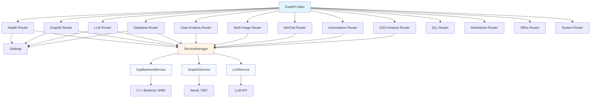
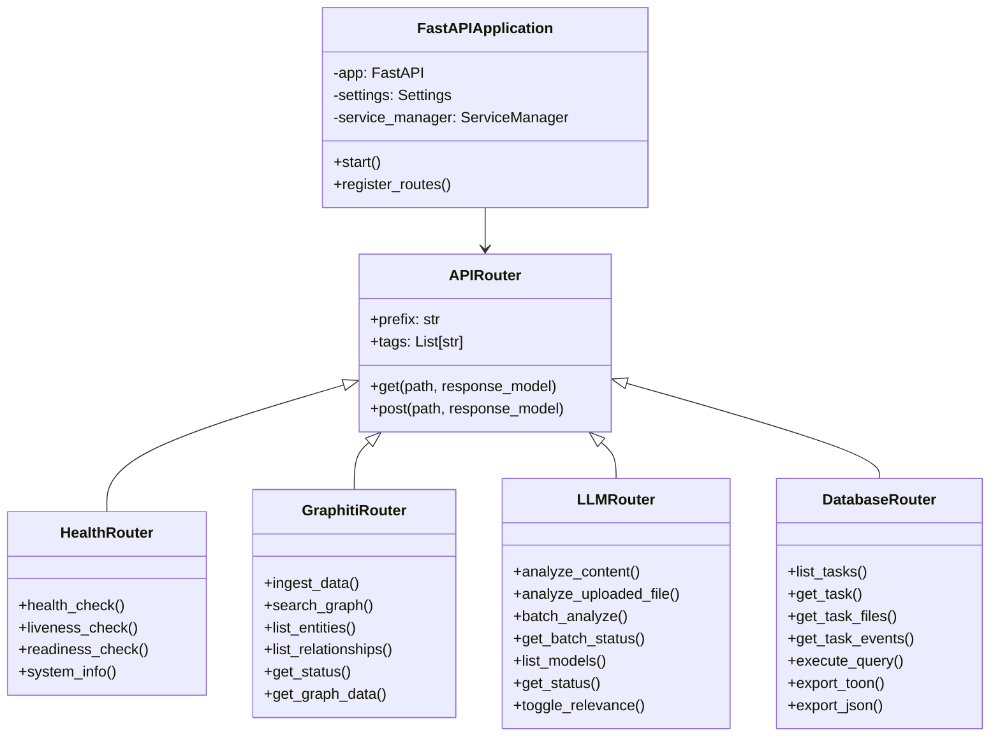
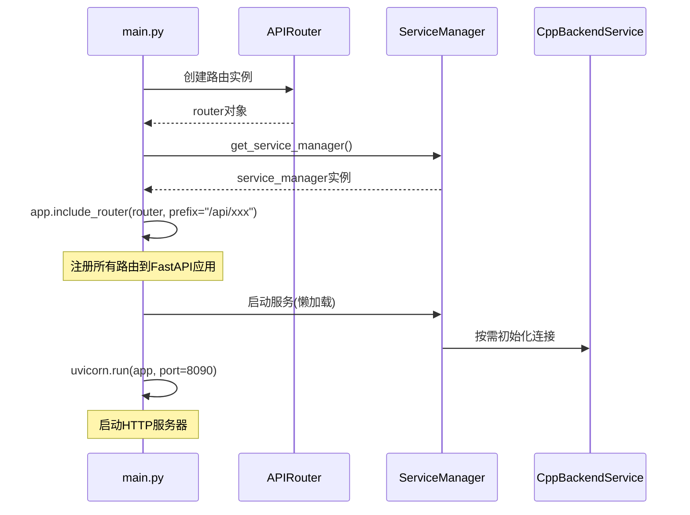

# Python HTTP 路由模块文档

## 1. 模块背景

### 业务背景

Python FastAPI 服务作为 C++ 后端的重要补充，提供以下核心能力：

1. **知识图谱集成**：Graphiti 知识图谱的数据摄取和查询
2. **LLM 分析服务**：文件内容的智能分析和批量处理
3. **数据库查询接口**：统一访问多个取证数据库的 API
4. **健康监控**：服务状态检查和依赖服务监控

这些功能通过模块化的路由（Routes）实现，每个路由负责特定领域的 API 端点。

### 技术背景

**FastAPI 框架**：
- 现代 Python Web 框架，基于 asyncio 和类型提示
- 自动 OpenAPI 文档生成
- 内置数据验证（Pydantic）
- 依赖注入系统
- 异步请求处理

**路由架构**：
- 基于 `APIRouter` 的模块化路由组织
- 每个路由模块负责特定功能领域
- 通过 `main.py` 统一注册所有路由
- 使用 `ServiceManager` 懒加载业务逻辑服务

**端口分配**：
- C++ HTTP Server：`8080` 端口
- Python FastAPI Server：`8090` 端口

---

## 2. 模块功能

### 核心路由模块

#### 1. Health Routes（健康检查路由）

**功能**：
- 基本健康检查（`/health`）
- Kubernetes 存活探针（`/health/live`）
- Kubernetes 就绪探针（`/health/ready`）
- 系统信息查询（`/api/system/info`）

**依赖检查**：
- C++ 后端连接状态
- Neo4j 数据库连接状态
- LLM 服务可用状态

#### 2. Graphiti Routes（知识图谱路由）

**功能**：
- 数据摄取（`POST /api/graphiti/ingest`）
- 图谱搜索（`POST /api/graphiti/search`）
- 实体列表（`GET /api/graphiti/entities`）
- 关系列表（`GET /api/graphiti/relationships`）
- 图数据导出（`GET /api/graphiti/graph`）
- 任务图管理（列表、删除）
- 服务状态查询

**任务隔离**：
- 使用 `task_id` 作为 Graphiti 的 `group_id`
- 每个任务拥有独立的知识图谱命名空间

#### 3. LLM Routes（LLM 分析路由）

**功能**：
- 单文件分析（`POST /api/llm/analyze`）
- 文件上传分析（`POST /api/llm/analyze/file`）
- 批量分析（`POST /api/llm/batch`）
- 批量状态查询（`GET /api/llm/batch/{job_id}`）
- 模型列表（`GET /api/llm/models`）
- 服务状态（`GET /api/llm/status`）
- 证据相关性标记（`POST /api/llm/toggle-relevance`）

**智能特性**：
- 自动检测文件类型（图片/文档/文本）
- 集成文档提取器处理 Office、PDF 等格式
- 结果持久化到 SQLite 数据库
- 后台批量处理

#### 4. Database Routes（数据库路由）

**功能**：
- 任务列表（`GET /api/db/tasks`）
- 任务详情（`GET /api/db/tasks/{task_id}`）
- 任务数据库列表（`GET /api/db/tasks/{task_id}/databases`）
- 文件查询（`GET /api/db/tasks/{task_id}/files`）
- 事件查询（`GET /api/db/tasks/{task_id}/events`）
- 自定义查询（`POST /api/db/query`）
- TOON 格式导出（`GET /api/db/tasks/{task_id}/export/toon`）
- JSON 格式导出（`GET /api/db/tasks/{task_id}/export/json`）

**数据访问**：
- 通过 CppBackendClient 与 C++ 后端通信
- 支持分页和过滤
- 只读查询（禁止修改操作）

#### 5. Case Analysis Routes（案例分析路由）

**功能**：
- 旧案例分析生成入口（`POST /api/llm/case-analysis`，已退役并返回 HTTP 410；仅保留兼容反馈）
- 保存分析描述（`POST /api/llm/case-analysis/description`）
- 获取历史分析报告（`GET /api/llm/case-analysis/{task_id}/report`）
- 获取历史过滤文件（`GET /api/llm/case-analysis/{task_id}/filtered-files`）

#### 6. Multi-Image Analysis Routes（多镜像分析路由）

**功能**：
- 案例 CRUD（`POST/GET/DELETE /api/llm/cases`）
- 多镜像分析（`POST /api/llm/multi-image-analysis`）
- 分析状态查询（`GET /api/llm/multi-image-analysis/{job_id}`）
- 智能创建案例（`POST /api/llm/cases/smart-create`）
- 增量分析（`POST /api/llm/cases/{case_id}/incremental-analysis`）

#### 7. WeChat Graph Routes（微信关系图谱路由）

**功能**：
- 关系图谱（`GET /api/wechat/graph`）
- 通信时间线（`GET /api/wechat/graph/timeline`）
- 社区发现（`GET /api/wechat/graph/community`）
- 个人社交网络（`GET /api/wechat/graph/person/{username}`）
- 聊天记录（`GET /api/wechat/chat`）
- 群聊记录（`GET /api/wechat/chat/group`）
- 账号信息（`GET /api/wechat/owner`）
- 联系人列表（`GET /api/wechat/contacts`）
- 缓存管理（`POST /api/wechat/graph/invalidate`）

**图分析算法**：
- PageRank 社交影响力分析
- Louvain 社区发现
- 边权重基于消息频率

#### 8. Associations Routes（事件关联路由）

**功能**：
- 事件簇关联文件（`POST /api/associations/cluster-files`）
- 文件关联事件簇（`POST /api/associations/file-clusters`）

#### 9. OSS Analysis Routes（OSS 分析路由）

**功能**：
- AI 对象过滤（`POST /api/forensics/oss/ai/filter`）
- AI 对象分析（`POST /api/forensics/oss/ai/analyze`）

#### 10. DLL Routes（DLL 分析路由）

**功能**：
- DLL 安全分析（`POST /api/llm/analyze/dll`）

#### 11. Markitdown Routes（文档转换路由）

**功能**：
- 文件转 Markdown（`POST /api/markitdown/convert`）
- 服务状态（`GET /api/markitdown/status`）

#### 12. Office Routes（Office 文档路由）

**功能**：
- 单文件解析（`POST /api/office/extract`）
- 批量解析（`POST /api/office/batch-extract`）

#### 13. System Routes（系统路由）

**功能**：
- 系统信息（`GET /api/system/info`）
- 系统日志（`GET /api/system/logs`）

### 边界与限制

| 限制项 | 说明 | 解决方案 |
|--------|------|----------|
| **C++ 后端依赖** | 大部分操作需要 C++ 后端运行 | 使用健康检查监控连接状态 |
| **LLM 响应时间** | 分析操作可能需要数秒 | 使用后台任务处理批量请求 |
| **Neo4j 连接** | 知识图谱功能需要 Neo4j | 提供 fallback 和错误提示 |
| **文件大小限制** | 上传文件和分析有大小限制 | 使用流式处理和分块 |
| **并发限制** | 批量任务可能消耗大量资源 | 使用队列和限流机制 |

---

## 3. 模块使用的库

### 依赖库清单

| 库名称 | 版本要求 | 用途 | 安装方式 |
|--------|----------|------|----------|
| **FastAPI** | 0.100+ | Web 框架 | `pip install fastapi` |
| **Pydantic** | 2.x+ | 数据验证 | `pip install pydantic` |
| **httpx** | 0.24+ | 异步 HTTP 客户端 | `pip install httpx` |
| **uvicorn** | 0.23+ | ASGI 服务器 | `pip install uvicorn` |

### 依赖关系图



---

## 4. 模块实现方式

### 架构设计



### 路由注册流程



### 核心 API 端点说明

#### Health Routes 端点

| 端点 | 方法 | 描述 | 响应模型 |
|------|------|------|----------|
| `/health` | GET | 基本健康检查 | `HealthResponse` |
| `/health/live` | GET | Kubernetes 存活探针 | `HealthResponse` |
| `/health/ready` | GET | Kubernetes 就绪探针 | `ReadinessResponse` |
| `/api/system/info` | GET | 系统信息 | `SystemInfoResponse` |

#### Graphiti Routes 端点

| 端点 | 方法 | 描述 | 响应模型 |
|------|------|------|----------|
| `/api/graphiti/ingest` | POST | 摄取证数据到知识图谱 | `IngestResponse` |
| `/api/graphiti/search` | POST | 搜索知识图谱 | `SearchResponse` |
| `/api/graphiti/entities` | GET | 列出实体 | `EntityListResponse` |
| `/api/graphiti/relationships` | GET | 列出关系 | `RelationshipListResponse` |
| `/api/graphiti/status` | GET | 服务状态 | `GraphitiStatusResponse` |
| `/api/graphiti/tasks` | GET | 列出任务图 | `TaskGraphsResponse` |
| `/api/graphiti/tasks/{task_id}` | DELETE | 删除任务图 | JSON |
| `/api/graphiti/graph` | GET | 获取可视化数据 | JSON |

#### LLM Routes 端点

| 端点 | 方法 | 描述 | 响应模型 |
|------|------|------|----------|
| `/api/llm/analyze` | POST | 分析内容 | `AnalyzeResponse` |
| `/api/llm/analyze/file` | POST | 分析上传文件 | `AnalyzeResponse` |
| `/api/llm/batch` | POST | 启动批量分析 | `BatchAnalyzeResponse` |
| `/api/llm/batch/{job_id}` | GET | 批量状态 | `BatchStatusResponse` |
| `/api/llm/models` | GET | 列出模型 | `ModelsResponse` |
| `/api/llm/status` | GET | 服务状态 | `LLMStatusResponse` |
| `/api/llm/toggle-relevance` | POST | 标记相关性 | JSON |

#### Database Routes 端点

| 端点 | 方法 | 描述 | 响应模型 |
|------|------|------|----------|
| `/api/db/tasks` | GET | 列出任务 | JSON |
| `/api/db/tasks/{task_id}` | GET | 任务详情 | JSON |
| `/api/db/tasks/{task_id}/files` | GET | 获取文件列表 | `FileListResponse` |
| `/api/db/tasks/{task_id}/events` | GET | 获取事件列表 | `EventListResponse` |
| `/api/db/tasks/{task_id}/export/toon` | GET | TOON 格式导出 | StreamingResponse |
| `/api/db/tasks/{task_id}/export/json` | GET | JSON 格式导出 | StreamingResponse |
| `/api/db/query` | POST | 执行查询 | `QueryResponse` |

### 数据模型

#### HealthResponse

```python
class HealthResponse(BaseModel):
    status: str              # "healthy" | "alive"
    timestamp: str           # ISO 8601 格式
    version: str             # 服务版本
    uptime_seconds: float    # 运行时长
```

#### ReadinessResponse

```python
class ReadinessResponse(BaseModel):
    ready: bool                       # 总体就绪状态
    checks: Dict[str, Any]             # 各依赖服务状态
    # {
    #   "cpp_backend": {"status": "connected", "url": "..."},
    #   "neo4j": {"status": "connected", "uri": "..."},
    #   "llm": {"status": "available", "url": "..."}
    # }
    timestamp: str
```

#### IngestResponse

```python
class IngestResponse(BaseModel):
    success: bool
    task_id: str                     # 任务 ID（用作 group_id）
    job_id: Optional[str]             # 后台作业 ID
    message: str                      # 状态消息
    entities_created: int             # 创建的实体数
    relationships_created: int        # 创建的关系数
    timestamp: str
```

#### SearchResponse

```python
class SearchResponse(BaseModel):
    success: bool
    query: str                        # 搜索查询
    task_id: str                      # 任务范围
    results: List[SearchResult]      # 搜索结果
    # [{
    #   "entity_id": "abc123",
    #   "entity_type": "File",
    #   "name": "report.docx",
    #   "properties": {...},
    #   "score": 0.95,
    #   "relationships": [...]
    # }]
    total_count: int
    timestamp: str
```

#### AnalyzeResponse

```python
class AnalyzeResponse(BaseModel):
    success: bool
    analysis: Dict[str, Any]          # 分析结果
    # {
    #   "summary": "文档摘要",
    #   "description": "详细描述",
    #   "keywords": ["关键词1", "关键词2"]
    # }
    model_used: str                   # 使用的模型
    tokens_used: int                  # 消耗的 token 数
    processing_time_ms: float         # 处理时间（毫秒）
```

#### FileListResponse

```python
class FileListResponse(BaseModel):
    success: bool
    files: List[FileRecord]           # 文件列表
    total_count: int                   # 总数
    page: int                         # 当前页码
    page_size: int                    # 页面大小
    timestamp: str
```

---

## 5. API 调用

### REST API

#### Health Check 端点

```bash
# 基本健康检查
curl http://localhost:8090/health

# 响应示例
{
  "status": "healthy",
  "timestamp": "2026-03-16T10:30:00",
  "version": "1.0.0",
  "uptime_seconds": 3600.5
}
```

```bash
# 就绪探针（检查依赖服务）
curl http://localhost:8090/health/ready

# 响应示例
{
  "ready": true,
  "checks": {
    "cpp_backend": {
      "status": "connected",
      "url": "http://localhost:8080"
    },
    "neo4j": {
      "status": "connected",
      "uri": "bolt://localhost:7687"
    },
    "llm": {
      "status": "available",
      "url": "http://localhost:1234/v1"
    }
  },
  "timestamp": "2026-03-16T10:30:00"
}
```

```bash
# 获取系统信息
curl http://localhost:8090/api/system/info

# 响应示例
{
  "service": "ForensicsProject Python Service",
  "version": "1.0.0",
  "python_version": "3.10.12",
  "config": {
    "http_port": 8090,
    "http_host": "0.0.0.0",
    "cpp_backend_url": "http://localhost:8080",
    "neo4j_uri": "bolt://localhost:7687",
    "llm_text_model": "gpt-4",
    "llm_vision_model": "gpt-4-vision-preview",
    "log_level": "INFO"
  },
  "timestamp": "2026-03-16T10:30:00"
}
```

#### Graphiti 知识图谱端点

```bash
# 摄取证数据到知识图谱
curl -X POST http://localhost:8090/api/graphiti/ingest \
  -H "Content-Type: application/json" \
  -d '{
    "task_id": "task_123",
    "include_llm_descriptions": true,
    "batch_size": 50
  }'

# 响应示例
{
  "success": true,
  "task_id": "task_123",
  "job_id": "ingest_job_abc456",
  "message": "Ingestion started for task task_123",
  "timestamp": "2026-03-16T10:30:00"
}
```

```bash
# 搜索知识图谱
curl -X POST http://localhost:8090/api/graphiti/search \
  -H "Content-Type: application/json" \
  -d '{
    "query": "malware documents with financial data",
    "task_id": "task_123",
    "limit": 50,
    "include_relationships": true
  }'

# 响应示例
{
  "success": true,
  "query": "malware documents with financial data",
  "task_id": "task_123",
  "results": [
    {
      "entity_id": "file_abc123",
      "entity_type": "File",
      "name": "suspicious_report.docx",
      "properties": {
        "path": "/evidence/Downloads/suspicious_report.docx",
        "size": 24576,
        "category": "documents"
      },
      "score": 0.92,
      "relationships": [
        {
          "type": "RELATES_TO",
          "target": "malware.exe",
          "weight": 0.88
        }
      ]
    }
  ],
  "total_count": 15,
  "timestamp": "2026-03-16T10:30:00"
}
```

```bash
# 列出实体
curl "http://localhost:8090/api/graphiti/entities?task_id=task_123&page=1&page_size=50"

# 响应示例
{
  "success": true,
  "task_id": "task_123",
  "entities": [
    {
      "name": "report.docx",
      "type": "File",
      "community": "documents",
      "id": "file_abc123"
    }
  ],
  "total_count": 1523,
  "page": 1,
  "page_size": 50
}
```

```bash
# 获取图可视化数据
curl "http://localhost:8090/api/graphiti/graph?task_id=task_123&max_nodes=200"

# 响应示例（force-graph 格式）
{
  "success": true,
  "task_id": "task_123",
  "nodes": [
    {"id": "file_1", "name": "report.docx", "type": "File", "group": 1},
    {"id": "file_2", "name": "malware.exe", "type": "Process", "group": 2}
  ],
  "links": [
    {"source": "file_1", "target": "file_2", "type": "OPENED_BY", "weight": 0.9}
  ],
  "node_count": 150,
  "link_count": 320
}
```

#### LLM 分析端点

```bash
# 分析文件内容
curl -X POST http://localhost:8090/api/llm/analyze \
  -H "Content-Type: application/json" \
  -d '{
    "file_path": "/evidence/document.txt",
    "model_type": "text",
    "prompt": "Summarize this document and extract key entities",
    "max_tokens": 1000,
    "temperature": 0.7,
    "files_db_path": "/output/evidence_files.db",
    "db_file_path": "/evidence/document.txt"
  }'

# 响应示例
{
  "success": true,
  "analysis": {
    "summary": "该文档是一份季度财务报告，包含收入分析和支出明细",
    "description": "详细描述...",
    "keywords": ["财务", "报告", "Q1", "收入", "支出"]
  },
  "model_used": "gpt-4",
  "tokens_used": 850,
  "processing_time_ms": 3245.67
}
```

```bash
# 上传文件分析
curl -X POST http://localhost:8090/api/llm/analyze/file \
  -F "file=@/path/to/document.pdf" \
  -F "model_type=text" \
  -F "prompt=Analyze this document"

# 响应示例（同 AnalyzeResponse）
```

```bash
# 启动批量分析
curl -X POST http://localhost:8090/api/llm/batch \
  -H "Content-Type: application/json" \
  -d '{
    "task_id": "task_123",
    "file_types": ["documents", "images"],
    "limit": 100,
    "model_type": "text"
  }'

# 响应示例
{
  "success": true,
  "task_id": "task_123",
  "job_id": "batch_job_xyz789",
  "message": "Batch analysis started in background",
  "total_files": 85
}
```

```bash
# 查询批量状态
curl http://localhost:8090/api/llm/batch/batch_job_xyz789

# 响应示例
{
  "success": true,
  "job_id": "batch_job_xyz789",
  "status": "running",
  "progress": 0.45,
  "files_processed": 38,
  "files_total": 85,
  "errors": [
    "Failed to analyze /path/to/file1.txt: Connection timeout"
  ],
  "results": [
    {
      "file_path": "/evidence/doc1.txt",
      "summary": "...",
      "status": "completed"
    }
  ]
}
```

```bash
# 列出可用模型
curl http://localhost:8090/api/llm/models

# 响应示例
{
  "success": true,
  "models": [
    {
      "name": "gpt-4",
      "type": "text",
      "base_url": "http://localhost:1234/v1",
      "max_tokens": 4096,
      "temperature": 0.7,
      "status": "available"
    },
    {
      "name": "gpt-4-vision-preview",
      "type": "vision",
      "base_url": "http://localhost:1234/v1",
      "max_tokens": 4096,
      "temperature": 0.7,
      "status": "available"
    }
  ]
}
```

```bash
# 切换文件相关性
curl -X POST http://localhost:8090/api/llm/toggle-relevance \
  -H "Content-Type: application/json" \
  -d '{
    "task_id": "task_123",
    "file_path": "/evidence/irrelevant.txt",
    "is_relevant": false
  }'

# 响应示例
{
  "success": true,
  "message": "File relevance updated to False"
}
```

#### Database 端点

```bash
# 列出所有任务
curl "http://localhost:8090/api/db/tasks?page=1&page_size=20"

# 响应示例
{
  "success": true,
  "tasks": [
    {
      "task_id": "task_123",
      "image_path": "/evidence/disk_image.dd",
      "status": "completed",
      "progress": 100.0,
      "created_at": "2026-03-15T10:00:00"
    }
  ],
  "total_count": 5,
  "page": 1,
  "page_size": 20
}
```

```bash
# 获取任务详情
curl http://localhost:8090/api/db/tasks/task_123

# 响应示例
{
  "success": true,
  "task": {
    "task_id": "task_123",
    "image_path": "/evidence/disk_image.dd",
    "status": "completed",
    "progress": 100.0,
    "output_files_db": "/output/task_123_files.db",
    "output_events_db": "/output/task_123_events.db",
    "extraction_directory": "/output/extracted"
  }
}
```

```bash
# 获取文件列表（带过滤）
curl "http://localhost:8090/api/db/tasks/task_123/files?file_type=documents&deleted_only=false&page=1&page_size=50"

# 响应示例
{
  "success": true,
  "files": [
    {
      "id": 1,
      "name": "report.docx",
      "path": "/Documents/report.docx",
      "size": 24576,
      "file_type": "Microsoft Word Document",
      "extension": ".docx",
      "md5": "abc123...",
      "created_time": "2026-03-15T10:30:00",
      "modified_time": "2026-03-15T14:20:00",
      "accessed_time": "2026-03-16T09:15:00",
      "is_deleted": false,
      "llm_description": "季度财务报告..."
    }
  ],
  "total_count": 1523,
  "page": 1,
  "page_size": 50
}
```

```bash
# 获取事件列表（带过滤）
curl "http://localhost:8090/api/db/tasks/task_123/events?event_type=MODIFIED&page=1&page_size=50"

# 响应示例
{
  "success": true,
  "events": [
    {
      "id": 456,
      "event_type": "MODIFIED",
      "file_path": "/Documents/report.docx",
      "timestamp": "2026-03-15T14:20:00",
      "details": null
    }
  ],
  "total_count": 8542,
  "page": 1,
  "page_size": 50
}
```

```bash
# 执行自定义查询
curl -X POST http://localhost:8090/api/db/query \
  -H "Content-Type: application/json" \
  -d '{
    "task_id": "task_123",
    "database_type": "files",
    "sql": "SELECT category, COUNT(*) as count FROM files GROUP BY category",
    "limit": 100
  }'

# 响应示例
{
  "success": true,
  "columns": ["category", "count"],
  "rows": [
    ["documents", 523],
    ["images", 312],
    ["videos", 45]
  ],
  "row_count": 3
}
```

```bash
# TOON 格式导出
curl "http://localhost:8090/api/db/tasks/task_123/export/toon?include_llm=true" \
  --output task_123_export.toon

# 输出格式（TOON 格式）
TOON.schema: name | path | category | size | llm_summary | llm_keywords
# records[1523]
"report.docx" | "/Documents/report.docx" | "documents" | 24576 | "季度财务报告" | "财务,报告,Q1"
"screenshot.png" | "/Pictures/screenshot.png" | "images" | 524288 | "系统界面截图" | "截图,界面"
```

```bash
# JSON 格式导出
curl "http://localhost:8090/api/db/tasks/task_123/export/json?database_type=files&include_llm=true" \
  --output task_123_files.json

# 输出格式（JSON）
{
  "database_type": "files",
  "task_id": "task_123",
  "exported_at": "2026-03-16T10:30:00",
  "records": [
    {
      "id": 1,
      "name": "report.docx",
      "path": "/Documents/report.docx",
      ...
    }
  ]
}
```

---

## 6. 二次开发

### 扩展点

#### 1. 添加新路由模块

创建新的 APIRouter 子模块并注册到主应用。

#### 2. 扩展现有路由

在现有路由中添加新的端点。

#### 3. 自定义响应格式

创建新的 Pydantic 模型定义响应结构。

#### 4. 中间件集成

添加认证、日志、CORS 等中间件。

### 添加新路由的步骤

#### 步骤 1: 创建路由模块文件

```python
# routes/custom.py
"""
Custom routes module for specialized functionality.
"""

import logging
from typing import Dict, Any
from fastapi import APIRouter, Depends, HTTPException
from pydantic import BaseModel, Field

from ..config import Settings, get_settings

logger = logging.getLogger(__name__)
router = APIRouter()


class CustomRequest(BaseModel):
    """Request model for custom operation."""
    param1: str = Field(..., description="First parameter")
    param2: int = Field(default=10, ge=1, le=100)


class CustomResponse(BaseModel):
    """Response model for custom operation."""
    success: bool
    result: Dict[str, Any]
    timestamp: str


@router.post("/custom", response_model=CustomResponse)
async def custom_operation(
    request: CustomRequest,
    settings: Settings = Depends(get_settings),
):
    """
    Perform custom operation.

    Demonstrates how to add a new route endpoint.
    """
    try:
        from ..services import get_service_manager
        service_manager = get_service_manager()

        # 实现自定义逻辑
        result = {
            "param1": request.param1,
            "param2": request.param2,
            "processed": True
        }

        return CustomResponse(
            success=True,
            result=result,
            timestamp=datetime.now().isoformat()
        )

    except Exception as e:
        logger.error(f"Custom operation failed: {e}", exc_info=True)
        raise HTTPException(status_code=500, detail=str(e))
```

#### 步骤 2: 注册到主应用

```python
# main.py
from fastapi import FastAPI
from .routes import custom

app = FastAPI(title="ForensicsProject Python Service")

# 注册路由
app.include_router(
    custom.router,
    prefix="/api/custom",
    tags=["Custom Operations"]
)
```

#### 步骤 3: 更新 OpenAPI 文档

```python
# 在 main.py 中添加额外配置
from fastapi.openapi.utils import get_openapi

def custom_openapi():
    if app.openapi_schema:
        return app.openapi_schema
    openapi_schema = get_openapi(
        title="ForensicsProject Python Service",
        version="1.0.0",
        routes=app.routes,
    )
    openapi_schema["info"]["x-logo"] = {
        "url": "https://example.com/logo.png"
    }
    return openapi_schema

app.openapi = custom_openapi
```

### 实现高级功能

#### 1. 添加认证中间件

```python
# middleware/auth.py
from fastapi import Request, HTTPException
from starlette.middleware.base import BaseHTTPMiddleware

class AuthMiddleware(BaseHTTPMiddleware):
    async def dispatch(self, request: Request, call_next):
        # 提取认证 token
        auth_header = request.headers.get("Authorization")
        if not auth_header:
            raise HTTPException(status_code=401, detail="Missing authorization header")

        if not auth_header.startswith("Bearer "):
            raise HTTPException(status_code=401, detail="Invalid authorization format")

        token = auth_header.split(" ")[1]

        # 验证 token
        if not self.verify_token(token):
            raise HTTPException(status_code=403, detail="Invalid token")

        # 将用户信息添加到 request.state
        request.state.user = await self.get_user_from_token(token)

        response = await call_next(request)
        return response

    def verify_token(self, token: str) -> bool:
        # 实现 token 验证逻辑
        return True

    async def get_user_from_token(self, token: str):
        # 从 token 获取用户信息
        return {"user_id": "user_123"}

# 在 main.py 中添加中间件
app.add_middleware(AuthMiddleware)
```

#### 2. 添加请求日志中间件

```python
# middleware/logging.py
import time
import logging
from fastapi import Request
from starlette.middleware.base import BaseHTTPMiddleware

logger = logging.getLogger(__name__)

class RequestLoggingMiddleware(BaseHTTPMiddleware):
    async def dispatch(self, request: Request, call_next):
        start_time = time.time()

        # 记录请求信息
        logger.info(f"Incoming request: {request.method} {request.url.path}")

        response = await call_next(request)

        # 计算处理时间
        process_time = (time.time() - start_time) * 1000
        response.headers["X-Process-Time"] = str(process_time)

        logger.info(
            f"Request completed: {request.method} {request.url.path} "
            f"Status: {response.status_code} Time: {process_time:.2f}ms"
        )

        return response
```

#### 3. 实现速率限制

```python
# middleware/rate_limit.py
from fastapi import Request, HTTPException
from starlette.middleware.base import BaseHTTPMiddleware
from collections import defaultdict
import time

class RateLimitMiddleware(BaseHTTPMiddleware):
    def __init__(self, app, calls: int = 100, period: int = 60):
        super().__init__(app)
        self.calls = calls
        self.period = period
        self.request_counts = defaultdict(list)

    async def dispatch(self, request: Request, call_next):
        # 识别客户端
        client_id = request.client.host
        current_time = time.time()

        # 清理过期记录
        self.request_counts[client_id] = [
            timestamp for timestamp in self.request_counts[client_id]
            if current_time - timestamp < self.period
        ]

        # 检查限制
        if len(self.request_counts[client_id]) >= self.calls:
            raise HTTPException(
                status_code=429,
                detail=f"Rate limit exceeded: {self.calls} calls per {self.period} seconds"
            )

        # 记录请求
        self.request_counts[client_id].append(current_time)

        return await call_next(request)
```

#### 4. 添加缓存支持

```python
# services/cache_service.py
from typing import Optional, Any
import hashlib
import json
from datetime import datetime, timedelta

class CacheService:
    def __init__(self):
        self._cache = {}
        self._ttl = {}

    def _generate_key(self, *args, **kwargs) -> str:
        """生成缓存键"""
        key_str = json.dumps(args, sort_keys=True) + json.dumps(kwargs, sort_keys=True)
        return hashlib.md5(key_str.encode()).hexdigest()

    def get(self, key: str) -> Optional[Any]:
        """获取缓存"""
        if key in self._cache:
            expiry = self._ttl.get(key)
            if expiry is None or datetime.now() < expiry:
                return self._cache[key]
            else:
                # 过期，删除
                del self._cache[key]
                del self._ttl[key]
        return None

    def set(self, key: str, value: Any, ttl_seconds: int = 300):
        """设置缓存"""
        self._cache[key] = value
        if ttl_seconds > 0:
            self._ttl[key] = datetime.now() + timedelta(seconds=ttl_seconds)

    def delete(self, key: str):
        """删除缓存"""
        if key in self._cache:
            del self._cache[key]
            del self._ttl[key]

    def clear(self):
        """清空所有缓存"""
        self._cache.clear()
        self._ttl.clear()

# 在路由中使用
cache = CacheService()

@router.get("/cached-data")
async def get_cached_data(query: str):
    cache_key = cache._generate_key("search", query)

    # 尝试从缓存获取
    result = cache.get(cache_key)
    if result is not None:
        return {"from_cache": True, "data": result}

    # 从数据库获取
    result = await fetch_from_database(query)

    # 存入缓存（5分钟 TTL）
    cache.set(cache_key, result, ttl_seconds=300)

    return {"from_cache": False, "data": result}
```

### 代码示例

#### 完整的新路由实现示例

```python
# routes/case_analysis.py
"""
Case analysis routes for aggregating and reporting evidence.
"""

import logging
from datetime import datetime
from typing import List, Dict, Any, Optional
from fastapi import APIRouter, Depends, HTTPException, Query, BackgroundTasks
from pydantic import BaseModel, Field

from ..config import Settings, get_settings

logger = logging.getLogger(__name__)
router = APIRouter()


# Request/Response Models

class CaseReportRequest(BaseModel):
    """Request to generate case report."""
    task_id: str = Field(..., description="Task ID to generate report for")
    include_llm_analysis: bool = Field(default=True, description="Include LLM-generated analysis")
    include_graph_insights: bool = Field(default=False, description="Include knowledge graph insights")
    export_format: str = Field(default="markdown", description="Export format: 'markdown', 'html', 'json'")


class CaseReportResponse(BaseModel):
    """Response for case report generation."""
    success: bool
    task_id: str
    report_id: str
    format: str
    generated_at: str
    download_url: Optional[str] = None


class EvidenceAggregationRequest(BaseModel):
    """Request to aggregate evidence by category."""
    task_id: str
    categories: Optional[List[str]] = None
    time_range: Optional[Dict[str, str]] = None  # {"start": "...", "end": "..."}


class EvidenceSummary(BaseModel):
    """Evidence summary."""
    category: str
    total_count: int
    total_size: int
    relevant_count: int  # Files marked as relevant
    top_keywords: List[str]


class AggregationResponse(BaseModel):
    """Response for evidence aggregation."""
    success: bool
    task_id: str
    summaries: List[EvidenceSummary]
    total_files: int
    relevant_files: int
    timestamp: str


# Routes

@router.post("/report/generate", response_model=CaseReportResponse)
async def generate_case_report(
    request: CaseReportRequest,
    background_tasks: BackgroundTasks,
    settings: Settings = Depends(get_settings),
):
    """
    Generate a comprehensive case report.

    Aggregates evidence from databases, LLM analysis, and knowledge graph
    to create a detailed forensic case report.
    """
    try:
        from ..services import get_service_manager
        service_manager = get_service_manager()

        # 验证任务存在
        task = await service_manager.cpp_backend.get_task(request.task_id)
        if not task:
            raise HTTPException(status_code=404, detail=f"Task {request.task_id} not found")

        # 生成报告 ID
        report_id = f"report_{request.task_id}_{int(datetime.now().timestamp())}"

        # 在后台生成报告
        background_tasks.add_task(
            _generate_report_in_background,
            report_id,
            request.task_id,
            request.include_llm_analysis,
            request.include_graph_insights,
            request.export_format
        )

        return CaseReportResponse(
            success=True,
            task_id=request.task_id,
            report_id=report_id,
            format=request.export_format,
            generated_at=datetime.now().isoformat(),
        )

    except HTTPException:
        raise
    except Exception as e:
        logger.error(f"Report generation failed: {e}", exc_info=True)
        raise HTTPException(status_code=500, detail=str(e))


async def _generate_report_in_background(
    report_id: str,
    task_id: str,
    include_llm: bool,
    include_graph: bool,
    export_format: str
):
    """后台任务：生成报告"""
    from ..services import get_service_manager
    service_manager = get_service_manager()

    # 1. 获取文件数据
    files = await service_manager.cpp_backend.get_task_files(
        task_id=task_id,
        limit=10000
    )

    # 2. 获取事件数据
    events = await service_manager.cpp_backend.get_task_events(
        task_id=task_id,
        limit=10000
    )

    # 3. 获取 LLM 分析（如果启用）
    llm_data = {}
    if include_llm:
        llm_data = await _extract_llm_insights(files)

    # 4. 获取图谱数据（如果启用）
    graph_data = {}
    if include_graph:
        graph_data = await service_manager.graphiti_service.get_graph_data(
            task_id=task_id,
            max_nodes=100
        )

    # 5. 生成报告
    report_content = _format_report(
        task_id=task_id,
        files=files,
        events=events,
        llm_data=llm_data,
        graph_data=graph_data,
        export_format=export_format
    )

    # 6. 保存报告
    report_path = f"/reports/{report_id}.{export_format}"
    # ... 保存逻辑 ...

    logger.info(f"Report generated: {report_id}")


@router.post("/aggregate", response_model=AggregationResponse)
async def aggregate_evidence(
    request: EvidenceAggregationRequest,
    settings: Settings = Depends(get_settings),
):
    """
    Aggregate evidence by category with LLM relevance filtering.
    """
    try:
        from ..services import get_service_manager
        service_manager = service_manager.get_service_manager()

        # 获取所有文件
        all_files = await service_manager.cpp_backend.get_task_files(
            task_id=request.task_id,
            file_types=request.categories,
            limit=10000
        )

        # 按类别聚合
        category_summaries = {}
        total_relevant = 0

        for file in all_files.get("files", []):
            category = file.get("file_type", "unknown")
            if category not in category_summaries:
                category_summaries[category] = {
                    "total_count": 0,
                    "total_size": 0,
                    "relevant_count": 0,
                    "keywords": []
                }

            category_summaries[category]["total_count"] += 1
            category_summaries[category]["total_size"] += file.get("size", 0)

            # 检查相关性
            llm_desc = file.get("llm_description")
            is_relevant = _is_relevant(llm_desc)
            if is_relevant:
                category_summaries[category]["relevant_count"] += 1
                total_relevant += 1

            # 提取关键词
            keywords = file.get("llm_keywords", "")
            if keywords:
                for kw in keywords.split(","):
                    kw = kw.strip()
                    if kw and kw not in category_summaries[category]["keywords"]:
                        category_summaries[category]["keywords"].append(kw)

        # 转换为响应模型
        summaries = [
            EvidenceSummary(
                category=cat,
                total_count=data["total_count"],
                total_size=data["total_size"],
                relevant_count=data["relevant_count"],
                top_keywords=data["keywords"][:10]  # 前 10 个关键词
            )
            for cat, data in category_summaries.items()
        ]

        return AggregationResponse(
            success=True,
            task_id=request.task_id,
            summaries=summaries,
            total_files=len(all_files.get("files", [])),
            relevant_files=total_relevant,
            timestamp=datetime.now().isoformat(),
        )

    except Exception as e:
        logger.error(f"Evidence aggregation failed: {e}", exc_info=True)
        raise HTTPException(status_code=500, detail=str(e))


# 辅助函数

async def _extract_llm_insights(files: List[Dict]) -> Dict:
    """提取 LLM 分析洞察"""
    # 实现 LLM 数据聚合逻辑
    return {}


def _format_report(...) -> str:
    """格式化报告内容"""
    # 实现报告生成逻辑
    return ""


def _is_relevant(llm_description: Optional[str]) -> bool:
    """判断文件是否相关（基于 LLM 描述）"""
    if not llm_description:
        return False

    # 检查是否标记为相关
    # 可以基于关键词、评分等
    return True
```

---

## 7. 其他

### 测试

#### 端到端测试示例

```python
# tests/test_routes.py
import pytest
from fastapi.testclient import TestClient
from python_service.httpserver.main import app

client = TestClient(app)

def test_health_check():
    """测试健康检查端点"""
    response = client.get("/health")
    assert response.status_code == 200

    data = response.json()
    assert data["status"] == "healthy"
    assert "uptime_seconds" in data
    assert "timestamp" in data


def test_readiness_check():
    """测试就绪探针"""
    response = client.get("/health/ready")
    assert response.status_code == 200

    data = response.json()
    assert "ready" in data
    assert "checks" in data
    assert "cpp_backend" in data["checks"]


@pytest.mark.asyncio
async def test_graphiti_ingest():
    """测试图谱摄取"""
    from python_service.httpserver.services import get_service_manager

    service_manager = get_service_manager()

    # 模拟摄取请求
    response = client.post("/api/graphiti/ingest", json={
        "task_id": "test_task",
        "include_llm_descriptions": True,
        "batch_size": 10
    })

    assert response.status_code == 200
    data = response.json()
    assert data["success"] is True
    assert "job_id" in data


@pytest.mark.asyncio
async def test_llm_analyze():
    """测试 LLM 分析"""
    # Mock LLM 服务响应
    # ... 测试代码

    response = client.post("/api/llm/analyze", json={
        "content": "This is a test document for analysis.",
        "model_type": "text"
    })

    assert response.status_code == 200
    data = response.json()
    assert data["success"] is True
    assert "analysis" in data
    assert "model_used" in data


def test_database_query():
    """测试数据库查询"""
    # 只允许 SELECT 查询
    response = client.post("/api/db/query", json={
        "task_id": "test_task",
        "database_type": "files",
        "sql": "SELECT * FROM files LIMIT 10"
    })

    assert response.status_code == 200
    data = response.json()
    assert data["success"] is True
    assert "columns" in data
    assert "rows" in data


def test_query_validation():
    """测试查询验证（拒绝非 SELECT）"""
    response = client.post("/api/db/query", json={
        "task_id": "test_task",
        "database_type": "files",
        "sql": "DELETE FROM files"  # 危险操作
    })

    assert response.status_code == 400


def test_toon_export():
    """测试 TOON 导出"""
    response = client.get("/api/db/tasks/test_task/export/toon")

    assert response.status_code == 200
    assert response.headers["content-type"] == "application/x-toon"

    content = response.text
    assert "TOON.schema:" in content
    assert "records[" in content
```

### 配置

#### 路由前缀配置

```python
# main.py 中的路由注册
app.include_router(
    health.router,
    prefix="",  # 健康检查无前缀
    tags=["Health"]
)

app.include_router(
    graphiti.router,
    prefix="/api/graphiti",
    tags=["Knowledge Graph"]
)

app.include_router(
    llm.router,
    prefix="/api/llm",
    tags=["LLM Analysis"]
)

app.include_router(
    database.router,
    prefix="/api/db",
    tags=["Database"]
)
```

#### CORS 配置

```python
from fastapi.middleware.cors import CORSMiddleware

app.add_middleware(
    CORSMiddleware,
    allow_origins=["http://localhost:3000", "http://localhost:8080"],  # 前端地址
    allow_credentials=True,
    allow_methods=["*"],
    allow_headers=["*"],
)
```

#### 日志配置

```python
import logging

# 配置路由模块日志
logging.basicConfig(
    level=logging.INFO,
    format='%(asctime)s - %(name)s - %(levelname)s - %(message)s'
)

# 为每个路由设置日志级别
logger = logging.getLogger("python_service.httpserver.routes")
logger.setLevel(logging.DEBUG)
```

### 故障排查

#### 常见问题

| 问题 | 可能原因 | 解决方法 |
|------|----------|----------|
| 路由 404 | 路由未注册或前缀错误 | 检查 `main.py` 中的路由注册 |
| CORS 错误 | 前端被阻止 | 配置 CORS 中间件允许的源 |
| C++ 后端连接失败 | C++ 服务未启动或端口错误 | 检查 C++ 服务状态和配置 |
| LLM 服务超时 | LLM API 响应慢 | 增加超时时间或使用后台任务 |
| 批量任务卡住 | 文件太多或 LLM 慢 | 减小批次大小或并行处理 |

#### 调试技巧

```python
# 1. 启用详细日志
import logging
logging.basicConfig(level=logging.DEBUG)

# 2. 打印所有注册的路由
@app.get("/routes")
async def list_routes():
    routes = []
    for route in app.routes:
        routes.append({
            "path": route.path,
            "methods": route.methods,
            "name": route.name
        })
    return {"routes": routes}

# 3. 测试单个路由隔离
@app.get("/test/service_manager")
async def test_service_manager(settings: Settings = Depends(get_settings)):
    from ..services import get_service_manager
    try:
        sm = get_service_manager()
        cpp_status = await sm.cpp_backend.health_check()
        return {"cpp_backend": "connected" if cpp_status else "disconnected"}
    except Exception as e:
        return {"error": str(e)}

# 4. 检查依赖服务
curl http://localhost:8080/health  # C++ 后端
curl http://localhost:7687  # Neo4j
curl http://localhost:1234/v1/models  # LLM API
```

### 相关模块

| 模块 | 关系 | 说明 |
|------|------|------|
| **Main (python/httpserver/main.py)** | 依赖 | FastAPI 应用入口，路由注册 |
| **ServiceManager** | 依赖 | 业务服务管理，懒加载 |
| **CppBackendService** | 依赖 | C++ 后端通信客户端 |
| **GraphitiService** | 依赖 | 知识图谱服务封装 |
| **LLMService** | 依赖 | LLM 分析服务封装 |

### 参考资源

- [FastAPI 官方文档](https://fastapi.tiangolo.com/)
- [Pydantic 数据验证](https://docs.pydantic.dev/)
- [REST API 最佳实践](https://restfulapi.net/)
- [Kubernetes 健康检查](https://kubernetes.io/docs/tasks/configure-pod-container/configure-liveness-readiness-startup-probes/)

### 变更历史

| 版本 | 日期 | 变更内容 | 作者 |
|------|------|----------|------|
| 1.0.0 | 2026-03-16 | 初始版本，完成四大路由模块文档 | Claude Code |

---

**文档版本**: 1.0.0
**最后更新**: 2026-06-06
**维护者**: ymj68520
