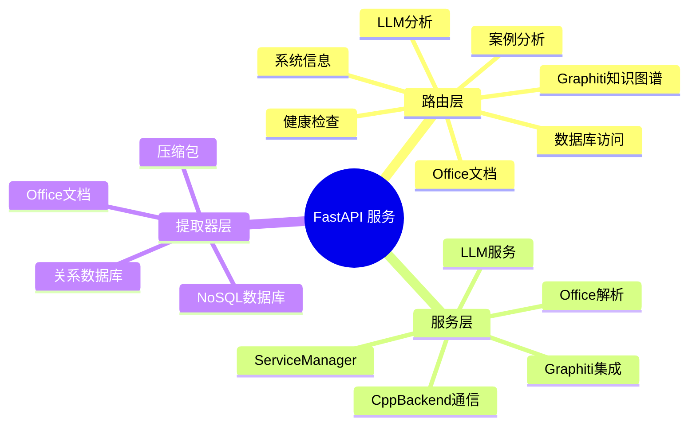
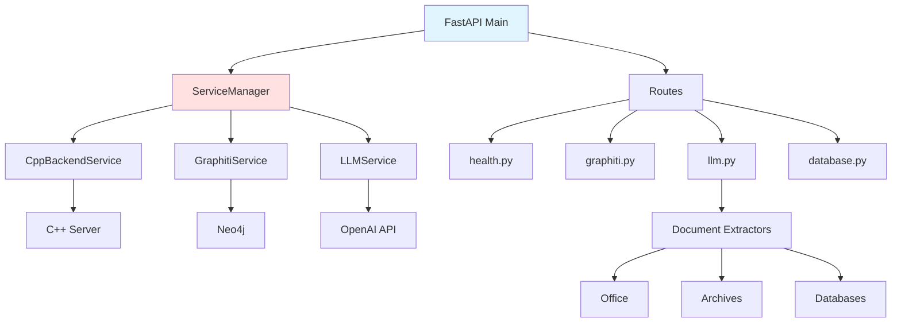
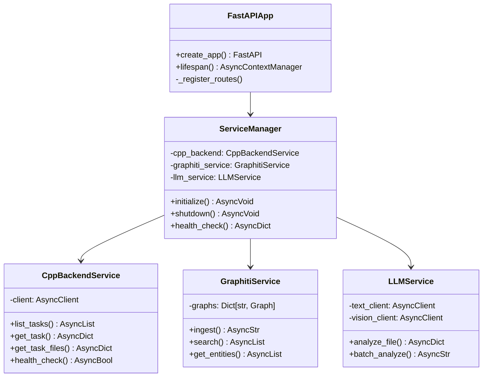
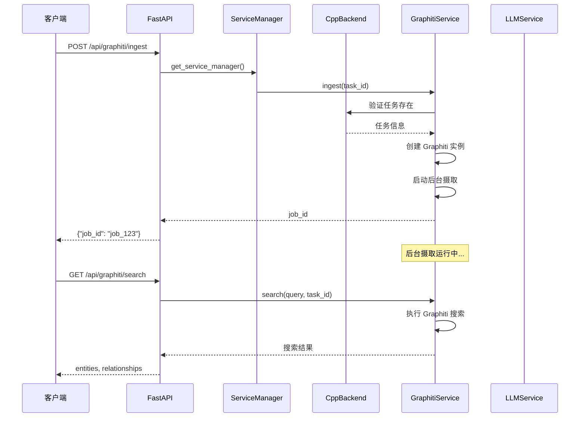

# FastAPI 主程序模块文档（Python）

## 1. 模块背景

### 业务背景

C++ HTTP 服务器虽然性能优异，但在 AI 集成、知识图谱等现代技术栈方面存在局限。Python FastAPI 服务作为补充，提供：

**核心价值**：
- **AI 集成**：无缝集成 OpenAI 兼容的 LLM 服务
- **知识图谱**：Graphiti 知识图谱摄取和搜索
- **文档处理**：Office 文档、压缩包等复杂格式解析
- **异步处理**：原生 asyncio 支持高并发
- **快速开发**：Python 生态的丰富库支持

**为什么需要双服务器架构？**

| 需求 | C++ 服务器 | Python 服务器 | 理由 |
|------|-----------|--------------|------|
| **磁盘分析** | ✅ | ❌ | 需要底层性能和 TSK 集成 |
| **LLM 分析** | ⚠️ | ✅ | Python AI 生态更成熟 |
| **知识图谱** | ❌ | ✅ | Graphiti Python SDK |
| **文档解析** | ❌ | ✅ | Python 文档库更丰富 |
| **实时搜索** | ✅ | ❌ | SQLite 本地查询更快 |

**在整体架构中的定位**：
```
Web 前端
    ↓
┌─────────────────────────────────────┐
│  API Gateway / 负载均衡 (可选)       │
└─────────────────────────────────────┘
    ↓                   ↓
┌──────────────┐    ┌──────────────┐
│ C++ Server   │    │ Python Server│
│  端口 8080   │◄──►│  端口 8090   │
│              │ HTTP│              │
│ 核心取证分析 │    │ AI/知识图谱  │
└──────────────┘    └──────────────┘
```

### 技术背景

**为什么选择 FastAPI？**

| 框架 | 优势 | 劣势 | 选择理由 |
|------|------|------|----------|
| **FastAPI** | 异步、自动文档、类型检查 | 相对较新 | ✅ 现代、高性能 |
| **Flask** | 成熟稳定 | 同步、需手动文档 | ❌ 性能不足 |
| **Django** | 全功能 | 笨重、过度设计 | ❌ 不适合 API |

**技术栈亮点**：

1. **异步 I/O**：
   - `asyncio` 原生支持
   - `httpx.AsyncClient` 并发请求
   - 后台任务处理

2. **依赖注入**：
   - `Depends()` 自动依赖管理
   - `lifespan` 上下文管理
   - 可测试的架构

3. **自动文档**：
   - OpenAPI 3.0 规范
   - Swagger UI (`/docs`)
   - ReDoc (`/redoc`)

## 2. 模块功能

### 核心功能

#### 1. 服务架构



#### 2. 路由模块

| 路由 | 前缀 | 功能 | 端点数 |
|------|------|------|--------|
| **health** | `/health` | 健康检查 | 4 |
| **graphiti** | `/api/graphiti` | 知识图谱操作 | 8 |
| **llm** | `/api/llm` | LLM 文件分析 | 6 |
| **database** | `/api/db` | 数据库查询和导出 | 7 |
| **office** | `/api/office` | Office 文档处理 | 3 |
| **case_analysis** | `/api/case` | 案例分析工作流 | 5 |
| **system** | `/api/system` | 系统信息和日志 | 4 |

#### 3. 服务生命周期管理

```python
# 服务初始化顺序
async def lifespan(app: FastAPI):
    # 启动阶段
    service_manager = get_service_manager()
    await service_manager.initialize()

    # 初始化顺序:
    # 1. CppBackendService (必需)
    # 2. GraphitiService (可选)
    # 3. LLMService (可选)

    yield

    # 关闭阶段
    await service_manager.shutdown()

    # 关闭顺序:
    # 1. LLMService
    # 2. GraphitiService
    # 3. CppBackendService
```

#### 4. 多模型 LLM 支持

**配置分离**：
```python
# config.py
class Settings(BaseSettings):
    # 文本模型（用于文档分析）
    llm_text_base_url: str = "http://localhost:1234"
    llm_text_model: str = "openai/gpt-oss-20b"

    # 视觉模型（用于图像分析）
    llm_vision_base_url: str = "http://localhost:1234"
    llm_vision_model: str = "qwen/qwen3-vl-4b"

    @property
    def llm_text_full_url(self) -> str:
        return f"{self.llm_text_base_url}/v1"

    @property
    def llm_vision_full_url(self) -> str:
        return f"{self.llm_vision_base_url}/v1"
```

### 边界与限制

**功能边界**：
- ❌ 不直接分析磁盘镜像（通过 C++ 后端）
- ❌ 不提供文件上传功能（安全考虑）
- ❌ 不支持 WebSocket（当前仅 HTTP）
- ❌ 不实现用户认证（依赖反向代理）

**已知限制**：
| 限制 | 影响 | 缓解方法 |
|------|------|----------|
| C++ 后端依赖 | C++ 服务不可用时降级 | 实现降级策略 |
| Neo4j 依赖 | Graphiti 需要运行 Neo4j | 可选依赖 |
| 内存占用 | 大型文档处理占用内存 | 流式处理 |

**性能指标**：
- API 响应时间：<200ms（查询类）
- 并发处理：100+ 并发请求
- LLM 分析：1-5 秒/文件（取决于模型）
- 内存占用：约 200MB 基础 + 50MB/并发任务

## 3. 模块使用的库

### 依赖库清单

| 库名称 | 版本 | 用途 | 许可证 | 官网 |
|--------|------|------|--------|------|
| **FastAPI** | 0.100+ | Web 框架 | MIT | https://fastapi.tiangolo.com/ |
| **httpx** | 0.24+ | 异步 HTTP 客户端 | BSD | https://www.python-httpx.org/ |
| **pydantic** | 2.0+ | 数据验证 | MIT | https://docs.pydantic.dev/ |
| **uvicorn** | 0.23+ | ASGI 服务器 | BSD | https://www.uvicorn.org/ |
| **python-multipart** | latest | 文件上传支持 | MIT | https://github.com/andrew-d/python-multipart |
| **openpyxl** | 3.1+ | Excel 处理 | MIT | https://openpyxl.readthedocs.io/ |
| **python-pptx** | 0.9+ | PowerPoint 处理 | MIT | https://python-pptx.readthedocs.io/ |
| **Graphiti** | latest | 知识图谱 | MIT | https://github.com/getpointai/graphiti |

### 依赖关系图



## 4. 模块实现方式

### 架构设计



### 核心组件说明

#### 主应用工厂 (`main.py`)

**职责**：
- 创建 FastAPI 应用实例
- 配置中间件和路由
- 管理服务生命周期

**关键代码**：
```python
from fastapi import FastAPI
from contextlib import asynccontextmanager

@asynccontextmanager
async def lifespan(app: FastAPI):
    # 启动
    service_manager = get_service_manager()
    await service_manager.initialize()
    yield
    # 关闭
    await service_manager.shutdown()

def create_app(settings: Settings = None) -> FastAPI:
    app = FastAPI(
        title="ForensicsProject Python Service",
        description="Python HTTP Service for digital forensics analysis",
        version="1.0.0",
        docs_url="/docs",
        redoc_url="/redoc",
        lifespan=lifespan,
    )

    # 中间件
    app.add_middleware(
        CORSMiddleware,
        allow_origins=["*"],
        allow_credentials=True,
        allow_methods=["*"],
        allow_headers=["*"],
    )

    # 路由注册
    _register_routes(app, settings)

    return app
```

#### 服务管理器 (`services/service_manager.py`)

**职责**：
- 协调所有后台服务
- 管理服务生命周期
- 提供健康检查

**关键代码**：
```python
class ServiceManager:
    def __init__(self, settings: Optional[Settings] = None):
        self.settings = settings or get_settings()
        self._cpp_backend: Optional[CppBackendService] = None
        self._graphiti_service: Optional[GraphitiService] = None
        self._llm_service: Optional[LLMService] = None
        self._initialized = False

    async def initialize(self):
        """按顺序初始化所有服务"""
        # 1. C++ 后端（必需）
        self._cpp_backend = CppBackendService(self.settings)
        await self._cpp_backend.initialize()

        # 2. Graphiti（可选）
        try:
            self._graphiti_service = GraphitiService(self.settings)
            await self._graphiti_service.initialize()
        except Exception as e:
            logger.warning(f"Graphiti initialization failed: {e}")

        # 3. LLM（可选）
        try:
            self._llm_service = LLMService(self.settings)
            await self._llm_service.initialize()
        except Exception as e:
            logger.warning(f"LLM initialization failed: {e}")

        self._initialized = True

    async def health_check(self) -> dict:
        """检查所有服务健康状态"""
        result = {"overall": "healthy", "services": {}}

        # C++ 后端（必需）
        cpp_healthy = await self._cpp_backend.health_check()
        result["services"]["cpp_backend"] = {
            "status": "healthy" if cpp_healthy else "unhealthy"
        }

        if not cpp_healthy:
            result["overall"] = "unhealthy"

        # Graphiti（可选）
        if self._graphiti_service:
            graphiti_healthy = await self._graphiti_service.health_check()
            result["services"]["graphiti"] = {
                "status": "healthy" if graphiti_healthy else "unhealthy"
            }

        # LLM（可选）
        if self._llm_service:
            llm_healthy = await self._llm_service.health_check()
            result["services"]["llm"] = {
                "status": "healthy" if llm_healthy else "unhealthy"
            }

        return result
```

#### C++ 后端通信 (`services/cpp_backend.py`)

**职责**：
- 与 C++ HTTP 服务通信
- 提供类型化的 API 客户端
- 处理重试和错误恢复

**关键代码**：
```python
class CppBackendService:
    def __init__(self, settings: Settings):
        self.settings = settings
        self.base_url = settings.cpp_backend_url
        self._client: Optional[httpx.AsyncClient] = None

    async def initialize(self):
        """初始化 HTTP 客户端"""
        self._client = httpx.AsyncClient(
            base_url=self.base_url,
            timeout=httpx.Timeout(30.0),
            limits=httpx.Limits(
                max_keepalive_connections=10,
                max_connections=20
            ),
        )

    async def _request(self, method: str, path: str, **kwargs) -> Dict[str, Any]:
        """执行 HTTP 请求（带重试）"""
        max_retries = 3
        for attempt in range(max_retries):
            try:
                response = await self._client.request(method, path, **kwargs)

                # 检查 HTML 响应（API 错误）
                if "text/html" in response.headers.get("content-type", "").lower():
                    return {"success": False, "error": "Backend returned HTML"}

                if response.status_code >= 400:
                    return {"success": False, "error": response.text}

                return response.json()

            except Exception as e:
                if attempt == max_retries - 1:
                    logger.error(f"Request failed after {max_retries} attempts: {e}")
                    return {"success": False, "error": str(e)}
                await asyncio.sleep(1)

    # 任务管理
    async def list_tasks(self, status: Optional[str] = None) -> List[Dict]:
        params = {"status": status} if status else {}
        result = await self._request("GET", "/api/tasks/list", params=params)
        return result.get("tasks", []) if result.get("success") else []

    async def get_task(self, task_id: str) -> Dict:
        result = await self._request("GET", f"/api/tasks/{task_id}")
        return result.get("task") if result.get("success") else {}

    # 文件操作
    async def get_task_files_paginated(
        self,
        task_id: str,
        limit: int = 100,
        offset: int = 0
    ) -> Dict:
        params = {"limit": limit, "offset": offset}
        result = await self._request("GET", f"/api/forensics/files/{task_id}", params=params)
        return result if result.get("success") else {}
```

### 关键流程



### 数据结构

#### 配置模型

```python
# config.py
from pydantic_settings import BaseSettings

class Settings(BaseSettings):
    # 服务器配置
    python_http_port: int = 8090
    python_http_host: str = "0.0.0.0"
    log_level: str = "INFO"

    # C++ 后端
    cpp_backend_url: str = "http://localhost:8080"

    # LLM 配置
    llm_text_base_url: str = "http://localhost:1234"
    llm_text_model: str = "openai/gpt-oss-20b"
    llm_vision_base_url: str = "http://localhost:1234"
    llm_vision_model: str = "qwen/qwen3-vl-4b"
    llm_api_key: str = ""

    # Neo4j/Graphiti
    neo4j_uri: str = "neo4j://localhost:7687"
    neo4j_user: str = "neo4j"
    neo4j_password: str = "password"
    graphiti_group_id: str = "forensics_files"

    # 数据库
    db_output_dir: str = "data"

    class Config:
        env_file = ".env"
        case_sensitive = False
```

#### API 请求/响应模型

```python
# 图谱摄取请求
class GraphitiIngestRequest(BaseModel):
    task_id: str
    include_llm_descriptions: bool = False
    batch_size: int = 50
    dry_run: bool = False

# LLM 分析请求
class LLMAnalyzeRequest(BaseModel):
    file_path: str
    files_db_path: str
    model_type: Literal["text", "vision"] = "text"
    max_content_length: int = 10000

# 数据库查询请求
class DatabaseQueryRequest(BaseModel):
    sql: str
    database_type: Literal["raw", "events", "files"] = "files"
```

## 5. API 调用

### REST API 端点

#### 健康检查

```bash
# 基础健康检查
curl http://localhost:8090/health

# Kubernetes 存活探针
curl http://localhost:8090/health/live

# Kubernetes 就绪探针（含依赖检查）
curl http://localhost:8090/health/ready

# 响应
{
  "status": "healthy",
  "services": {
    "cpp_backend": {"status": "healthy"},
    "graphiti": {"status": "healthy"},
    "llm": {"status": "healthy"}
  },
  "timestamp": "2024-01-01T10:00:00Z"
}
```

#### Graphiti 知识图谱

```bash
# 数据摄取（后台任务）
curl -X POST http://localhost:8090/api/graphiti/ingest \
  -H "Content-Type: application/json" \
  -d '{
    "task_id": "task_abc123",
    "include_llm_descriptions": true,
    "batch_size": 50
  }'

# 响应
{
  "success": true,
  "job_id": "job_xyz789",
  "status": "running",
  "message": "知识图谱摄取已启动"
}

# 搜索知识图谱
curl -X POST http://localhost:8090/api/graphiti/search \
  -H "Content-Type: application/json" \
  -d '{
    "query": "malware documents",
    "task_id": "task_abc123",
    "limit": 50
  }'

# 响应
{
  "success": true,
  "results": [
    {
      "entity": {
        "name": "trojan.exe",
        "type": "FILE",
        "summary": "检测到可疑的可执行文件"
      },
      "relationships": [
        {"type": "LOCATED_IN", "target": "C:/Temp/trojan.exe"}
      ]
    }
  ]
}

# 获取实体列表
curl "http://localhost:8090/api/graphiti/entities?task_id=task_abc123&limit=100"

# 获取关系列表
curl "http://localhost:8090/api/graphiti/relationships?task_id=task_abc123"

# 获取图可视化数据
curl "http://localhost:8090/api/graphiti/graph?task_id=task_abc123&max_nodes=200"

# 删除图谱数据
curl -X DELETE "http://localhost:8090/api/graphiti/task/task_abc123"
```

#### LLM 文件分析

```bash
# 单文件分析
curl -X POST http://localhost:8090/api/llm/analyze \
  -H "Content-Type: application/json" \
  -d '{
    "file_path": "/path/to/document.pdf",
    "files_db_path": "/output/evidence_files.db",
    "model_type": "text"
  }'

# 批量分析
curl -X POST http://localhost:8090/api/llm/batch \
  -H "Content-Type: application/json" \
  -d '{
    "task_id": "task_abc123",
    "file_types": ["documents", "images"],
    "limit": 100
  }'

# 文件上传分析
curl -X POST http://localhost:8090/api/llm/analyze/file \
  -F "file=@document.pdf" \
  -F "model_type=text"

# 查询分析状态
curl "http://localhost:8090/api/llm/jobs/job_123/status"
```

#### 数据库操作

```bash
# 列出任务数据库
curl "http://localhost:8090/api/db/tasks?task_id=task_abc123"

# 自定义 SQL 查询
curl -X POST http://localhost:8090/api/db/query \
  -H "Content-Type: application/json" \
  -d '{
    "sql": "SELECT * FROM files WHERE size > 1048576 LIMIT 10",
    "database_type": "files"
  }'

# TOON 格式导出
curl "http://localhost:8090/api/db/tasks/task_abc123/export/toon?include_llm=true"

# JSON 格式导出
curl "http://localhost:8090/api/db/tasks/task_abc123/export/json?database_type=events"
```

### API 参数说明

#### Graphiti 摄取参数

| 参数名 | 类型 | 必填 | 默认值 | 说明 |
|--------|------|------|--------|------|
| `task_id` | string | ✅ | - | 任务 ID |
| `include_llm_descriptions` | boolean | ❌ | false | 是否包含 LLM 描述 |
| `batch_size` | integer | ❌ | 50 | 批处理大小 |
| `dry_run` | boolean | ❌ | false | 试运行模式 |

#### LLM 分析参数

| 参数名 | 类型 | 必填 | 默认值 | 说明 |
|--------|------|------|--------|------|
| `file_path` | string | ✅ | - | 文件路径 |
| `files_db_path` | string | ✅ | - | 文件数据库路径 |
| `model_type` | string | ❌ | text | text/vision |
| `max_content_length` | integer | ❌ | 10000 | 最大内容长度 |

## 6. 二次开发

### 扩展点

#### 1. 添加新的文档提取器

**位置**：`services/extractors/`

**示例**：添加 PDF 元数据提取器

```python
# services/extractors/pdf.py
from .base import BaseExtractor, register_extractor
import PyPDF2
from typing import Optional

@register_extractor
class PDFExtractor(BaseExtractor):
    """PDF 文档元数据提取器"""

    @classmethod
    def can_handle(cls, file_path: str) -> bool:
        return file_path.lower().endswith('.pdf')

    async def extract_to_markdown(self, file_path: str) -> str:
        """提取 PDF 内容为 Markdown"""
        try:
            with open(file_path, 'rb') as f:
                reader = PyPDF2.PdfReader(f)

            result = []
            result.append(f"# PDF Document: {os.path.basename(file_path)}\n")
            result.append(f"Pages: {len(reader.pages)}\n")

            # 提取元数据
            if reader.metadata:
                result.append("## Metadata\n")
                for key, value in reader.metadata.items():
                    result.append(f"- {key}: {value}\n")

            # 提取文本内容
            result.append("## Content\n")
            for page_num, page in enumerate(reader.pages, 1):
                text = page.extract_text()
                if text.strip():
                    result.append(f"\n### Page {page_num}\n")
                    result.append(text)

            return "\n".join(result)

        except Exception as e:
            logger.error(f"PDF extraction failed: {e}")
            return f"# Error\n\nFailed to extract PDF: {str(e)}"
```

**使用**：
```python
# 自动注册，无需显式调用
extractor = get_document_extractor_locator()
markdown = await extractor.extract_to_markdown("document.pdf")
```

#### 2. 添加新的分析路由

**位置**：`routes/`

**示例**：添加批量文件哈希计算

```python
# routes/hash_analysis.py
from fastapi import APIRouter, Depends, HTTPException
from typing import List
import hashlib

router = APIRouter(prefix="/api/hash", tags=["Hash Analysis"])

@router.post("/batch")
async def calculate_batch_hashes(
    task_id: str,
    cpp_backend: CppBackendService = Depends(get_cpp_backend)
):
    """批量计算文件哈希"""
    # 获取任务文件
    files_data = await cpp_backend.get_task_files_paginated(
        task_id, limit=1000
    )

    if not files_data.get("success"):
        raise HTTPException(status_code=404, detail="Task not found")

    results = []
    for file_info in files_data.get("files", []):
        file_path = file_info["path"]

        # 计算哈希
        try:
            md5_hash = calculate_file_hash(file_path, "md5")
            sha256_hash = calculate_file_hash(file_path, "sha256")

            results.append({
                "path": file_path,
                "md5": md5_hash,
                "sha256": sha256_hash,
                "size": file_info.get("size", 0)
            })

        except Exception as e:
            results.append({
                "path": file_path,
                "error": str(e)
            })

    return {
        "success": True,
        "task_id": task_id,
        "hashes": results,
        "total": len(results)
    }

def calculate_file_hash(file_path: str, algorithm: str) -> str:
    """计算文件哈希"""
    hash_func = hashlib.new(algorithm)

    with open(file_path, 'rb') as f:
        for chunk in iter(lambda: f.read(4096), b""):
            hash_func.update(chunk)

    return hash_func.hexdigest()
```

**注册路由**：
```python
# main.py
def _register_routes(app: FastAPI, settings: Settings):
    # 现有路由...

    # 新增哈希分析路由
    from routes.hash_analysis import router as hash_router
    app.include_router(hash_router)
```

#### 3. 添加新的后台任务类型

**位置**：`services/`

**示例**：添加定期统计任务

```python
# services/scheduler.py
import asyncio
from typing import Callable, Optional

class BackgroundScheduler:
    """后台任务调度器"""

    def __init__(self):
        self._tasks: dict[str, asyncio.Task] = {}
        self._running = False

    async def start(self):
        """启动调度器"""
        self._running = True
        asyncio.create_task(self._run_periodic_tasks())

    async def stop(self):
        """停止调度器"""
        self._running = False
        for task in self._tasks.values():
            task.cancel()
        await asyncio.gather(*self._tasks.values(), return_exceptions=True)

    def schedule_periodic(
        self,
        name: str,
        interval_seconds: int,
        coro: Callable
    ):
        """调度定期任务"""
        async def periodic_wrapper():
            while self._running:
                try:
                    await coro()
                except Exception as e:
                    logger.error(f"Periodic task {name} failed: {e}")
                await asyncio.sleep(interval_seconds)

        self._tasks[name] = asyncio.create_task(periodic_wrapper())

    async def _run_periodic_tasks(self):
        """运行所有定期任务"""
        # 示例：每小时清理旧任务
        self.schedule_periodic(
            "cleanup_old_tasks",
            3600,  # 1 小时
            self._cleanup_old_tasks
        )

    async def _cleanup_old_tasks(self):
        """清理超过 7 天的已完成任务"""
        from datetime import datetime, timedelta
        import glob

        cutoff = datetime.now() - timedelta(days=7)
        pattern = "tasks/task_*.json"

        for file_path in glob.glob(pattern):
            if os.path.getmtime(file_path) < cutoff.timestamp():
                try:
                    os.remove(file_path)
                    logger.info(f"Removed old task file: {file_path}")
                except Exception as e:
                    logger.error(f"Failed to remove {file_path}: {e}")
```

**集成**：
```python
# main.py
@asynccontextmanager
async def lifespan(app: FastAPI):
    service_manager = get_service_manager()
    await service_manager.initialize()

    # 启动后台调度器
    scheduler = BackgroundScheduler()
    await scheduler.start()

    yield

    # 关闭调度器
    await scheduler.stop()
    await service_manager.shutdown()
```

### 添加新功能的步骤

#### 完整示例：添加文件相似度分析

**步骤 1：定义服务类**

```python
# services/similarity_service.py
from typing import List, Dict, Tuple
import numpy as np
from sklearn.feature_extraction.text import TfidfVectorizer
from sklearn.metrics.pairwise import cosine_similarity

class SimilarityService:
    """文件相似度分析服务"""

    def __init__(self):
        self.vectorizer = TfidfVectorizer(max_features=1000)

    async def analyze_similarity(
        self,
        files: List[Dict],
        threshold: float = 0.8
    ) -> List[Dict]:
        """分析文件相似度"""
        # 提取文件内容
        contents = []
        for file_info in files:
            content = await self._extract_content(file_info["path"])
            contents.append(content)

        # 计算 TF-IDF 矩阵
        tfidf_matrix = self.vectorizer.fit_transform(contents)

        # 计算相似度矩阵
        similarity_matrix = cosine_similarity(tfidf_matrix)

        # 找出相似文件对
        similar_pairs = []
        for i in range(len(files)):
            for j in range(i + 1, len(files)):
                similarity = similarity_matrix[i][j]
                if similarity >= threshold:
                    similar_pairs.append({
                        "file1": files[i]["path"],
                        "file2": files[j]["path"],
                        "similarity": float(similarity),
                        "similarity_percentage": round(similarity * 100, 2)
                    })

        return similar_pairs

    async def _extract_content(self, file_path: str) -> str:
        """提取文件内容（简化示例）"""
        try:
            with open(file_path, 'r', encoding='utf-8', errors='ignore') as f:
                # 读取前 10KB
                return f.read(10240)
        except Exception:
            return ""
```

**步骤 2：创建路由**

```python
# routes/similarity.py
from fastapi import APIRouter, Depends, HTTPException
from services.similarity_service import SimilarityService

router = APIRouter(prefix="/api/similarity", tags=["Similarity"])
similarity_service = SimilarityService()

@router.post("/analyze")
async def analyze_similarity(
    task_id: str,
    threshold: float = 0.8,
    cpp_backend: CppBackendService = Depends(get_cpp_backend)
):
    """分析文件相似度"""
    # 获取任务文件
    files_data = await cpp_backend.get_task_files_paginated(
        task_id, limit=100
    )

    if not files_data.get("success"):
        raise HTTPException(status_code=404, detail="Task not found")

    files = files_data.get("files", [])

    # 分析相似度
    similar_pairs = await similarity_service.analyze_similarity(
        files, threshold
    )

    return {
        "success": True,
        "task_id": task_id,
        "threshold": threshold,
        "similar_pairs": similar_pairs,
        "total_pairs": len(similar_pairs)
    }
```

**步骤 3：注册路由**

```python
# main.py
def _register_routes(app: FastAPI, settings: Settings):
    # ... 现有路由

    # 新增相似度分析路由
    from routes.similarity import router as similarity_router
    app.include_router(similarity_router)
```

### 代码示例

#### 完整的中间件实现

```python
# middleware/logging.py
from fastapi import Request
import time
import logging

logger = logging.getLogger(__name__)

async def log_requests_middleware(request: Request, call_next):
    """请求日志中间件"""
    start_time = time.time()

    # 记录请求
    logger.info(f"Request: {request.method} {request.url.path}")

    # 处理请求
    response = await call_next(request)

    # 计算耗时
    process_time = (time.time() - start_time) * 1000
    response.headers["X-Process-Time"] = str(process_time)

    # 记录响应
    logger.info(
        f"Response: {request.method} {request.url.path} - "
        f"{response.status_code} - {process_time:.2f}ms"
    )

    return response
```

**注册中间件**：
```python
# main.py
app.middleware("http")(log_requests_middleware)
```

### 最佳实践

#### 性能优化

**1. 异步数据库操作**：
```python
import aiosqlite

async def query_database_async(db_path: str, sql: str):
    """异步数据库查询"""
    async with aiosqlite.connect(db_path) as db:
        async with db.execute(sql) as cursor:
            rows = await cursor.fetchall()
            columns = [description[0] for description in cursor.description]
            return [dict(zip(columns, row)) for row in rows]
```

**2. 批处理**：
```python
async def batch_analyze_files(file_paths: List[str], batch_size: int = 10):
    """批量分析文件"""
    results = []

    for i in range(0, len(file_paths), batch_size):
        batch = file_paths[i:i + batch_size]
        batch_results = await asyncio.gather(
            *[analyze_file(path) for path in batch],
            return_exceptions=True
        )
        results.extend(batch_results)

    return results
```

#### 常见陷阱

**1. 阻塞操作**：
```python
# 错误：同步阻塞
def process_file(file_path: str):
    time.sleep(5)  # 阻塞整个服务
    return result

# 正确：异步
async def process_file(file_path: str):
    await asyncio.sleep(5)  # 不阻塞
    return result
```

**2. 异常处理**：
```python
# 错误：吞掉异常
try:
    result = await some_operation()
except:
    pass  # 静默失败

# 正确：记录异常
try:
    result = await some_operation()
except Exception as e:
    logger.error(f"Operation failed: {e}", exc_info=True)
    raise HTTPException(status_code=500, detail=str(e))
```

## 7. 其他

### 测试

**测试位置**：
```
python_service/tests/
├── test_routes/
│   ├── test_health.py
│   ├── test_graphiti.py
│   └── test_llm.py
└── test_services/
    ├── test_cpp_backend.py
    └── test_llm_service.py
```

**运行测试**：
```bash
cd python_service
pytest tests/ -v
```

### 配置

**环境变量** (`.env`):
```env
# 服务配置
PYTHON_HTTP_PORT=8090
PYTHON_HTTP_HOST=0.0.0.0
LOG_LEVEL=INFO

# C++ 后端
CPP_BACKEND_URL=http://localhost:8080

# LLM 配置
LLM_TEXT_BASE_URL=http://localhost:1234
LLM_TEXT_MODEL=openai/gpt-oss-20b
LLM_VISION_MODEL=qwen/qwen3-vl-4b

# Neo4j
NEO4J_URI=neo4j://localhost:7687
NEO4J_USER=neo4j
NEO4J_PASSWORD=password

# Graphiti
GRAPHITI_GROUP_ID=forensics_files
GRAPHITI_USE_LOCAL_LLM=true
```

### 故障排查

| 问题 | 可能原因 | 解决方法 |
|------|----------|----------|
| **服务无法启动** | 端口被占用 | 更换 PYTHON_HTTP_PORT |
| **C++ 后端连接失败** | C++ 服务未运行 | 启动 C++ 服务 |
| **LLM 分析失败** | LLM 服务不可用 | 检查 LLM_BASE_URL |
| **Graphiti 错误** | Neo4j 未运行 | 启动 Neo4j |

### 相关模块

- **[ServiceManager](../services/ServiceManager.md)** - 服务管理器
- **[CppBackendClient](../services/CppBackendClient.md)** - C++ 后端通信
- **[GraphitiRoutes](../routes/Graphiti.md)** - 知识图谱路由
- **[LLMRoutes](../routes/LLM.md)** - LLM 分析路由

### 参考资源

- [FastAPI 官方文档](https://fastapi.tiangolo.com/)
- [httpx 文档](https://www.python-httpx.org/)
- [Graphiti 文档](https://github.com/getpointai/graphiti)

### 变更历史

| 版本 | 日期 | 变更内容 | 作者 |
|------|------|----------|------|
| 1.0.0 | 2024-03-01 | 初始版本 | Forensics Team |
| 1.1.0 | 2024-06-15 | 添加 Graphiti 集成 | Forensics Team |
| 1.2.0 | 2024-09-20 | 添加文档提取器 | Forensics Team |

---

**最后更新**: 2026-03-11
**维护者**: ymj68520
