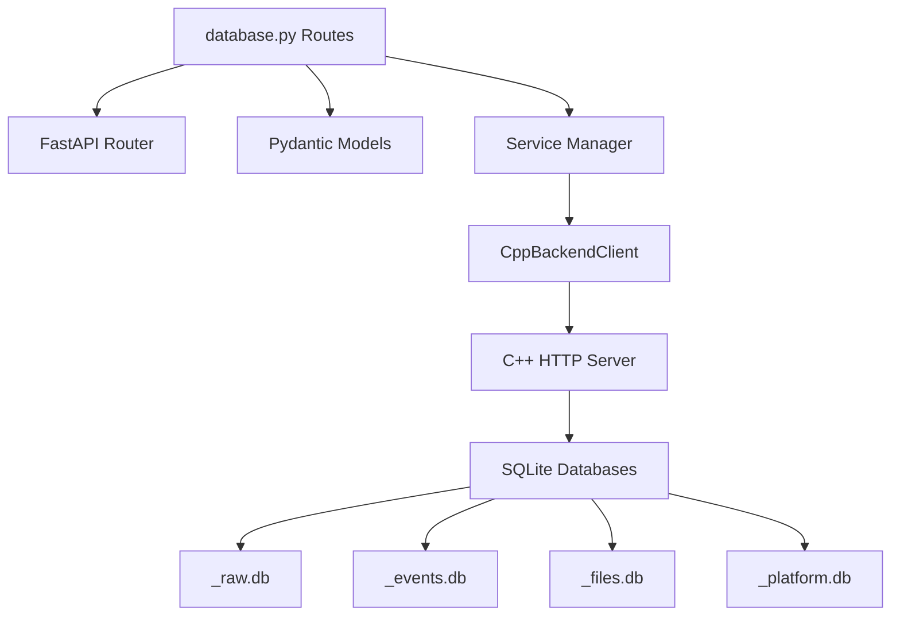
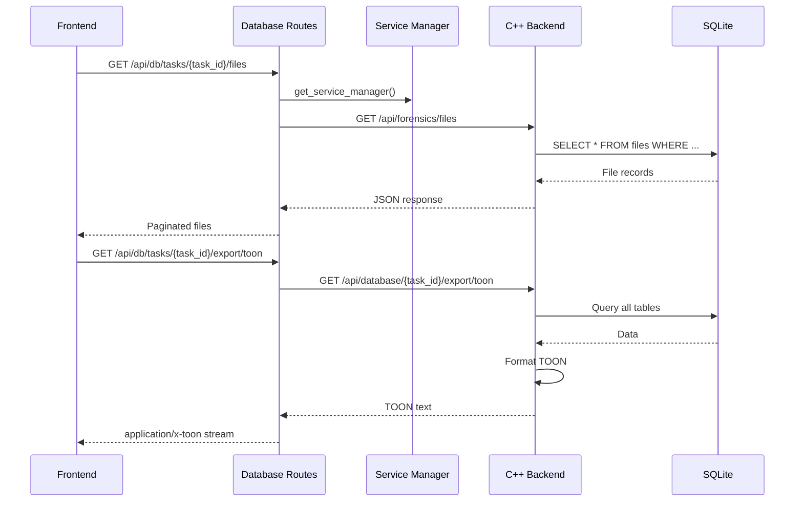
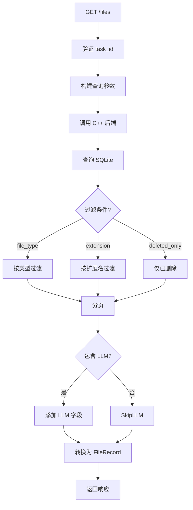
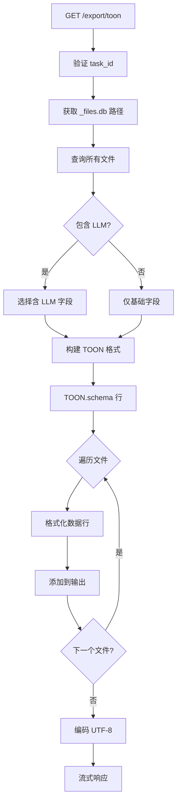

# Database Access Routes 模块文档

## 1. 模块背景

### 业务背景

数字取证分析产生的数据存储在多个 SQLite 数据库中（`_raw.db`, `_events.db`, `_files.db`, `_android.db`, `_windows.db`, `_linux.db`）。Database Access Routes 模块提供统一的数据访问接口，实现：

1. **任务管理**: 列出和分析取证任务
2. **文件查询**: 分页查询文件记录，支持多维度过滤
3. **事件查询**: 获取时间线事件，支持时间范围过滤
4. **数据导出**: 导出为 TOON（高效 LLM 格式）或 JSON
5. **自定义查询**: 安全的 SQL 查询接口（仅 SELECT）
6. **数据库列表**: 列出任务关联的所有数据库

**典型应用场景**：

```
场景 1: 生成证据报告
1. 查询任务的文件列表
2. 筛选包含 LLM 描述的文件
3. 导出为 TOON 格式
4. 交给 LLM 生成报告

场景 2: 时间线分析
1. 查询事件时间范围
2. 按事件类型过滤
3. 识别异常活动模式
4. 导出数据用于可视化

场景 3: 自定义取证查询
1. 编写自定义 SQL
2. 仅 SELECT 操作（安全）
3. 获取特定数据
4. 导出分析结果
```

### 技术背景

**多数据库架构**：

```
ForensicsProject/
├── case1_raw.db         # 原始文件系统元数据
├── case1_events.db      # 时间线事件
├── case1_files.db       # 分类文件（含 LLM 分析）
├── case1_android.db     # Android 取证数据
├── case1_windows.db     # Windows 工件
└── case1_linux.db       # Linux 工件
```

**Python FastAPI 作为网关**：

Python 服务通过 HTTP 与 C++ 后端通信，提供：
- **协议转换**: HTTP → SQLite 查询
- **数据聚合**: 跨多个数据库的联合查询
- **格式转换**: SQLite → TOON/JSON
- **安全控制**: SQL 注入防护，仅允许 SELECT

**TOON 格式**：

Token-Oriented Object Notation，专为 LLM 优化的格式：

```toon
TOON.schema: path | size | type | llm_description
/Windows/System32/config/SAM | 1048576 | system_file | Windows SAM database containing user account information
/Users/john/Documents/suspicious.pdf | 204800 | document | Contains phishing email template
```

相比 JSON 节省 30-60% token。

---

## 2. 模块功能

### 核心功能

| 功能 | 端点 | 描述 |
|------|------|------|
| **任务列表** | `GET /api/db/tasks` | 列出所有分析任务 |
| **任务详情** | `GET /api/db/tasks/{task_id}` | 获取任务详细信息 |
| **数据库列表** | `GET /api/db/tasks/{task_id}/databases` | 列出任务的数据库 |
| **文件查询** | `GET /api/db/tasks/{task_id}/files` | 查询文件记录 |
| **事件查询** | `GET /api/db/tasks/{task_id}/events` | 查询时间线事件 |
| **自定义查询** | `POST /api/db/query` | 执行自定义 SQL |
| **TOON 导出** | `GET /api/db/tasks/{task_id}/export/toon` | 导出 TOON 格式 |
| **JSON 导出** | `GET /api/db/tasks/{task_id}/export/json` | 导出 JSON 格式 |

### 功能详解

#### 1. 任务管理

**列出所有任务**:

```http
GET /api/db/tasks?status=completed&page=1&page_size=50
```

**查询参数**:
- `status`: 过滤状态 (`pending`, `running`, `completed`, `failed`)
- `page`: 页码（从 1 开始）
- `page_size`: 每页数量（1-100）

**响应示例**:
```json
{
  "success": true,
  "tasks": [
    {
      "id": "abc-123-def",
      "path": "/evidence/case1.E01",
      "status": "completed",
      "progress": 100.0,
      "created_at": "2026-03-15T10:00:00Z",
      "completed_at": "2026-03-15T10:30:00Z",
      "output_files_db": "/data/case1_files.db",
      "extraction_directory": "/extracted/case1"
    }
  ],
  "total_count": 10,
  "page": 1,
  "page_size": 50,
  "timestamp": "2026-03-16T10:30:00Z"
}
```

**获取任务详情**:

```http
GET /api/db/tasks/abc-123-def
```

返回任务的完整元数据和数据库路径。

**列出任务数据库**:

```http
GET /api/db/tasks/abc-123-def/databases
```

**响应**:
```json
{
  "success": true,
  "task_id": "abc-123-def",
  "databases": [
    {
      "type": "raw",
      "path": "/data/case1_raw.db",
      "size_bytes": 104857600,
      "table_count": 5
    },
    {
      "type": "events",
      "path": "/data/case1_events.db",
      "size_bytes": 52428800,
      "table_count": 10
    },
    {
      "type": "files",
      "path": "/data/case1_files.db",
      "size_bytes": 209715200,
      "table_count": 15
    }
  ],
  "timestamp": "2026-03-16T10:30:00Z"
}
```

#### 2. 文件查询

**查询参数**:
```http
GET /api/db/tasks/{task_id}/files?
    file_type=documents&           # 按类型过滤
    extension=.pdf&                # 按扩展名过滤
    deleted_only=true&             # 仅显示已删除文件
    include_llm=true&              # 包含 LLM 描述
    page=1&page_size=50
```

**响应示例**:
```json
{
  "success": true,
  "files": [
    {
      "id": 12345,
      "name": "report.pdf",
      "path": "/Users/john/Documents/report.pdf",
      "size": 204800,
      "file_type": "documents",
      "extension": ".pdf",
      "md5": "abc123...",
      "created_time": "2026-03-10T14:30:00Z",
      "modified_time": "2026-03-15T10:00:00Z",
      "accessed_time": "2026-03-15T10:05:00Z",
      "is_deleted": false,
      "llm_description": "Quarterly financial report containing sensitive budget data"
    }
  ],
  "total_count": 150,
  "page": 1,
  "page_size": 50,
  "timestamp": "2026-03-16T10:30:00Z"
}
```

**支持的 file_type**:

```
images, videos, audio_files, documents, archives, executables,
databases, source_code, web_files, email_files, system_files,
encrypted_files, unknown_files
```

#### 3. 事件查询

**查询参数**:
```http
GET /api/db/tasks/{task_id}/events?
    event_type=MODIFIED&           # 事件类型过滤
    start_time=2026-03-01T00:00:00Z&  # 时间范围开始
    end_time=2026-03-31T23:59:59Z&    # 时间范围结束
    page=1&page_size=50
```

**事件类型**:
- `CREATED`: 文件创建
- `MODIFIED`: 文件修改
- `ACCESSED`: 文件访问
- `CHANGED`: 元数据变更
- `DELETED`: 文件删除

**响应示例**:
```json
{
  "success": true,
  "events": [
    {
      "id": 67890,
      "event_type": "MODIFIED",
      "file_path": "/Users/john/Documents/suspicious.docx",
      "timestamp": "2026-03-15T10:30:00Z",
      "details": {
        "size_before": 102400,
        "size_after": 204800,
        "mode": "0x644"
      }
    }
  ],
  "total_count": 5000,
  "page": 1,
  "page_size": 50,
  "timestamp": "2026-03-16T10:30:00Z"
}
```

#### 4. 自定义查询

**安全 SQL 查询**（仅 SELECT）:

```http
POST /api/db/query
Content-Type: application/json

{
  "task_id": "abc-123-def",
  "database_type": "files",
  "table": "documents",
  "sql": "SELECT path, size, llm_description FROM documents WHERE size > ?",
  "parameters": {"min_size": 1000000},
  "limit": 100
}
```

**安全检查**:
1. SQL 必须以 `SELECT` 开头
2. 禁止的关键词: `DROP`, `DELETE`, `UPDATE`, `INSERT`, `ALTER`, `CREATE`, `TRUNCATE`
3. 使用参数化查询防止注入

**database_type** 选项:
- `files`: _files.db
- `events`: _events.db
- `android`: _android.db
- `windows`: _windows.db
- `linux`: _linux.db

**响应示例**:
```json
{
  "success": true,
  "columns": ["path", "size", "llm_description"],
  "rows": [
    ["/path/to/file1.pdf", 1048576, "Financial report"],
    ["/path/to/file2.docx", 2097152, "Project proposal"]
  ],
  "row_count": 2,
  "timestamp": "2026-03-16T10:30:00Z"
}
```

#### 5. TOON 导出

**导出 TOON 格式**:

```http
GET /api/db/tasks/{task_id}/export/toon?include_llm=true
```

**TOON 格式示例**:

```toon
TOON.schema: id | name | path | size | type | md5 | created_time | modified_time | llm_description
1 | config.ini | /Windows/config.ini | 2048 | system_file | abc123 | 2026-03-10T10:00:00Z | 2026-03-15T14:30:00Z | Configuration file containing database credentials
2 | report.pdf | /Users/Documents/report.pdf | 204800 | document | def456 | 2026-03-12T09:15:00Z | 2026-03-15T11:00:00Z | Quarterly financial report with budget data
3 | screenshot.png | /Downloads/screenshot.png | 524288 | images | ghi789 | 2026-03-14T16:20:00Z | 2026-03-14T16:20:00Z | Screenshot showing email phishing attempt
```

**优势**:
- **Token 高效**: 比 JSON 节省 30-60% token
- **LLM 友好**: 表格格式，易于解析
- **可逆转换**: 可无损转换回 JSON

**curl 示例**:
```bash
# 导出 TOON
curl -X GET "http://localhost:8090/api/db/tasks/abc-123-def/export/toon?include_llm=true" \
  -H "Accept: application/x-toon" \
  --output case1_export.toon

# 查看内容
head -20 case1_export.toon
```

#### 6. JSON 导出

**导出 JSON 格式**:

```http
GET /api/db/tasks/{task_id}/export/json?database_type=files&include_llm=true
```

**响应示例**:

```json
{
  "task_id": "abc-123-def",
  "database_type": "files",
  "export_time": "2026-03-16T10:30:00Z",
  "files": [
    {
      "id": 1,
      "name": "config.ini",
      "path": "/Windows/config.ini",
      "size": 2048,
      "file_type": "system_file",
      "md5": "abc123",
      "created_time": "2026-03-10T10:00:00Z",
      "modified_time": "2026-03-15T14:30:00Z",
      "llm_summary": "Configuration file",
      "llm_description": "Configuration file containing database credentials",
      "llm_keywords": "config, credentials, database",
      "llm_analyzed_at": "2026-03-16T10:00:00Z",
      "llm_model_used": "llama-3-8b-instruct"
    }
  ],
  "total_files": 150
}
```

### 边界与限制

| 限制 | 说明 | 缓解措施 |
|------|------|----------|
| **数据库锁定** | SQLite 并发写入限制 | 读写分离，使用 WAL 模式 |
| **大结果集** | 可能耗尽内存 | 强制分页，限制 page_size |
| **SQL 注入** | 自定义查询风险 | 仅允许 SELECT，参数化查询 |
| **C++ 后端依赖** | 依赖 C++ 服务可用 | 优雅降级，缓存常用查询 |
| **文件路径** | 相对路径需要提取目录 | 自动拼接 extraction_directory |

---

## 3. 模块使用的库

### 依赖库清单

| 库名 | 版本 | 用途 |
|------|------|------|
| **fastapi** | ^0.104.0 | Web 框架 |
| **pydantic** | ^2.5.0 | 数据验证 |
| **httpx** | ^0.25.0 | 异步 HTTP 客户端（C++ 后端） |
| **aiosqlite** | ^0.19.0 | 异步 SQLite 操作 |

### 依赖关系图



### 核心代码依赖

**CppBackendClient** (`services/cpp_backend.py`):

```python
class CppBackendClient:
    def __init__(self, base_url: str):
        self.base_url = base_url
        self.client = httpx.AsyncClient(timeout=30.0)

    async def list_tasks(
        self,
        status: Optional[str] = None,
        page: int = 1,
        page_size: int = 50
    ) -> Dict:
        """列出任务"""
        params = {"page": page, "page_size": page_size}
        if status:
            params["status"] = status

        response = await self.client.get(
            f"{self.base_url}/api/tasks",
            params=params
        )
        response.raise_for_status()
        return response.json()

    async def get_task_files_paginated(
        self,
        task_id: str,
        file_type: Optional[str] = None,
        extension: Optional[str] = None,
        deleted_only: bool = False,
        include_llm: bool = True,
        page: int = 1,
        page_size: int = 50
    ) -> Dict:
        """获取文件列表（分页）"""
        params = {
            "task_id": task_id,
            "page": page,
            "page_size": page_size,
            "include_llm": include_llm
        }
        if file_type:
            params["file_type"] = file_type
        if extension:
            params["extension"] = extension
        if deleted_only:
            params["deleted_only"] = True

        response = await self.client.get(
            f"{self.base_url}/api/forensics/files",
            params=params
        )
        response.raise_for_status()
        return response.json()

    async def get_task_events(
        self,
        task_id: str,
        event_type: Optional[str] = None,
        start_time: Optional[str] = None,
        end_time: Optional[str] = None,
        page: int = 1,
        page_size: int = 50
    ) -> Dict:
        """获取事件列表"""
        params = {
            "task_id": task_id,
            "page": page,
            "page_size": page_size
        }
        if event_type:
            params["event_type"] = event_type
        if start_time:
            params["start_time"] = start_time
        if end_time:
            params["end_time"] = end_time

        response = await self.client.get(
            f"{self.base_url}/api/forensics/timeline",
            params=params
        )
        response.raise_for_status()
        return response.json()

    async def execute_query(
        self,
        task_id: str,
        database_type: str,
        table: Optional[str] = None,
        sql: Optional[str] = None,
        parameters: Optional[Dict] = None,
        limit: int = 1000
    ) -> Dict:
        """执行自定义查询"""
        request_body = {
            "task_id": task_id,
            "database_type": database_type,
            "limit": limit
        }
        if table:
            request_body["table"] = table
        if sql:
            request_body["sql"] = sql
        if parameters:
            request_body["parameters"] = parameters

        response = await self.client.post(
            f"{self.base_url}/api/database/query",
            json=request_body
        )
        response.raise_for_status()
        return response.json()

    async def export_toon(
        self,
        task_id: str,
        include_llm: bool = True
    ) -> str:
        """导出 TOON 格式"""
        params = {"include_llm": include_lln}
        response = await self.client.get(
            f"{self.base_url}/api/database/{task_id}/export/toon",
            params=params
        )
        response.raise_for_status()
        return response.text

    async def export_json(
        self,
        task_id: str,
        database_type: str = "files",
        include_llm: bool = True
    ) -> Dict:
        """导出 JSON 格式"""
        params = {
            "database_type": database_type,
            "include_llm": include_llm
        }
        response = await self.client.get(
            f"{self.base_url}/api/database/{task_id}/export/json",
            params=params
        )
        response.raise_for_status()
        return response.json()
```

---

## 4. 模块实现方式

### 架构设计



### 核心类说明

#### 1. 请求/响应模型

```python
class FileRecord(BaseModel):
    """文件记录"""
    id: int
    name: str
    path: str
    size: int
    file_type: str
    extension: Optional[str] = None
    md5: Optional[str] = None
    created_time: Optional[str] = None
    modified_time: Optional[str] = None
    accessed_time: Optional[str] = None
    is_deleted: bool = False
    llm_description: Optional[str] = None

class EventRecord(BaseModel):
    """事件记录"""
    id: int
    event_type: str
    file_path: str
    timestamp: str
    details: Optional[Dict[str, Any]] = None

class QueryRequest(BaseModel):
    """查询请求"""
    task_id: str = Field(..., description="任务 ID")
    database_type: str = Field(..., description="数据库类型")
    table: Optional[str] = Field(None, description="表名")
    sql: Optional[str] = Field(None, description="自定义 SQL")
    parameters: Optional[Dict[str, Any]] = Field(None, description="查询参数")
    limit: int = Field(default=1000, ge=1, le=10000, description="最大结果数")

class QueryResponse(BaseModel):
    """查询响应"""
    success: bool
    columns: List[str]
    rows: List[List[Any]]
    row_count: int
    timestamp: str
```

#### 2. 路由处理器

**文件查询**:

```python
@router.get("/tasks/{task_id}/files", response_model=FileListResponse)
async def get_task_files(
    task_id: str,
    file_type: Optional[str] = Query(None),
    extension: Optional[str] = Query(None),
    deleted_only: bool = Query(False),
    include_llm: bool = Query(True),
    page: int = Query(1, ge=1),
    page_size: int = Query(50, ge=1, le=500),
    settings: Settings = Depends(get_settings),
):
    """获取文件列表"""
    try:
        from ..services import get_service_manager
        service_manager = get_service_manager()

        # 调用 C++ 后端
        result = await service_manager.cpp_backend.get_task_files_paginated(
            task_id=task_id,
            file_type=file_type,
            extension=extension,
            deleted_only=deleted_only,
            include_llm=include_llm,
            page=page,
            page_size=page_size,
        )

        # 转换为响应模型
        files = [
            FileRecord(
                id=f.get("id", 0),
                name=f.get("name", ""),
                path=f.get("path", ""),
                size=f.get("size", 0),
                file_type=f.get("file_type", "unknown"),
                extension=f.get("extension"),
                md5=f.get("md5"),
                created_time=f.get("created_time"),
                modified_time=f.get("modified_time"),
                accessed_time=f.get("accessed_time"),
                is_deleted=f.get("is_deleted", False),
                llm_description=f.get("llm_description") if include_llm else None,
            )
            for f in result.get("files", [])
        ]

        return FileListResponse(
            success=True,
            files=files,
            total_count=result.get("total_count", len(files)),
            page=page,
            page_size=page_size,
            timestamp=datetime.now().isoformat(),
        )
    except Exception as e:
        logger.error(f"Get files failed: {e}", exc_info=True)
        raise HTTPException(status_code=500, detail=str(e))
```

**自定义查询**:

```python
@router.post("/query", response_model=QueryResponse)
async def execute_query(
    request: QueryRequest,
    settings: Settings = Depends(get_settings),
):
    """执行自定义 SQL 查询"""
    # 验证 SQL
    if request.sql:
        sql_upper = request.sql.strip().upper()
        if not sql_upper.startswith("SELECT"):
            raise HTTPException(
                status_code=400,
                detail="Only SELECT queries are allowed"
            )

        # 检查危险关键词
        dangerous_keywords = ["DROP", "DELETE", "UPDATE", "INSERT", "ALTER", "CREATE", "TRUNCATE"]
        for keyword in dangerous_keywords:
            if keyword in sql_upper:
                raise HTTPException(
                    status_code=400,
                    detail=f"Query contains forbidden keyword: {keyword}"
                )

    try:
        from ..services import get_service_manager
        service_manager = get_service_manager()

        result = await service_manager.cpp_backend.execute_query(
            task_id=request.task_id,
            database_type=request.database_type,
            table=request.table,
            sql=request.sql,
            parameters=request.parameters,
            limit=request.limit,
        )

        return QueryResponse(
            success=True,
            columns=result.get("columns", []),
            rows=result.get("rows", []),
            row_count=len(result.get("rows", [])),
            timestamp=datetime.now().isoformat(),
        )
    except Exception as e:
        logger.error(f"Query failed: {e}", exc_info=True)
        raise HTTPException(status_code=500, detail=str(e))
```

**TOON 导出**:

```python
@router.get("/tasks/{task_id}/export/toon")
async def export_toon(
    task_id: str,
    include_llm: bool = Query(True),
    settings: Settings = Depends(get_settings),
):
    """导出 TOON 格式"""
    try:
        from ..services import get_service_manager
        service_manager = get_service_manager()

        # 生成 TOON
        toon_content = await service_manager.cpp_backend.export_toon(
            task_id=task_id,
            include_llm=include_llm,
        )

        # 流式响应
        return StreamingResponse(
            iter([toon_content.encode("utf-8")]),
            media_type="application/x-toon",
            headers={
                "Content-Disposition": f"attachment; filename={task_id}_export.toon"
            }
        )
    except Exception as e:
        logger.error(f"TOON export failed: {e}", exc_info=True)
        raise HTTPException(status_code=500, detail=str(e))
```

### 关键流程

#### 文件查询流程



#### TOON 导出流程



**TOON 格式化代码**:

```python
def format_toon(files: List[Dict], include_llm: bool) -> str:
    """格式化为 TOON"""
    lines = []

    # Schema 头
    if include_llm:
        schema = "TOON.schema: id | name | path | size | type | md5 | created_time | modified_time | llm_description"
    else:
        schema = "TOON.schema: id | name | path | size | type | md5 | created_time | modified_time"
    lines.append(schema)

    # 数据行
    for f in files:
        if include_llm:
            line = (
                f'{f["id"]} | '
                f'{f["name"]} | '
                f'{f["path"]} | '
                f'{f["size"]} | '
                f'{f["file_type"]} | '
                f'{f.get("md5", "")} | '
                f'{f.get("created_time", "")} | '
                f'{f.get("modified_time", "")} | '
                f'{f.get("llm_description", "")}'
            )
        else:
            line = (
                f'{f["id"]} | '
                f'{f["name"]} | '
                f'{f["path"]} | '
                f'{f["size"]} | '
                f'{f["file_type"]} | '
                f'{f.get("md5", "")} | '
                f'{f.get("created_time", "")} | '
                f'{f.get("modified_time", "")}'
            )
        lines.append(line)

    return "\n".join(lines)
```

### 数据结构

#### SQLite 数据库架构

**_files.db** 表结构:

```sql
-- 文档表
CREATE TABLE documents (
    id INTEGER PRIMARY KEY,
    name TEXT NOT NULL,
    path TEXT NOT NULL UNIQUE,
    size INTEGER,
    extension TEXT,
    md5 TEXT,
    created_time TEXT,
    modified_time TEXT,
    accessed_time TEXT,
    is_deleted BOOLEAN DEFAULT 0,
    llm_summary TEXT,
    llm_description TEXT,
    llm_keywords TEXT,
    llm_analyzed_at TEXT,
    llm_model_used TEXT,
    llm_is_relevant BOOLEAN DEFAULT 1
);

-- 其他文件类型表: images, videos, audio_files, archives, etc.
```

**_events.db** 表结构:

```sql
CREATE TABLE events (
    id INTEGER PRIMARY KEY,
    file_path TEXT NOT NULL,
    event_type TEXT NOT NULL,  -- CREATED, MODIFIED, ACCESSED, CHANGED, DELETED
    timestamp TEXT NOT NULL,
    details TEXT  -- JSON 格式
);

-- 索引
CREATE INDEX idx_events_type ON events(event_type);
CREATE INDEX idx_events_timestamp ON events(timestamp);
```

---

## 5. API 调用

### REST API

#### 1. 列出任务

```bash
# 列出所有任务
curl -X GET "http://localhost:8090/api/db/tasks?page=1&page_size=50" | jq

# 过滤已完成任务
curl -X GET "http://localhost:8090/api/db/tasks?status=completed" | jq
```

#### 2. 查询文件

```bash
# 查询所有 PDF 文档
curl -X GET "http://localhost:8090/api/db/tasks/abc-123-def/files?extension=.pdf&page=1&page_size=50" | jq

# 查询已删除的可执行文件
curl -X GET "http://localhost:8090/api/db/tasks/abc-123-def/files?file_type=executables&deleted_only=true" | jq

# 查询包含 LLM 描述的文档
curl -X GET "http://localhost:8090/api/db/tasks/abc-123-def/files?file_type=documents&include_llm=true" | jq
```

#### 3. 查询事件

```bash
# 查询所有修改事件
curl -X GET "http://localhost:8090/api/db/tasks/abc-123-def/events?event_type=MODIFIED&page=1&page_size=50" | jq

# 查询时间范围内的事件
curl -X GET "http://localhost:8090/api/db/tasks/abc-123-def/events?start_time=2026-03-01T00:00:00Z&end_time=2026-03-31T23:59:59Z" | jq
```

#### 4. 自定义查询

```bash
# 查询大文件
curl -X POST "http://localhost:8090/api/db/query" \
  -H "Content-Type: application/json" \
  -d '{
    "task_id": "abc-123-def",
    "database_type": "files",
    "sql": "SELECT path, size FROM documents WHERE size > ? ORDER BY size DESC",
    "parameters": {"min_size": 1000000},
    "limit": 100
  }' | jq

# 查询包含特定关键词的文件
curl -X POST "http://localhost:8090/api/db/query" \
  -H "Content-Type: application/json" \
  -d '{
    "task_id": "abc-123-def",
    "database_type": "files",
    "sql": "SELECT path, llm_description FROM documents WHERE llm_description LIKE ?",
    "parameters": {"keyword": "%password%"},
    "limit": 50
  }' | jq
```

#### 5. TOON 导出

```bash
# 导出 TOON（包含 LLM 描述）
curl -X GET "http://localhost:8090/api/db/tasks/abc-123-def/export/toon?include_llm=true" \
  -H "Accept: application/x-toon" \
  --output case1_export.toon

# 查看前 20 行
head -20 case1_export.toon

# 统计行数
wc -l case1_export.toon
```

#### 6. JSON 导出

```bash
# 导出文件数据为 JSON
curl -X GET "http://localhost:8090/api/db/tasks/abc-123-def/export/json?database_type=files&include_llm=true" \
  -H "Accept: application/json" \
  --output case1_files.json

# 美化输出
jq . case1_files.json | head -50
```

---

## 6. 二次开发

### 扩展点

#### 1. 添加 CSV 导出

**场景**: 导出为 CSV 格式用于 Excel 分析

```python
from fastapi.responses import StreamingResponse
import csv
import io

@router.get("/tasks/{task_id}/export/csv")
async def export_csv(
    task_id: str,
    database_type: str = Query("files"),
    table: str = Query("documents"),
    settings: Settings = Depends(get_settings),
):
    """导出 CSV 格式"""

    from ..services import get_service_manager
    service_manager = get_service_manager()

    # 查询数据
    result = await service_manager.cpp_backend.execute_query(
        task_id=task_id,
        database_type=database_type,
        table=table,
        sql=f"SELECT * FROM {table}",
        limit=10000
    )

    # 构建 CSV
    output = io.StringIO()
    writer = csv.writer(output)

    # 写入表头
    writer.writerow(result["columns"])

    # 写入数据
    for row in result["rows"]:
        writer.writerow(row)

    # 流式响应
    csv_content = output.getvalue()

    return StreamingResponse(
        iter([csv_content.encode("utf-8")]),
        media_type="text/csv",
        headers={
            "Content-Disposition": f"attachment; filename={task_id}_{table}.csv"
        }
    )
```

#### 2. 添加聚合统计端点

**场景**: 获取文件统计信息

```python
@router.get("/tasks/{task_id}/statistics")
async def get_task_statistics(
    task_id: str,
    settings: Settings = Depends(get_settings),
):
    """获取任务统计信息"""

    from ..services import get_service_manager
    service_manager = get_service_manager()

    stats = {}

    # 文件类型统计
    type_stats = await service_manager.cpp_backend.execute_query(
        task_id=task_id,
        database_type="files",
        sql="""
            SELECT
                'images' as table_name, COUNT(*) as count FROM images
            UNION ALL
            SELECT 'documents', COUNT(*) FROM documents
            UNION ALL
            SELECT 'executables', COUNT(*) FROM executables
        """
    )
    stats["by_type"] = {row[0]: row[1] for row in type_stats["rows"]}

    # 总大小统计
    size_stats = await service_manager.cpp_backend.execute_query(
        task_id=task_id,
        database_type="files",
        sql="""
            SELECT
                SUM(size) as total_size,
                AVG(size) as avg_size,
                MAX(size) as max_size,
                COUNT(*) as total_files
            FROM documents
        """
    )

    if size_stats["rows"]:
        row = size_stats["rows"][0]
        stats["size"] = {
            "total_bytes": row[0] or 0,
            "average_bytes": row[1] or 0,
            "max_bytes": row[2] or 0,
            "total_files": row[3] or 0
        }

    # LLM 分析统计
    llm_stats = await service_manager.cpp_backend.execute_query(
        task_id=task_id,
        database_type="files",
        sql="""
            SELECT
                COUNT(*) as total,
                SUM(CASE WHEN llm_analyzed_at IS NOT NULL THEN 1 ELSE 0 END) as analyzed,
                SUM(CASE WHEN llm_is_relevant = 1 THEN 1 ELSE 0 END) as relevant
            FROM documents
        """
    )

    if llm_stats["rows"]:
        row = llm_stats["rows"][0]
        stats["llm"] = {
            "total_files": row[0],
            "analyzed_files": row[1],
            "relevant_files": row[2],
            "analysis_coverage": (row[1] / row[2] * 100) if row[2] > 0 else 0
        }

    return {
        "task_id": task_id,
        "statistics": stats,
        "timestamp": datetime.now().isoformat()
    }
```

#### 3. 添加全文搜索代理

**场景**: 通过 Python 路由调用 C++ 全文搜索

```python
@router.get("/tasks/{task_id}/search")
async def search_files(
    task_id: str,
    query: str = Query(..., min_length=2),
    page: int = Query(1, ge=1),
    page_size: int = Query(50, ge=1, le=100),
    settings: Settings = Depends(get_settings),
):
    """使用 Xapian 全文搜索"""

    from ..services import get_service_manager
    service_manager = get_service_manager()

    # 调用 C++ 后端全文搜索
    result = await service_manager.cpp_backend.fulltext_search(
        task_id=task_id,
        query=query,
        page=page,
        page_size=page_size
    )

    return {
        "success": True,
        "task_id": task_id,
        "query": query,
        "results": result.get("results", []),
        "total_matches": result.get("total_matches", 0),
        "page": page,
        "page_size": page_size,
        "timestamp": datetime.now().isoformat()
    }
```

### 添加新功能的步骤

#### 步骤 1: 定义新的响应模型

```python
class StatisticsResponse(BaseModel):
    """统计响应"""
    task_id: str
    statistics: Dict[str, Any]
    timestamp: str
```

#### 步骤 2: 实现业务逻辑

```python
@router.get("/tasks/{task_id}/analytics")
async def get_analytics(task_id: str):
    """获取分析数据"""

    # 收集统计数据
    stats = await collect_statistics(task_id)

    return StatisticsResponse(
        task_id=task_id,
        statistics=stats,
        timestamp=datetime.now().isoformat()
    )
```

#### 步骤 3: 添加 Swagger 文档

```python
@router.get(
    "/tasks/{task_id}/analytics",
    response_model=StatisticsResponse,
    responses={200: {"description": "Analytics retrieved successfully"}},
    summary="Get task analytics",
    description="Returns comprehensive statistics for a task"
)
async def get_analytics(task_id: str):
    # ...
```

### 代码示例

#### 示例 1: 时间线聚合

```python
@router.get("/tasks/{task_id}/timeline/aggregate")
async def aggregate_timeline(
    task_id: str,
    granularity: str = Query("hour", regex="^(hour|day|week)$"),
    settings: Settings = Depends(get_settings),
):
    """聚合时间线数据"""

    from ..services import get_service_manager
    service_manager = get_service_manager()

    # 根据粒度构建 SQL
    if granularity == "hour":
        time_format = "%Y-%m-%dT%H:00:00"
        time_trunc = "strftime('%Y-%m-%dT%H:00:00', timestamp)"
    elif granularity == "day":
        time_format = "%Y-%m-%dT00:00:00"
        time_trunc = "date(timestamp)"
    else:  # week
        time_trunc = "strftime('%Y-W%V', timestamp)"

    sql = f"""
        SELECT
            {time_trunc} as time_bucket,
            event_type,
            COUNT(*) as count
        FROM events
        GROUP BY time_bucket, event_type
        ORDER BY time_bucket, event_type
    """

    result = await service_manager.cpp_backend.execute_query(
        task_id=task_id,
        database_type="events",
        sql=sql,
        limit=10000
    )

    # 聚合数据
    time_buckets = {}
    for row in result["rows"]:
        time_bucket, event_type, count = row
        if time_bucket not in time_buckets:
            time_buckets[time_bucket] = {}
        time_buckets[time_bucket][event_type] = count

    return {
        "task_id": task_id,
        "granularity": granularity,
        "time_buckets": time_buckets,
        "timestamp": datetime.now().isoformat()
    }
```

#### 示例 2: 文件关系图

```python
@router.get("/tasks/{task_id}/file-graph")
async def get_file_graph(
    task_id: str,
    max_files: int = Query(100, ge=10, le=500),
    settings: Settings = Depends(get_settings),
):
    """获取文件关系图数据"""

    from ..services import get_service_manager
    service_manager = get_service_manager()

    # 获取文件列表（节点）
    files_result = await service_manager.cpp_backend.get_task_files(
        task_id=task_id,
        limit=max_files
    )

    nodes = []
    for f in files_result.get("files", []):
        nodes.append({
            "id": f["id"],
            "name": f["name"],
            "path": f["path"],
            "type": f["file_type"]
        })

    # 简单关系：同目录文件
    links = []
    path_to_files = {}
    for f in files_result.get("files", []):
        path = Path(f["path"]).parent
        if path not in path_to_files:
            path_to_files[path] = []
        path_to_files[path].append(f["id"])

    for path, file_ids in path_to_files.items():
        if len(file_ids) > 1:
            # 连接同目录的文件
            for i in range(len(file_ids) - 1):
                links.append({
                    "source": file_ids[i],
                    "target": file_ids[i + 1],
                    "type": "same_directory",
                    "path": str(path)
                })

    return {
        "task_id": task_id,
        "nodes": nodes,
        "links": links,
        "node_count": len(nodes),
        "link_count": len(links)
    }
```

---

## 7. 其他

### 测试

#### 单元测试

```python
import pytest
from httpx import AsyncClient

@pytest.mark.asyncio
async def test_list_tasks(client: AsyncClient, mock_cpp_backend):
    """测试任务列表"""
    mock_cpp_backend.list_tasks.return_value = {
        "tasks": [
            {"id": "task-1", "status": "completed", "path": "/data/case1.E01"}
        ],
        "total_count": 1
    }

    response = await client.get("/api/db/tasks?page=1&page_size=50")

    assert response.status_code == 200
    data = response.json()
    assert data["success"] == True
    assert len(data["tasks"]) == 1

@pytest.mark.asyncio
async def test_get_files(client: AsyncClient):
    """测试文件查询"""
    response = await client.get("/api/db/tasks/test-task/files?page=1&page_size=50")

    assert response.status_code == 200
    data = response.json()
    assert "files" in data
    assert "total_count" in data

@pytest.mark.asyncio
async def test_export_toon(client: AsyncClient):
    """测试 TOON 导出"""
    response = await client.get("/api/db/tasks/test-task/export/toon")

    assert response.status_code == 200
    assert response.headers["content-type"] == "application/x-toon; charset=utf-8"

    content = response.text
    assert content.startswith("TOON.schema:")
```

### 配置

#### C++ 后端连接配置

```bash
# .env 配置
CPP_BACKEND_URL=http://localhost:8080
CPP_BACKEND_TIMEOUT=30
CPP_BACKEND_MAX_RETRIES=3
```

#### 查询限制配置

```python
# config.py
class DatabaseConfig(BaseSettings):
    """数据库配置"""
    max_page_size: int = 500
    max_query_limit: int = 10000
    query_timeout: int = 60  # 秒

    class Config:
        env_prefix = "DB_"
```

### 故障排查

#### 常见问题

| 问题 | 可能原因 | 解决方法 |
|------|----------|----------|
| **任务不存在** | task_id 错误 | 验证任务 ID，使用 `/api/db/tasks` 列出 |
| **数据库文件损坏** | SQLite 损坏 | 使用 `sqlite3 file.db "PRAGMA integrity_check;"` |
| **查询超时** | 大量数据 | 增加超时时间或优化查询 |
| **TOON 导出为空** | 文件表无数据 | 检查任务是否完成分析 |
| **分页返回重复** | 并发修改 | 使用事务隔离 |

#### 调试技巧

**1. 验证数据库架构**:

```python
@router.get("/tasks/{task_id}/schema")
async def get_database_schema(
    task_id: str,
    database_type: str = Query(...),
    settings: Settings = Depends(get_settings),
):
    """获取数据库架构"""

    from ..services import get_service_manager
    service_manager = get_service_manager()

    # 查询所有表
    tables_query = "SELECT name FROM sqlite_master WHERE type='table' ORDER BY name"
    tables_result = await service_manager.cpp_backend.execute_query(
        task_id=task_id,
        database_type=database_type,
        sql=tables_query
    )

    schema = {}

    for table_row in tables_result["rows"]:
        table_name = table_row[0]

        # 查询表结构
        pragma_query = f"PRAGMA table_info({table_name})"
        columns_result = await service_manager.cpp_backend.execute_query(
            task_id=task_id,
            database_type=database_type,
            sql=pragma_query
        )

        schema[table_name] = {
            "columns": [
                {
                    "name": col[1],
                    "type": col[2],
                    "not_null": col[3] == 1,
                    "primary_key": col[5] == 1
                }
                for col in columns_result["rows"]
            ]
        }

    return {
        "task_id": task_id,
        "database_type": database_type,
        "schema": schema
    }
```

**2. 查询性能分析**:

```python
@router.post("/tasks/{task_id}/analyze-query")
async def analyze_query(
    task_id: str,
    sql: str,
    database_type: str = Query("files"),
    settings: Settings = Depends(get_settings),
):
    """分析查询性能"""

    from ..services import get_service_manager
    service_manager = get_service_manager()

    import time

    start = time.time()

    result = await service_manager.cpp_backend.execute_query(
        task_id=task_id,
        database_type=database_type,
        sql=sql,
        limit=1000
    )

    elapsed = time.time() - start

    return {
        "sql": sql,
        "row_count": result["row_count"],
        "elapsed_seconds": elapsed,
        "rows_per_second": result["row_count"] / elapsed if elapsed > 0 else 0
    }
```

### 相关模块

- **DatabaseManager** (`docs/modules/cpp/core/DatabaseManager.md`): C++ 数据库管理
- **ForensicsRoutes** (`docs/modules/cpp/network/routes/ForensicsRoutes.md`): C++ 取证路由
- **TOONExporter** (`docs/modules/cpp/core/TOONExporter.md`): TOON 格式导出器

### 参考资源

- **SQLite 文档**: https://www.sqlite.org/docs.html
- **FastAPI 文件响应**: https://fastapi.tiangolo.com/advanced/custom-response/
- **TOON 格式**: 项目内部规范

### 变更历史

| 版本 | 日期 | 变更说明 | 作者 |
|------|------|----------|------|
| 1.0.0 | 2026-03-16 | 初始版本，实现任务、文件、事件、查询、导出端点 | Claude Code |

---

**文档完成日期**: 2026-03-16
**文档版本**: 1.0.0
**维护者**: ymj68520
