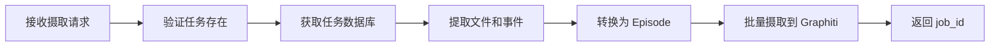
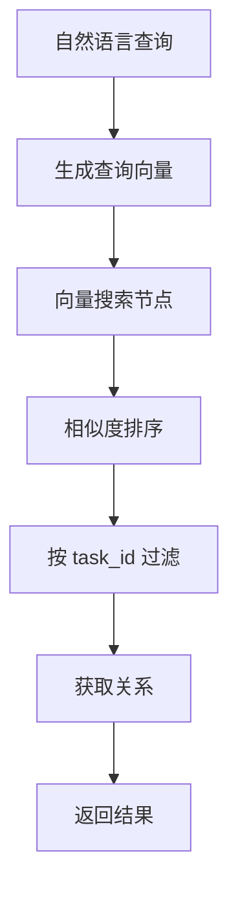
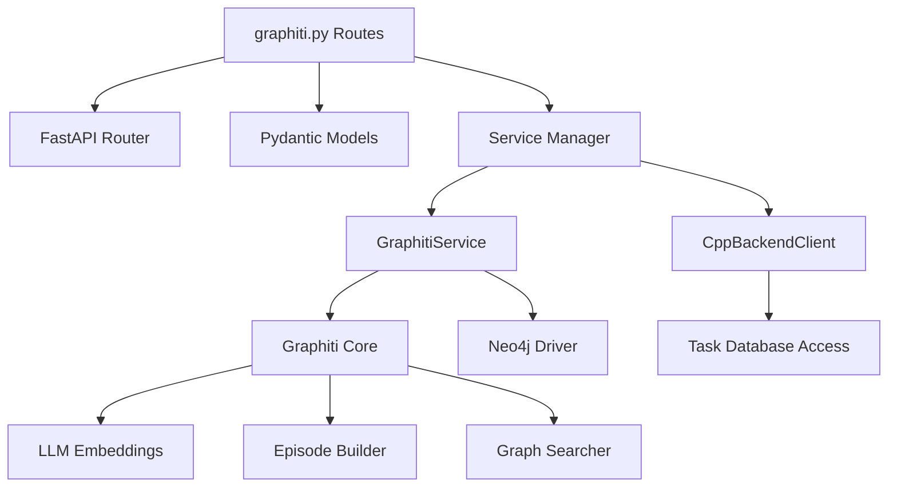
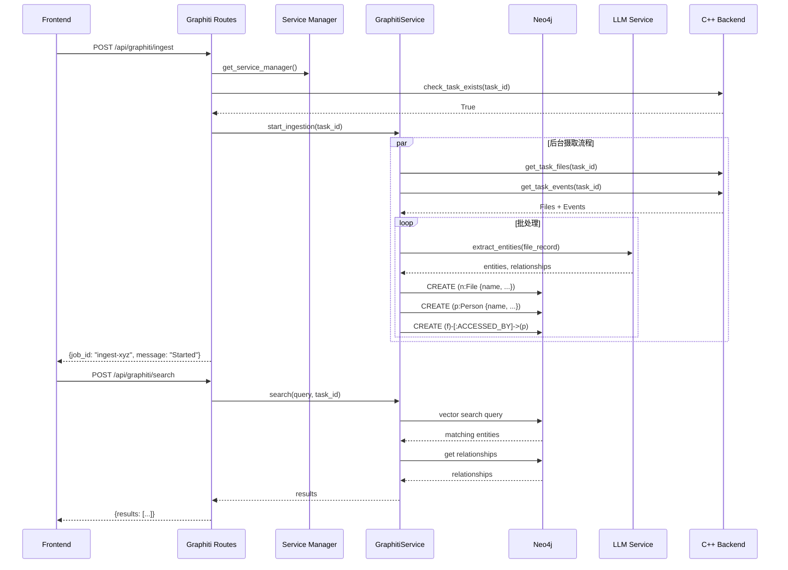
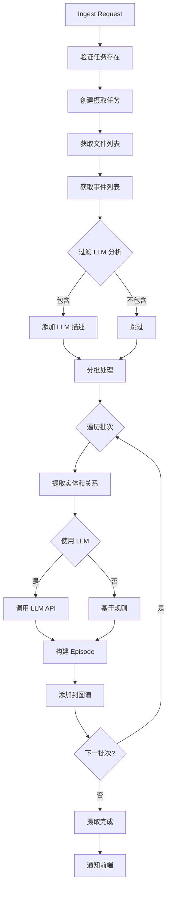
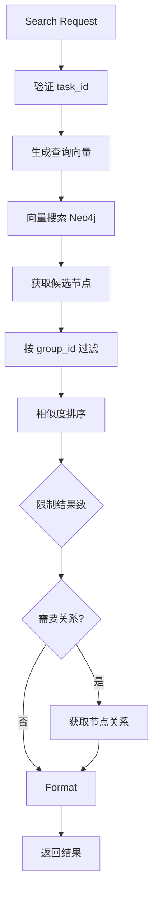

# Graphiti Knowledge Graph Routes 模块文档

## 1. 模块背景

### 业务背景

在数字取证分析中，数据之间的关系往往比数据本身更重要。Graphiti 知识图谱路由模块为每个取证任务提供独立的知识图谱命名空间，实现：

1. **实体关系提取**: 从文件元数据、时间线事件、LLM 分析结果中提取实体和关系
2. **关联分析**: 发现跨文件、跨时间的隐藏关联（如：同一用户访问多个可疑文件）
3. **智能检索**: 支持自然语言查询，如"查找所有与恶意软件相关的文档"
4. **可视化支持**: 提供图结构数据用于前端力导向图渲染
5. **任务隔离**: 每个任务使用独立的 `group_id`，确保数据安全和多租户隔离

**典型应用场景**：

```
调查场景：分析员工数据泄露行为

1. 文件分析：发现大量敏感文档被访问
   ↓
2. 知识图谱：构建 [用户] → [访问] → [文档] 关系
   ↓
3. 关联分析：发现异常访问模式（非工作时间、大文件传输）
   ↓
4. 证据链：构建完整的时间线和证据关系图
```

### 技术背景

**Graphiti 框架**：

Graphiti 是基于 Neo4j 的知识图谱构建框架，提供：
- **自动实体提取**: 使用 LLM 从文本中识别实体（人名、地点、组织、时间等）
- **关系发现**: 自动发现实体间的语义关系
- **向量搜索**: 基于 Neo4j GDS 的图向量搜索
- **时间窗口**: 支持时序图谱，追踪关系演化

**任务隔离机制**：

```python
# 每个任务使用独立的 group_id
group_id = f"task_{task_id}"  # 例如: "task_abc-123-def"

# Graphiti 会自动隔离数据
await graphiti.add_episode(
    name=episode_name,
    episode_body=content,
    group_id=group_id,  # 关键：任务级隔离
    reference=reference
)
```

**Neo4j 图数据库架构**：

```cypher
// 节点类型
(:File {name, path, size, type})
(:Person {name, email})
(:Organization {name})
(:Event {timestamp, type})
(:Keyword {text})

// 关系类型
(:File)-[:ACCESSED_BY]->(:Person)
(:File)-[:CONTAINS]->(:Keyword)
(:File)-[:RELATED_TO]->(:Event)
(:Person)-[:MEMBER_OF]->(:Organization)
```

---

## 2. 模块功能

### 核心功能

| 功能 | 端点 | 描述 |
|------|------|------|
| **数据摄取** | `POST /api/graphiti/ingest` | 将任务数据摄取到知识图谱 |
| **图谱搜索** | `POST /api/graphiti/search` | 自然语言搜索图谱 |
| **实体列表** | `GET /api/graphiti/entities` | 列出任务的所有实体 |
| **关系列表** | `GET /api/graphiti/relationships` | 列出任务的关系 |
| **图谱状态** | `GET /api/graphiti/status` | 获取图谱服务状态 |
| **任务列表** | `GET /api/graphiti/tasks` | 列出所有有图谱的任务 |
| **删除图谱** | `DELETE /api/graphiti/tasks/{task_id}` | 删除任务图谱 |
| **图数据** | `GET /api/graphiti/graph` | 获取可视化图数据 |

### 功能详解

#### 1. 数据摄取 (`/api/graphiti/ingest`)

**请求参数**:
```python
{
    "task_id": "abc-123-def",                    # 任务 ID（作为 group_id）
    "include_llm_descriptions": true,            # 是否包含 LLM 描述
    "batch_size": 50                             # 批处理大小
}
```

**处理流程**:



**数据源**:

1. **文件记录** (`_files.db`):
   - 文件路径、名称、类型
   - LLM 描述（如果已分析）
   - MD5 哈希、时间戳

2. **事件记录** (`_events.db`):
   - 文件创建、修改、访问、删除事件
   - 时间戳、事件类型

3. **平台数据** (`_android.db`, `_windows.db`, `_linux.db`):
   - Android 联系人、通话记录
   - Windows 注册表键值
   - Linux 系统日志

**响应**:
```json
{
  "success": true,
  "task_id": "abc-123-def",
  "job_id": "ingest-xyz-789",
  "message": "Ingestion started for task abc-123-def",
  "timestamp": "2026-03-16T10:30:00Z"
}
```

#### 2. 图谱搜索 (`/api/graphiti/search`)

**请求参数**:
```python
{
    "query": "malware documents accessed by user john",
    "task_id": "abc-123-def",                     # 在哪个任务中搜索
    "entity_types": ["File", "Person"],           # 可选：过滤实体类型
    "limit": 100,                                 # 最大结果数
    "include_relationships": true                 # 包含关系信息
}
```

**搜索机制**:



**响应示例**:
```json
{
  "success": true,
  "query": "malware documents accessed by user john",
  "task_id": "abc-123-def",
  "results": [
    {
      "entity_id": "file_456",
      "entity_type": "File",
      "name": "suspicious.exe",
      "properties": {
        "path": "/Downloads/suspicious.exe",
        "size": 2048576,
        "md5": "abc123..."
      },
      "score": 0.92,
      "relationships": [
        {
          "type": "ACCESSED_BY",
          "target": "person_john",
          "target_name": "John Doe",
          "timestamp": "2026-03-15T14:30:00Z"
        }
      ]
    }
  ],
  "total_count": 1,
  "timestamp": "2026-03-16T10:30:00Z"
}
```

#### 3. 实体和关系查询

**列出示例**:
```bash
# 列出所有文件实体
GET /api/graphiti/entities?task_id=abc-123-def&entity_type=File&page=1&page_size=50

# 列出所有访问关系
GET /api/graphiti/relationships?task_id=abc-123-def&relationship_type=ACCESSED_BY

# 查找特定实体的关系
GET /api/graphiti/relationships?task_id=abc-123-def&source_id=file_456
```

#### 4. 图数据导出 (`/api/graphiti/graph`)

返回用于前端力导向图渲染的数据：

```json
{
  "success": true,
  "task_id": "abc-123-def",
  "nodes": [
    {
      "id": "file_456",
      "label": "suspicious.exe",
      "type": "File",
      "properties": {...}
    },
    {
      "id": "person_john",
      "label": "John Doe",
      "type": "Person",
      "properties": {...}
    }
  ],
  "links": [
    {
      "source": "file_456",
      "target": "person_john",
      "label": "ACCESSED_BY",
      "properties": {
        "timestamp": "2026-03-15T14:30:00Z"
      }
    }
  ],
  "node_count": 2,
  "link_count": 1,
  "timestamp": "2026-03-16T10:30:00Z"
}
```

### 边界与限制

| 限制 | 说明 | 缓解措施 |
|------|------|----------|
| **Neo4j 连接** | 需要 Neo4j 服务运行 | 优雅降级，禁用图谱功能 |
| **摄取时间** | 大型任务摄取较慢 | 使用批处理和进度回调 |
| **内存占用** | 图数据加载占用内存 | 分页查询，限制节点数 |
| **搜索精度** | 依赖 LLM 向量化 | 使用特定领域词表 |
| **任务隔离** | 使用 group_id 隔离 | 验证所有查询都包含 task_id |

---

## 3. 模块使用的库

### 依赖库清单

| 库名 | 版本 | 用途 |
|------|------|------|
| **fastapi** | ^0.104.0 | Web 框架 |
| **pydantic** | ^2.5.0 | 数据验证 |
| **graphiti** | ^0.1.0 | 知识图谱核心库 |
| **neo4j** | ^5.0.0 | Neo4j Python 驱动 |
| **python-multipart** | ^0.0.6 | 文件上传支持 |

### 依赖关系图



### 核心代码依赖

**GraphitiService** (`services/graphiti_service.py`):

```python
class GraphitiService:
    def __init__(self, neo4j_uri: str, neo4j_user: str, neo4j_password: str):
        self.client = Neo4jClient(uri=neo4j_uri, user=neo4j_user, password=neo4j_password)
        self.graphiti = Graphiti(self.client)

    async def start_ingestion(self, task_id: str, include_llm: bool, batch_size: int) -> str:
        """启动摄取任务"""
        job_id = generate_job_id()

        # 后台执行
        asyncio.create_task(self._run_ingestion(job_id, task_id, include_llm, batch_size))

        return job_id

    async def search(self, query: str, task_id: str, **kwargs) -> List[Dict]:
        """搜索图谱"""
        group_id = f"task_{task_id}"
        results = await self.graphiti.search(
            query=query,
            group_id=group_id,
            **kwargs
        )
        return results

    async def get_graph_data(self, task_id: str, max_nodes: int) -> Tuple[List, List]:
        """获取图数据用于可视化"""
        group_id = f"task_{task_id}"

        # Cypher 查询
        nodes_query = f"""
            MATCH (n)
            WHERE n.group_id = $group_id
            RETURN n LIMIT $max_nodes
        """

        links_query = f"""
            MATCH (n1)-[r]->(n2)
            WHERE n1.group_id = $group_id AND n2.group_id = $group_id
            RETURN n1.id as source, n2.id as target, type(r) as label, r as properties
        """

        nodes = await self.client.execute_query(nodes_query, {"group_id": group_id, "max_nodes": max_nodes})
        links = await self.client.execute_query(links_query, {"group_id": group_id})

        return nodes, links
```

---

## 4. 模块实现方式

### 架构设计



### 核心类说明

#### 1. 请求/响应模型

```python
class IngestRequest(BaseModel):
    """摄取请求"""
    task_id: str = Field(..., description="任务 ID（用作 group_id）")
    include_llm_descriptions: bool = Field(default=True, description="包含 LLM 描述")
    batch_size: int = Field(default=50, ge=1, le=500, description="批处理大小")

class SearchRequest(BaseModel):
    """搜索请求"""
    query: str = Field(..., min_length=1, description="搜索查询")
    task_id: str = Field(..., description="任务 ID")
    entity_types: Optional[List[str]] = Field(None, description="过滤实体类型")
    limit: int = Field(default=100, ge=1, le=1000, description="最大结果")
    include_relationships: bool = Field(default=True, description="包含关系")

class SearchResult(BaseModel):
    """单个搜索结果"""
    entity_id: str
    entity_type: str
    name: str
    properties: Dict[str, Any]
    score: float
    relationships: Optional[List[Dict[str, Any]]]
```

#### 2. 路由处理器

```python
@router.post("/ingest", response_model=IngestResponse)
async def ingest_data(
    request: IngestRequest,
    background_tasks: BackgroundTasks,
    settings: Settings = Depends(get_settings),
):
    """摄取任务数据到知识图谱"""
    try:
        from ..services import get_service_manager
        service_manager = get_service_manager()

        # 验证任务存在
        task_exists = await service_manager.cpp_backend.check_task_exists(request.task_id)
        if not task_exists:
            raise HTTPException(status_code=404, detail=f"Task {request.task_id} not found")

        # 启动后台摄取
        job_id = await service_manager.graphiti_service.start_ingestion(
            task_id=request.task_id,
            include_llm_descriptions=request.include_llm_descriptions,
            batch_size=request.batch_size,
        )

        return IngestResponse(
            success=True,
            task_id=request.task_id,
            job_id=job_id,
            message=f"Ingestion started for task {request.task_id}",
            timestamp=datetime.now().isoformat(),
        )
    except HTTPException:
        raise
    except Exception as e:
        logger.error(f"Ingestion failed: {e}", exc_info=True)
        raise HTTPException(status_code=500, detail=str(e))
```

### 关键流程

#### 数据摄取流程



**实现代码**:

```python
async def _run_ingestion(self, job_id: str, task_id: str, include_llm: bool, batch_size: int):
    """执行摄取任务（后台运行）"""
    try:
        from .database_reader import DatabaseReader
        from .toon_transformer import TOONTransformer

        group_id = f"task_{task_id}"

        # 读取数据
        reader = DatabaseReader(task_id)
        transformer = TOONTransformer(task_id)

        # 获取文件和事件
        files = await reader.get_files()
        events = await reader.get_events()

        # 批处理
        for i in range(0, len(files), batch_size):
            batch = files[i:i + batch_size]

            for file_record in batch:
                # 构建 Episode
                content = transformer.file_to_episode(file_record, include_llm=include_llm)

                # 添加到图谱
                await self.graphiti.add_episode(
                    name=f"file_{file_record['id']}",
                    episode_body=content,
                    group_id=group_id,
                    reference={"file_id": file_record['id'], "path": file_record['path']}
                )

        # 摄取事件
        for event in events:
            content = transformer.event_to_episode(event)
            await self.graphiti.add_episode(
                name=f"event_{event['id']}",
                episode_body=content,
                group_id=group_id,
                reference={"event_id": event['id']}
            )

    except Exception as e:
        logger.error(f"Ingestion job {job_id} failed: {e}", exc_info=True)
```

#### 图谱搜索流程



**实现代码**:

```python
async def search(
    self,
    query: str,
    task_id: str,
    entity_types: Optional[List[str]] = None,
    limit: int = 100,
    include_relationships: bool = True
) -> List[Dict[str, Any]]:
    """搜索图谱"""
    group_id = f"task_{task_id}"

    # 1. 向量搜索
    search_results = await self.graphiti.search(
        query=query,
        group_id=group_id,
        limit=limit * 2,  # 获取更多候选
    )

    # 2. 过滤和排序
    filtered = []
    for result in search_results:
        # 实体类型过滤
        if entity_types and result.get("type") not in entity_types:
            continue

        filtered.append({
            "id": result.get("id"),
            "type": result.get("type", "Unknown"),
            "name": result.get("name", ""),
            "properties": result.get("properties", {}),
            "score": result.get("score", 0.0),
        })

    # 3. 限制结果数
    filtered = filtered[:limit]

    # 4. 获取关系
    if include_relationships:
        for result in filtered:
            entity_id = result["id"]
            relationships = await self._get_relationships(group_id, entity_id)
            result["relationships"] = relationships

    return filtered

async def _get_relationships(self, group_id: str, entity_id: str) -> List[Dict]:
    """获取实体的关系"""
    query = """
        MATCH (n1)-[r]->(n2)
        WHERE n1.group_id = $group_id AND elementId(n1) = $entity_id
        RETURN type(r) as type, n2.name as target_name, n2.id as target_id, r as properties
    """

    results = await self.client.execute_query(
        query,
        {"group_id": group_id, "entity_id": entity_id}
    )

    return [
        {
            "type": r["type"],
            "target": r["target_id"],
            "target_name": r["target_name"],
            "properties": r["properties"]
        }
        for r in results
    ]
```

### 数据结构

#### Neo4j 节点结构

```cypher
// 文件节点
(:File {
  group_id: "task_abc-123",
  id: "file_456",
  name: "document.pdf",
  path: "/path/to/document.pdf",
  size: 1024000,
  type: "PDF",
  md5: "abc123...",
  created_time: "2026-03-15T10:00:00Z",
  llm_description: "Contains financial data...",
  keywords: ["financial", "report"]
})

// 人物节点
(:Person {
  group_id: "task_abc-123",
  id: "person_john",
  name: "John Doe",
  email: "john@example.com"
})

// 关系
(:File)-[:ACCESSED_BY {timestamp: "2026-03-15T14:30:00Z"}]->(:Person)
```

#### 请求/响应示例

```python
# 摄取请求
ingest_request = {
    "task_id": "task-123",
    "include_llm_descriptions": True,
    "batch_size": 50
}

# 搜索请求
search_request = {
    "query": "所有与恶意软件相关的 PDF 文档",
    "task_id": "task-123",
    "entity_types": ["File", "Keyword"],
    "limit": 50,
    "include_relationships": True
}

# 图数据响应
graph_data = {
    "nodes": [
        {"id": "file_1", "label": "malware.pdf", "type": "File"},
        {"id": "person_1", "label": "John", "type": "Person"}
    ],
    "links": [
        {"source": "file_1", "target": "person_1", "label": "ACCESSED_BY"}
    ]
}
```

---

## 5. API 调用

### REST API

#### 1. 数据摄取

**请求**:
```http
POST /api/graphiti/ingest HTTP/1.1
Host: localhost:8090
Content-Type: application/json

{
  "task_id": "abc-123-def",
  "include_llm_descriptions": true,
  "batch_size": 50
}
```

**响应**:
```http
HTTP/1.1 200 OK
Content-Type: application/json

{
  "success": true,
  "task_id": "abc-123-def",
  "job_id": "ingest-xyz-789",
  "message": "Ingestion started for task abc-123-def",
  "timestamp": "2026-03-16T10:30:00.123456"
}
```

**curl 示例**:
```bash
curl -X POST http://localhost:8090/api/graphiti/ingest \
  -H "Content-Type: application/json" \
  -d '{
    "task_id": "abc-123-def",
    "include_llm_descriptions": true,
    "batch_size": 50
  }' | jq
```

#### 2. 图谱搜索

**请求**:
```http
POST /api/graphiti/search HTTP/1.1
Host: localhost:8090
Content-Type: application/json

{
  "query": "malware documents accessed by user john",
  "task_id": "abc-123-def",
  "entity_types": ["File", "Person"],
  "limit": 50,
  "include_relationships": true
}
```

**响应**:
```http
HTTP/1.1 200 OK
Content-Type: application/json

{
  "success": true,
  "query": "malware documents accessed by user john",
  "task_id": "abc-123-def",
  "results": [
    {
      "entity_id": "file_456",
      "entity_type": "File",
      "name": "suspicious.exe",
      "properties": {
        "path": "/Downloads/suspicious.exe",
        "size": 2048576,
        "md5": "abc123...",
        "llm_description": "Suspicious executable with network behavior"
      },
      "score": 0.92,
      "relationships": [
        {
          "type": "ACCESSED_BY",
          "target": "person_john",
          "target_name": "John Doe",
          "timestamp": "2026-03-15T14:30:00Z"
        }
      ]
    }
  ],
  "total_count": 1,
  "timestamp": "2026-03-16T10:30:00.123456"
}
```

**curl 示例**:
```bash
curl -X POST http://localhost:8090/api/graphiti/search \
  -H "Content-Type: application/json" \
  -d '{
    "query": "malware documents",
    "task_id": "abc-123-def",
    "limit": 50
  }' | jq
```

#### 3. 列出实体

**请求**:
```http
GET /api/graphiti/entities?task_id=abc-123-def&entity_type=File&page=1&page_size=50 HTTP/1.1
Host: localhost:8090
```

**响应**:
```http
HTTP/1.1 200 OK
Content-Type: application/json

{
  "success": true,
  "task_id": "abc-123-def",
  "entities": [
    {
      "id": "file_456",
      "type": "File",
      "name": "document.pdf",
      "properties": {
        "path": "/docs/document.pdf",
        "size": 1024000
      }
    }
  ],
  "total_count": 150,
  "page": 1,
  "page_size": 50,
  "timestamp": "2026-03-16T10:30:00.123456"
}
```

**curl 示例**:
```bash
curl -X GET "http://localhost:8090/api/graphiti/entities?task_id=abc-123-def&entity_type=File&page=1&page_size=50" | jq
```

#### 4. 获取图数据

**请求**:
```http
GET /api/graphiti/graph?task_id=abc-123-def&max_nodes=200 HTTP/1.1
Host: localhost:8090
```

**响应**:
```http
HTTP/1.1 200 OK
Content-Type: application/json

{
  "success": true,
  "task_id": "abc-123-def",
  "nodes": [
    {
      "id": "file_456",
      "label": "suspicious.exe",
      "type": "File",
      "properties": {
        "path": "/Downloads/suspicious.exe",
        "size": 2048576
      }
    },
    {
      "id": "person_john",
      "label": "John Doe",
      "type": "Person",
      "properties": {
        "email": "john@example.com"
      }
    }
  ],
  "links": [
    {
      "source": "file_456",
      "target": "person_john",
      "label": "ACCESSED_BY",
      "properties": {
        "timestamp": "2026-03-15T14:30:00Z"
      }
    }
  ],
  "node_count": 2,
  "link_count": 1,
  "timestamp": "2026-03-16T10:30:00.123456"
}
```

**curl 示例**:
```bash
curl -X GET "http://localhost:8090/api/graphiti/graph?task_id=abc-123-def&max_nodes=200" | jq
```

#### 5. 删除任务图谱

**请求**:
```http
DELETE /api/graphiti/tasks/abc-123-def HTTP/1.1
Host: localhost:8090
```

**响应**:
```http
HTTP/1.1 200 OK
Content-Type: application/json

{
  "success": true,
  "task_id": "abc-123-def",
  "message": "Graph deleted",
  "timestamp": "2026-03-16T10:30:00.123456"
}
```

**curl 示例**:
```bash
curl -X DELETE http://localhost:8090/api/graphiti/tasks/abc-123-def | jq
```

---

## 6. 二次开发

### 扩展点

#### 1. 自定义实体提取器

**场景**: 添加 IP 地址、URL 等网络安全相关实体

```python
import re
from typing import List, Dict

class NetworkEntityExtractor:
    """网络安全实体提取器"""

    def extract(self, text: str) -> List[Dict]:
        entities = []

        # 提取 IP 地址
        ip_pattern = r'\b(?:\d{1,3}\.){3}\d{1,3}\b'
        for match in re.finditer(ip_pattern, text):
            entities.append({
                "type": "IPAddress",
                "name": match.group(),
                "properties": {"address": match.group()}
            })

        # 提取 URL
        url_pattern = r'https?://[^\s<>"]+'
        for match in re.finditer(url_pattern, text):
            entities.append({
                "type": "URL",
                "name": match.group(),
                "properties": {"url": match.group()}
            })

        return entities

# 在摄取时使用
extractor = NetworkEntityExtractor()

for file_record in files:
    content = file_record.get("content", "")

    # 使用自定义提取器
    custom_entities = extractor.extract(content)

    # 添加到图谱
    for entity in custom_entities:
        await graphiti_service.add_entity(
            group_id=group_id,
            entity_type=entity["type"],
            name=entity["name"],
            properties=entity["properties"]
        )
```

#### 2. 自定义关系发现器

**场景**: 发现"相同 MD5"关系（识别重复文件）

```python
async def discover_duplicate_files(group_id: str, client: Neo4jClient):
    """发现重复文件关系"""
    query = """
        MATCH (f1:File), (f2:File)
        WHERE f1.group_id = $group_id
          AND f2.group_id = $group_id
          AND f1.md5 = f2.md5
          AND elementId(f1) < elementId(f2)
        MERGE (f1)-[r:DUPLICATE_OF]->(f2)
        RETURN count(r) as duplicates_found
    """

    result = await client.execute_query(query, {"group_id": group_id})
    return result[0]["duplicates_found"]

# 在摄取完成后调用
await discover_duplicate_files(group_id, neo4j_client)
```

#### 3. 添加时间分析功能

**场景**: 分析事件时间模式

```python
@router.get("/api/graphiti/temporal-analysis")
async def temporal_analysis(
    task_id: str = Query(...),
    granularity: str = Query("hour", regex="^(hour|day|week)$")
):
    """时间维度分析"""
    group_id = f"task_{task_id}"

    # 根据粒度构建时间桶查询
    if granularity == "hour":
        time_format = "%Y-%m-%dT%H:00:00"
    elif granularity == "day":
        time_format = "%Y-%m-%dT00:00:00"
    else:  # week
        time_format = "%Y-W%V"

    query = f"""
        MATCH (e:Event)
        WHERE e.group_id = $group_id
        RETURN
            datetime(e.timestamp).format("{time_format}") as time_bucket,
            count(e) as event_count
        ORDER BY time_bucket
    """

    results = await neo4j_client.execute_query(query, {"group_id": group_id})

    return {
        "task_id": task_id,
        "granularity": granularity,
        "time_buckets": [
            {"time": r["time_bucket"], "count": r["event_count"]}
            for r in results
        ]
    }
```

### 添加新功能的步骤

#### 步骤 1: 定义新的请求/响应模型

```python
class GraphAnalyticsRequest(BaseModel):
    """图谱分析请求"""
    task_id: str
    analysis_type: str  # "centrality", "community", "path"
    parameters: Dict[str, Any] = {}

class GraphAnalyticsResponse(BaseModel):
    """图谱分析响应"""
    task_id: str
    analysis_type: str
    results: Dict[str, Any]
```

#### 步骤 2: 实现分析逻辑

```python
@router.post("/api/graphiti/analyze")
async def analyze_graph(request: GraphAnalyticsRequest):
    """执行图谱分析"""
    group_id = f"task_{request.task_id}"

    if request.analysis_type == "centrality":
        # 中心性分析
        query = """
            MATCH (n)-[r]->(m)
            WHERE n.group_id = $group_id
            WITH n, count(r) as degree
            ORDER BY degree DESC
            LIMIT 10
            RETURN n.name as name, n.type as type, degree
        """
        results = await neo4j_client.execute_query(query, {"group_id": group_id})

        return {
            "task_id": request.task_id,
            "analysis_type": "centrality",
            "results": {
                "top_nodes": [
                    {"name": r["name"], "type": r["type"], "degree": r["degree"]}
                    for r in results
                ]
            }
        }

    elif request.analysis_type == "community":
        # 社区检测（使用 Louvain 算法）
        query = """
            CALL communityDetection($group_id)
            YIELD nodeId, community
            RETURN community, collect(nodeId) as members
        """
        # ... 实现社区检测
```

#### 步骤 3: 添加服务层方法

```python
# 在 GraphitiService 中添加
class GraphitiService:
    async def compute_centrality(self, group_id: str) -> List[Dict]:
        """计算节点中心性"""
        query = """
            MATCH (n)-[r]->(m)
            WHERE n.group_id = $group_id
            WITH n, count(r) as degree
            RETURN n.id as id, n.name as name, degree
            ORDER BY degree DESC
            LIMIT 100
        """

        results = await self.client.execute_query(query, {"group_id": group_id})
        return results
```

#### 步骤 4: 添加测试

```python
@pytest.mark.asyncio
async def test_centrality_analysis():
    """测试中心性分析"""
    response = await client.post("/api/graphiti/analyze", json={
        "task_id": "test-task",
        "analysis_type": "centrality"
    })

    assert response.status_code == 200
    data = response.json()
    assert "results" in data
    assert "top_nodes" in data["results"]
```

### 代码示例

#### 示例 1: 路径查询

```python
@router.get("/api/graphiti/shortest-path")
async def shortest_path(
    task_id: str = Query(...),
    source_id: str = Query(...),
    target_id: str = Query(...)
):
    """查找两个实体间的最短路径"""
    group_id = f"task_{task_id}"

    query = """
        MATCH path = shortestPath(
            (source)-[*..6]-(target)
        )
        WHERE source.group_id = $group_id
          AND target.group_id = $group_id
          AND elementId(source) = $source_id
          AND elementId(target) = $target_id
        RETURN [node in nodes(path) | {
            id: elementId(node),
            name: node.name,
            type: labels(node)[0]
        }] as nodes,
        [rel in relationships(path) | {
            type: type(rel),
            source: elementId(startNode(rel)),
            target: elementId(endNode(rel))
        }] as relationships
    """

    result = await neo4j_client.execute_query(query, {
        "group_id": group_id,
        "source_id": source_id,
        "target_id": target_id
    })

    if not result:
        return {"path": None}

    return {
        "nodes": result[0]["nodes"],
        "relationships": result[0]["relationships"],
        "length": len(result[0]["nodes"])
    }
```

#### 示例 2: 子图导出

```python
@router.get("/api/graphiti/subgraph")
async def get_subgraph(
    task_id: str = Query(...),
    center_node_id: str = Query(...),
    depth: int = Query(1, ge=1, le=3)
):
    """获取以某节点为中心的子图"""
    group_id = f"task_{task_id}"

    # 使用可变长度路径
    query = f"""
        MATCH (center)-[r*1..{depth}]-(neighbor)
        WHERE center.group_id = $group_id
          AND neighbor.group_id = $group_id
          AND elementId(center) = $center_id
        RETURN DISTINCT
            center,
            neighbor,
            relationships(r) as rels
    """

    results = await neo4j_client.execute_query(query, {
        "group_id": group_id,
        "center_id": center_node_id
    })

    # 构建节点和边
    nodes = set()
    links = []

    for record in results:
        center = record["center"]
        neighbor = record["neighbor"]

        nodes.add((center.element_id, center["name"], labels(center)[0]))
        nodes.add((neighbor.element_id, neighbor["name"], labels(neighbor)[0]))

        for rel in record["rels"]:
            links.append({
                "source": rel.start_node.element_id,
                "target": rel.end_node.element_id,
                "label": type(rel)
            })

    return {
        "nodes": [{"id": nid, "name": name, "type": ntype} for nid, name, ntype in nodes],
        "links": links
    }
```

---

## 7. 其他

### 测试

#### 单元测试

```python
import pytest
from httpx import AsyncClient

@pytest.mark.asyncio
async def test_ingest_data(client: AsyncClient, mock_service_manager):
    """测试数据摄取"""
    mock_service_manager.cpp_backend.check_task_exists.return_value = True
    mock_service_manager.graphiti_service.start_ingestion.return_value = "job-123"

    response = await client.post("/api/graphiti/ingest", json={
        "task_id": "test-task",
        "include_llm_descriptions": True,
        "batch_size": 50
    })

    assert response.status_code == 200
    data = response.json()
    assert data["success"] == True
    assert "job_id" in data

@pytest.mark.asyncio
async def test_search_graph(client: AsyncClient, mock_service_manager):
    """测试图谱搜索"""
    mock_service_manager.graphiti_service.search.return_value = [
        {
            "id": "file_1",
            "type": "File",
            "name": "test.pdf",
            "properties": {},
            "score": 0.9,
            "relationships": []
        }
    ]

    response = await client.post("/api/graphiti/search", json={
        "query": "test document",
        "task_id": "test-task",
        "limit": 50
    })

    assert response.status_code == 200
    data = response.json()
    assert data["success"] == True
    assert len(data["results"]) == 1
```

#### 集成测试

```python
@pytest.mark.integration
async def test_full_ingestion_workflow():
    """测试完整摄取工作流"""
    # 1. 创建任务
    # 2. 启动摄取
    # 3. 等待完成
    # 4. 验证图谱数据
    # 5. 测试搜索
    pass
```

### 配置

#### Neo4j 连接配置

```bash
# .env 配置
NEO4J_URI=bolt://localhost:7687
NEO4J_USER=neo4j
NEO4J_PASSWORD=password
GRAPHITI_GROUP_ID_PREFIX=task_
```

#### 性能调优参数

```python
# config.py
class GraphitiConfig(BaseSettings):
    """Graphiti 配置"""
    ingestion_batch_size: int = 50
    search_limit: int = 100
    max_nodes_in_graph: int = 500
    vector_search_threshold: float = 0.7
    enable_caching: bool = True
    cache_ttl_seconds: int = 300

    class Config:
        env_prefix = "GRAPHITI_"
```

### 故障排查

#### 常见问题

| 问题 | 可能原因 | 解决方法 |
|------|----------|----------|
| **摄取失败** | Neo4j 连接断开 | 检查 Neo4j 服务状态，验证连接配置 |
| **搜索无结果** | 向量化失败 | 验证 LLM 服务，检查 embedding 模型 |
| **关系缺失** | Episode 构建错误 | 检查转换器逻辑，验证数据格式 |
| **内存溢出** | 图数据过大 | 分批处理，使用分页查询 |
| **任务隔离失效** | group_id 错误 | 验证所有查询都使用正确的 group_id |

#### 调试技巧

**1. 查看 Neo4j 查询日志**:

```cypher
// 查看最近执行的查询
CALL dbms.listQueries()

// 查看节点统计
MATCH (n)
WHERE n.group_id = "task_abc-123"
RETURN labels(n) as type, count(n) as count
```

**2. 检查摄取进度**:

```python
@router.get("/api/graphiti/ingest/{job_id}/progress")
async def get_ingestion_progress(job_id: str):
    """获取摄取任务进度"""
    progress = await service_manager.graphiti_service.get_ingestion_progress(job_id)

    return {
        "job_id": job_id,
        "status": progress["status"],
        "files_processed": progress["files_processed"],
        "files_total": progress["files_total"],
        "entities_created": progress["entities_created"],
        "relationships_created": progress["relationships_created"],
        "current_batch": progress.get("current_batch", 0)
    }
```

**3. 验证任务隔离**:

```python
@router.get("/api/graphiti/verify-isolation")
async def verify_task_isolation(task_id: str):
    """验证任务数据隔离"""
    group_id = f"task_{task_id}"

    # 确保没有其他任务的节点
    query = """
        MATCH (n)
        WHERE n.group_id = $group_id
        RETURN count(n) as node_count
    """

    result = await neo4j_client.execute_query(query, {"group_id": group_id})

    return {
        "task_id": task_id,
        "group_id": group_id,
        "node_count": result[0]["node_count"],
        "is_isolated": True
    }
```

### 相关模块

- **GraphitiIntegration** (`docs/modules/python/graphiti/GraphitiIntegration.md`): Graphiti 集成核心文档
- **GraphitiIngestor** (`docs/modules/python/graphiti_integration/GraphitiIngestor.md`): 数据摄取引擎
- **TOONTransformer** (`docs/modules/python/graphiti_integration/TOONTransformer.md`): 数据转换器
- **DatabaseReader** (`docs/modules/python/graphiti_integration/DatabaseReader.md`): 数据库读取器

### 参考资源

- **Graphiti 官方文档**: https://github.com/getwaterto/graphiti
- **Neo4j 文档**: https://neo4j.com/docs/
- **Neo4j GDS 插件**: https://neo4j.com/docs/graph-data-science/current/
- **向量搜索**: https://neo4j.com/docs/operations-manual/current/vector-index/

### 变更历史

| 版本 | 日期 | 变更说明 | 作者 |
|------|------|----------|------|
| 1.0.0 | 2026-03-16 | 初始版本，实现摄取、搜索、查询、可视化端点 | Claude Code |

---

**文档完成日期**: 2026-03-16
**文档版本**: 1.0.0
**维护者**: ymj68520
