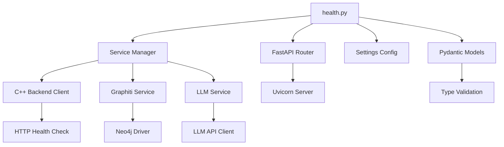
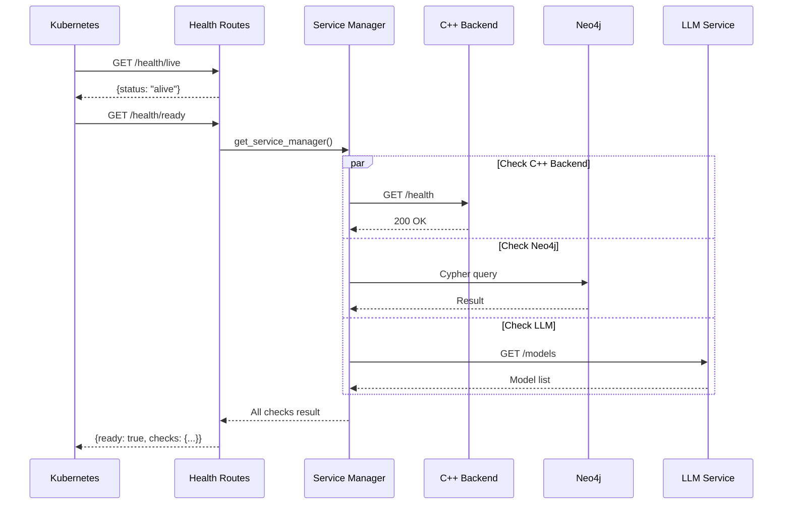

# Health Check Routes 模块文档

## 1. 模块背景

### 业务背景

在容器化和微服务架构中，服务健康检查是保障系统可用性的关键机制。Python FastAPI 服务作为数字取证系统的核心组件，需要提供标准的健康检查接口，以便：

1. **容器编排集成**: Kubernetes 等编排器需要通过 liveness 和 readiness probes 来判断服务状态
2. **负载均衡决策**: 负载均衡器根据健康状态决定是否将流量路由到实例
3. **监控告警**: 监控系统定期检查健康端点，触发告警或自动恢复
4. **服务发现**: 服务注册中心通过健康检查维护可用服务列表
5. **依赖验证**: 在服务启动后验证所有依赖服务（C++ 后端、Neo4j、LLM）的可用性

### 技术背景

**健康检查最佳实践**：

- **Liveness Probe（存活探针）**: 检测服务进程是否存活，失败时重启容器
- **Readiness Probe（就绪探针）**: 检测服务是否准备好处理请求，失败时从 Service 中摘除
- **Startup Probe（启动探针）**: 检测慢启动服务是否已启动，避免 liveness/readiness 误判

**FastAPI 实现特点**：

```python
# 异步路由支持
@router.get("/health")
async def health_check():
    # 非阻塞 I/O
    return {"status": "healthy"}

# 依赖注入
@router.get("/health/ready")
async def readiness_check(settings: Settings = Depends(get_settings)):
    # 访问配置
    pass
```

**Kubernetes 集成示例**：

```yaml
livenessProbe:
  httpGet:
    path: /health/live
    port: 8090
  initialDelaySeconds: 30
  periodSeconds: 10

readinessProbe:
  httpGet:
    path: /health/ready
    port: 8090
  initialDelaySeconds: 10
  periodSeconds: 5
```

---

## 2. 模块功能

### 核心功能

| 功能 | 端点 | 描述 |
|------|------|------|
| **基础健康检查** | `GET /health` | 返回服务基本状态和运行时间 |
| **存活探针** | `GET /health/live` | Kubernetes liveness probe，检测进程存活 |
| **就绪探针** | `GET /health/ready` | Kubernetes readiness probe，检测依赖连通性 |
| **系统信息** | `GET /api/system/info` | 返回配置和运行环境信息 |

### 功能详解

#### 1. 基础健康检查 (`/health`)

```python
{
  "status": "healthy",
  "timestamp": "2026-03-16T10:30:00Z",
  "version": "1.0.0",
  "uptime_seconds": 3600.5
}
```

**用途**：
- 快速验证服务是否响应
- 获取服务运行时间
- 确认服务版本

#### 2. 存活探针 (`/health/live`)

```python
{
  "status": "alive",
  "timestamp": "2026-03-16T10:30:00Z",
  "version": "1.0.0",
  "uptime_seconds": 3600.5
}
```

**用途**：
- Kubernetes liveness probe 专用
- 检测进程崩溃或死锁
- 失败时触发容器重启

**配置建议**：
```yaml
livenessProbe:
  initialDelaySeconds: 30  # 等待服务完全启动
  periodSeconds: 10        # 每 10 秒检查一次
  timeoutSeconds: 5        # 超时时间
  failureThreshold: 3      # 连续 3 次失败后重启
```

#### 3. 就绪探针 (`/health/ready`)

```python
{
  "ready": true,
  "checks": {
    "cpp_backend": {
      "status": "connected",
      "url": "http://localhost:8080"
    },
    "neo4j": {
      "status": "connected",
      "uri": "bolt://localhost:7687"
    },
    "llm": {
      "status": "available",
      "url": "http://localhost:1234"
    }
  },
  "timestamp": "2026-03-16T10:30:00Z"
}
```

**依赖检查逻辑**：

1. **C++ 后端**（必需）:
   - 发送 GET 请求到 `{cpp_backend_url}/health`
   - 连接失败时 `ready=false`
   - 用于转发取证分析请求

2. **Neo4j**（可选）:
   - 验证 Graphiti 知识图谱连接
   - 连接失败不影响 `ready` 状态
   - 仅禁用知识图谱功能

3. **LLM 服务**（可选）:
   - 验证 OpenAI 兼容 API 可用性
   - 连接失败不影响 `ready` 状态
   - 仅禁用 AI 分析功能

#### 4. 系统信息 (`/api/system/info`)

```python
{
  "service": "ForensicsProject Python Service",
  "version": "1.0.0",
  "python_version": "3.10.12",
  "config": {
    "http_port": 8090,
    "http_host": "0.0.0.0",
    "cpp_backend_url": "http://localhost:8080",
    "neo4j_uri": "bolt://localhost:7687",
    "llm_text_model": "llama-3-8b-instruct",
    "llm_vision_model": "llava-v1.6-7b",
    "log_level": "INFO",
    "platform": "Linux-6.5.0-generic-x86_64"
  },
  "timestamp": "2026-03-16T10:30:00Z"
}
```

### 边界与限制

| 限制 | 说明 | 缓解措施 |
|------|------|----------|
| **连接超时** | 依赖服务检查可能阻塞 | 设置合理的超时时间 |
| **网络分区** | 可能误报依赖不可用 | 实现重试机制 |
| **敏感信息** | 配置信息暴露 | 生产环境隐藏敏感字段 |
| **缓存问题** | 状态可能过时 | 每次实时检查 |

---

## 3. 模块使用的库

### 依赖库清单

| 库名 | 版本 | 用途 |
|------|------|------|
| **fastapi** | ^0.104.0 | Web 框架，路由和依赖注入 |
| **pydantic** | ^2.5.0 | 数据验证和序列化 |
| **time** | 标准库 | 运行时间计算 |
| **datetime** | 标准库 | 时间戳生成 |
| **sys** | 标准库 | Python 版本信息 |
| **platform** | 标准库 | 系统平台信息 |

### 依赖关系图



### 核心代码依赖

**配置加载** (`config.py`):

```python
from pydantic_settings import BaseSettings

class Settings(BaseSettings):
    python_http_port: int = 8090
    python_http_host: str = "0.0.0.0"
    cpp_backend_url: str = "http://localhost:8080"
    neo4j_uri: str = "bolt://localhost:7687"
    llm_text_base_url: str = "http://localhost:1234"

    class Config:
        env_file = ".env"

async def get_settings() -> Settings:
    return Settings()
```

---

## 4. 模块实现方式

### 架构设计



### 核心类说明

#### 1. 响应模型（Pydantic）

```python
class HealthResponse(BaseModel):
    """基础健康检查响应"""
    status: str                    # "healthy"
    timestamp: str                 # ISO 8601 格式
    version: str                   # 服务版本
    uptime_seconds: float          # 运行时长

class ReadinessResponse(BaseModel):
    """就绪探针响应"""
    ready: bool                    # 是否就绪
    checks: Dict[str, Any]         # 各依赖检查结果
    timestamp: str

class SystemInfoResponse(BaseModel):
    """系统信息响应"""
    service: str                   # 服务名称
    version: str                   # 服务版本
    python_version: str            # Python 版本
    config: Dict[str, Any]         # 配置信息
    timestamp: str
```

#### 2. 启动时间跟踪

```python
# 模块级变量，服务启动时初始化
_start_time = time.time()

def uptime() -> float:
    """计算服务运行时间"""
    return time.time() - _start_time
```

### 关键流程

#### 就绪探针检查流程

```mermaid
flowchart TD
    Start[GET /health/ready] --> GetSM[获取 Service Manager]
    GetSM --> Init[初始化 checks = {}]
    Init --> InitReady[all_ready = True]

    InitReady --> CheckCPP{检查 C++ Backend}
    CheckCPP -->|成功| CPPOK[cpp_backend: connected]
    CheckCPP -->|失败| CPPFail[cpp_backend: disconnected]
    CPPFail --> SetReady1[all_ready = False]

    CPPOK --> CheckNeo4j{检查 Neo4j}
    SetReady1 --> CheckNeo4j
    CheckNeo4j -->|连接成功| NeoOK[neo4j: connected]
    CheckNeo4j -->|未配置/失败| NeoFail[neo4j: unavailable]

    NeoOK --> CheckLLM{检查 LLM}
    NeoFail --> CheckLLM
    CheckLLM -->|可用| LLMOK[llm: available]
    CheckLLM -->|不可用| LLMFail[llm: unavailable]

    LLMOK --> BuildResp[构建响应]
    LLMFail --> BuildResp

    BuildResp --> Return[返回 ReadinessResponse]
```

#### 依赖检查实现

```python
async def readiness_check(settings: Settings = Depends(get_settings)):
    checks = {}
    all_ready = True

    # 1. C++ 后端检查（必需）
    try:
        from ..services import get_service_manager
        service_manager = get_service_manager()
        cpp_status = await service_manager.cpp_backend.health_check()
        checks["cpp_backend"] = {
            "status": "connected" if cpp_status else "disconnected",
            "url": settings.cpp_backend_url,
        }
        if not cpp_status:
            all_ready = False
    except Exception as e:
        checks["cpp_backend"] = {
            "status": "error",
            "error": str(e),
        }
        all_ready = False

    # 2. Neo4j 检查（可选）
    try:
        neo4j_status = await service_manager.graphiti_service.health_check()
        checks["neo4j"] = {
            "status": "connected" if neo4j_status else "disconnected",
            "uri": settings.neo4j_uri,
        }
    except Exception as e:
        checks["neo4j"] = {
            "status": "unavailable",
            "error": str(e),
        }
        # Neo4j 失败不影响 ready 状态

    # 3. LLM 检查（可选）
    try:
        llm_status = await service_manager.llm_service.health_check()
        checks["llm"] = {
            "status": "available" if llm_status else "unavailable",
            "url": settings.llm_text_base_url,
        }
    except Exception as e:
        checks["llm"] = {
            "status": "unavailable",
            "error": str(e),
        }
        # LLM 失败不影响 ready 状态

    return ReadinessResponse(
        ready=all_ready,
        checks=checks,
        timestamp=datetime.now().isoformat(),
    )
```

### 数据结构

#### Health Checks Map

```python
checks: Dict[str, Dict[str, Any]]
# 示例：
{
    "cpp_backend": {
        "status": "connected",        # connected, disconnected, error
        "url": "http://localhost:8080"
    },
    "neo4j": {
        "status": "connected",        # connected, unavailable, error
        "uri": "bolt://localhost:7687"
    },
    "llm": {
        "status": "available",        # available, unavailable, error
        "url": "http://localhost:1234"
    }
}
```

---

## 5. API 调用

### REST API

#### 1. 基础健康检查

**请求**:
```http
GET /health HTTP/1.1
Host: localhost:8090
```

**响应**:
```http
HTTP/1.1 200 OK
Content-Type: application/json

{
  "status": "healthy",
  "timestamp": "2026-03-16T10:30:00.123456",
  "version": "1.0.0",
  "uptime_seconds": 3600.5
}
```

**curl 示例**:
```bash
curl -X GET http://localhost:8090/health | jq
```

#### 2. 存活探针

**请求**:
```http
GET /health/live HTTP/1.1
Host: localhost:8090
```

**响应**:
```http
HTTP/1.1 200 OK
Content-Type: application/json

{
  "status": "alive",
  "timestamp": "2026-03-16T10:30:00.123456",
  "version": "1.0.0",
  "uptime_seconds": 3600.5
}
```

**curl 示例**:
```bash
curl -X GET http://localhost:8090/health/live | jq
```

**Kubernetes 配置**:
```yaml
livenessProbe:
  httpGet:
    path: /health/live
    port: 8090
  initialDelaySeconds: 30
  periodSeconds: 10
  timeoutSeconds: 5
  failureThreshold: 3
```

#### 3. 就绪探针

**请求**:
```http
GET /health/ready HTTP/1.1
Host: localhost:8090
```

**成功响应** (所有必需依赖可用):
```http
HTTP/1.1 200 OK
Content-Type: application/json

{
  "ready": true,
  "checks": {
    "cpp_backend": {
      "status": "connected",
      "url": "http://localhost:8080"
    },
    "neo4j": {
      "status": "connected",
      "uri": "bolt://localhost:7687"
    },
    "llm": {
      "status": "available",
      "url": "http://localhost:1234/v1"
    }
  },
  "timestamp": "2026-03-16T10:30:00.123456"
}
```

**未就绪响应** (C++ 后端不可用):
```http
HTTP/1.1 200 OK
Content-Type: application/json

{
  "ready": false,
  "checks": {
    "cpp_backend": {
      "status": "disconnected",
      "url": "http://localhost:8080"
    },
    "neo4j": {
      "status": "unavailable",
      "error": "Connection refused"
    },
    "llm": {
      "status": "available",
      "url": "http://localhost:1234/v1"
    }
  },
  "timestamp": "2026-03-16T10:30:00.123456"
}
```

**curl 示例**:
```bash
curl -X GET http://localhost:8090/health/ready | jq
```

**Kubernetes 配置**:
```yaml
readinessProbe:
  httpGet:
    path: /health/ready
    port: 8090
  initialDelaySeconds: 10
  periodSeconds: 5
  timeoutSeconds: 3
  successThreshold: 1
  failureThreshold: 3
```

#### 4. 系统信息

**请求**:
```http
GET /api/system/info HTTP/1.1
Host: localhost:8090
```

**响应**:
```http
HTTP/1.1 200 OK
Content-Type: application/json

{
  "service": "ForensicsProject Python Service",
  "version": "1.0.0",
  "python_version": "3.10.12 (main, Nov 20 2023, 15:14:05) [GCC 11.4.0]",
  "config": {
    "http_port": 8090,
    "http_host": "0.0.0.0",
    "cpp_backend_url": "http://localhost:8080",
    "neo4j_uri": "bolt://localhost:7687",
    "llm_text_model": "llama-3-8b-instruct",
    "llm_vision_model": "llava-v1.6-7b",
    "log_level": "INFO",
    "platform": "Linux-6.5.0-generic-x86_64-with-glibc2.35"
  },
  "timestamp": "2026-03-16T10:30:00.123456"
}
```

**curl 示例**:
```bash
curl -X GET http://localhost:8090/api/system/info | jq
```

---

## 6. 二次开发

### 扩展点

#### 1. 添加新的依赖检查

**场景**: 添加 Redis 缓存服务检查

```python
# 在 readiness_check 中添加
try:
    from ..services import get_service_manager
    service_manager = get_service_manager()

    # 添加 Redis 检查
    redis_status = await service_manager.redis_service.ping()
    checks["redis"] = {
        "status": "connected" if redis_status else "disconnected",
        "host": settings.redis_host,
        "port": settings.redis_port,
    }
    if not redis_status:
        # 根据需要决定是否影响 ready 状态
        all_ready = False
except Exception as e:
    checks["redis"] = {
        "status": "error",
        "error": str(e),
    }
    all_ready = False
```

#### 2. 自定义健康指标

**场景**: 添加内存、CPU 使用率检查

```python
import psutil

@router.get("/health/metrics")
async def health_metrics():
    """返回详细健康指标"""
    memory = psutil.virtual_memory()
    cpu_percent = psutil.cpu_percent(interval=1)

    return {
        "memory": {
            "total_gb": memory.total / (1024**3),
            "available_gb": memory.available / (1024**3),
            "percent_used": memory.percent,
            "status": "warning" if memory.percent > 80 else "ok"
        },
        "cpu": {
            "percent_used": cpu_percent,
            "core_count": psutil.cpu_count(),
            "status": "warning" if cpu_percent > 80 else "ok"
        },
        "disk": {
            "path": "/",
            "total_gb": psutil.disk_usage('/').total / (1024**3),
            "free_gb": psutil.disk_usage('/').free / (1024**3),
            "percent_used": psutil.disk_usage('/').percent,
        },
        "timestamp": datetime.now().isoformat(),
    }
```

#### 3. 健康状态缓存

**场景**: 减少频繁检查的开销

```python
from functools import lru_cache
from datetime import timedelta

# 缓存配置
HEALTH_CHECK_CACHE_TTL = 30  # 秒

class CachedHealthChecker:
    def __init__(self):
        self._cache = {}
        self._cache_time = {}

    async def check_with_cache(self, service_name: str, checker: Callable):
        now = time.time()
        cache_key = service_name

        # 检查缓存
        if cache_key in self._cache_time:
            cache_age = now - self._cache_time[cache_key]
            if cache_age < HEALTH_CHECK_CACHE_TTL:
                return self._cache[cache_key]

        # 执行检查
        result = await checker()

        # 更新缓存
        self._cache[cache_key] = result
        self._cache_time[cache_key] = now

        return result

# 使用
checker = CachedHealthChecker()

async def readiness_check(settings: Settings = Depends(get_settings)):
    cpp_status = await checker.check_with_cache(
        "cpp_backend",
        lambda: service_manager.cpp_backend.health_check()
    )
    # ...
```

### 添加新功能的步骤

#### 步骤 1: 定义新的响应模型

```python
from pydantic import BaseModel

class ExtendedHealthResponse(BaseModel):
    """扩展健康检查响应"""
    status: str
    timestamp: str
    version: str
    uptime_seconds: float
    metrics: Dict[str, Any]      # 新增
    dependencies: Dict[str, Any]  # 新增
```

#### 步骤 2: 实现健康检查逻辑

```python
@router.get("/health/full")
async def full_health_check(settings: Settings = Depends(get_settings)):
    """完整健康检查，包含指标和依赖"""
    from ..services import get_service_manager
    service_manager = get_service_manager()

    # 收集系统指标
    memory = psutil.virtual_memory()
    cpu = psutil.cpu_percent(interval=0.1)

    # 检查所有依赖
    dependencies = {}
    for name, checker in [
        ("cpp_backend", service_manager.cpp_backend.health_check),
        ("neo4j", service_manager.graphiti_service.health_check),
        ("llm", service_manager.llm_service.health_check),
    ]:
        try:
            status = await checker()
            dependencies[name] = {"status": "ok" if status else "failed"}
        except Exception as e:
            dependencies[name] = {"status": "error", "error": str(e)}

    return ExtendedHealthResponse(
        status="healthy",
        timestamp=datetime.now().isoformat(),
        version="1.0.0",
        uptime_seconds=time.time() - _start_time,
        metrics={
            "memory": {"percent": memory.percent},
            "cpu": {"percent": cpu},
        },
        dependencies=dependencies,
    )
```

#### 步骤 3: 添加 Swagger 文档

```python
@router.get(
    "/health/full",
    response_model=ExtendedHealthResponse,
    responses={
        200: {"description": "Full health check completed"},
        503: {"description": "Service unhealthy"}
    },
    summary="Full health check with metrics and dependencies",
    description="Returns comprehensive health information including system metrics and dependency status"
)
async def full_health_check(...):
    # ...
```

#### 步骤 4: 编写测试

```python
import pytest
from httpx import AsyncClient

@pytest.mark.asyncio
async def test_full_health_check(client: AsyncClient):
    response = await client.get("/health/full")
    assert response.status_code == 200

    data = response.json()
    assert "status" in data
    assert "metrics" in data
    assert "dependencies" in data
    assert "memory" in data["metrics"]
    assert "cpu" in data["metrics"]
```

### 代码示例

#### 示例 1: 实现心跳端点

```python
import asyncio

@router.get("/health/ping")
async def ping():
    """最简单的健康检查，用于快速连通性测试"""
    return {"pong": True}
```

#### 示例 2: 实现版本端点

```python
from importlib.metadata import version

@router.get("/health/version")
async def version_info():
    """返回服务及依赖版本信息"""
    return {
        "service": "ForensicsProject Python Service",
        "version": "1.0.0",
        "dependencies": {
            "fastapi": version("fastapi"),
            "pydantic": version("pydantic"),
            "httpx": version("httpx"),
        },
        "python": sys.version,
        "timestamp": datetime.now().isoformat(),
    }
```

#### 示例 3: 实现优雅关闭检查

```python
class GracefulShutdown:
    def __init__(self):
        self.shutting_down = False

    async def shutdown(self):
        """触发优雅关闭"""
        self.shutting_down = True
        # 给连接 30 秒时间完成请求
        await asyncio.sleep(30)

shutdown_handler = GracefulShutdown()

@router.get("/health/ready")
async def readiness_check(settings: Settings = Depends(get_settings)):
    """就绪探针，考虑优雅关闭状态"""
    if shutdown_handler.shutting_down:
        return JSONResponse(
            status_code=503,
            content={
                "ready": False,
                "reason": "shutting_down",
                "timestamp": datetime.now().isoformat(),
            }
        )

    # 原有检查逻辑...
```

---

## 7. 其他

### 测试

#### 单元测试示例

```python
import pytest
from fastapi.testclient import TestClient

def test_health_check():
    """测试基础健康检查"""
    from routes.health import router, _start_time
    app = FastAPI()
    app.include_router(router)

    client = TestClient(app)
    response = client.get("/health")

    assert response.status_code == 200
    data = response.json()
    assert data["status"] == "healthy"
    assert "uptime_seconds" in data
    assert data["uptime_seconds"] >= 0

def test_liveness_probe():
    """测试存活探针"""
    response = client.get("/health/live")
    assert response.status_code == 200
    assert response.json()["status"] == "alive"

@pytest.mark.asyncio
async def test_readiness_probe_with_dependencies(mock_service_manager):
    """测试就绪探针与依赖检查"""
    # Mock service manager
    mock_service_manager.cpp_backend.health_check.return_value = True
    mock_service_manager.graphiti_service.health_check.return_value = True

    response = await client.get("/health/ready")
    assert response.status_code == 200
    data = response.json()
    assert data["ready"] == True
    assert "cpp_backend" in data["checks"]
    assert data["checks"]["cpp_backend"]["status"] == "connected"
```

#### 集成测试示例

```python
@pytest.mark.integration
async def test_kubernetes_readiness_flow():
    """测试 Kubernetes readiness 流程"""
    # 1. 启动服务
    # 2. 等待 /health/ready 返回 true
    # 3. 停止 C++ 后端
    # 4. 验证 /health/ready 返回 false
    # 5. 重启 C++ 后端
    # 6. 验证 /health/ready 恢复为 true
    pass
```

### 配置

#### 环境变量

```bash
# .env 配置示例
PYTHON_HTTP_PORT=8090
PYTHON_HTTP_HOST=0.0.0.0

# 依赖服务配置
CPP_BACKEND_URL=http://localhost:8080
NEO4J_URI=bolt://localhost:7687
NEO4J_USER=neo4j
NEO4J_PASSWORD=password
LLM_TEXT_BASE_URL=http://localhost:1234/v1
LLM_VISION_BASE_URL=http://localhost:1234/v1
```

#### 健康检查配置

```python
# config.py
class HealthCheckConfig(BaseSettings):
    """健康检查配置"""
    enabled_checks: List[str] = ["cpp_backend", "neo4j", "llm"]
    check_timeout: float = 5.0  # 秒
    cache_ttl: int = 30  # 缓存时间（秒）
    required_checks: List[str] = ["cpp_backend"]  # 必需的检查

    class Config:
        env_prefix = "HEALTH_"
```

### 故障排查

#### 常见问题

| 问题 | 可能原因 | 解决方法 |
|------|----------|----------|
| **健康检查超时** | 依赖服务响应慢 | 增加 `timeoutSeconds` 或优化检查逻辑 |
| **就绪探针频繁失败** | C++ 后端未就绪 | 增加 `initialDelaySeconds` |
| **内存泄漏** | 未释放连接 | 使用连接池，设置合理超时 |
| **版本信息不准确** | 硬编码版本 | 使用动态版本检测 |

#### 调试技巧

**1. 启用详细日志**:

```python
import logging

logging.basicConfig(level=logging.DEBUG)
logger = logging.getLogger("routes.health")

async def readiness_check(...):
    logger.debug("Starting readiness check")
    # ...
```

**2. 手动测试依赖**:

```bash
# 测试 C++ 后端
curl http://localhost:8080/health

# 测试 Neo4j
cypher-shell -u neo4j -p password "RETURN 1"

# 测试 LLM
curl http://localhost:1234/v1/models
```

**3. 监控健康检查指标**:

```python
from prometheus_client import Counter, Histogram

health_check_counter = Counter(
    'health_check_total',
    'Total health checks',
    ['endpoint', 'status']
)

health_check_duration = Histogram(
    'health_check_duration_seconds',
    'Health check duration',
    ['endpoint']
)

@router.get("/health/ready")
async def readiness_check(...):
    with health_check_duration.labels('/health/ready').time():
        try:
            # 检查逻辑...
            health_check_counter.labels('/health/ready', 'success').inc()
        except Exception as e:
            health_check_counter.labels('/health/ready', 'failure').inc()
            raise
```

### 相关模块

- **ServiceManager** (`python_service/httpserver/services/service_manager.py`): 服务管理器，协调所有依赖服务
- **CppBackendClient** (`python_service/httpserver/services/cpp_backend.py`): C++ 后端 HTTP 客户端
- **GraphitiService** (`python_service/httpserver/services/graphiti_service.py`): 知识图谱服务
- **LLMService** (`python_service/httpserver/services/llm_service.py`): LLM 分析服务

### 参考资源

- **FastAPI 官方文档**: https://fastapi.tiangolo.com/
- **Kubernetes 健康检查**: https://kubernetes.io/docs/tasks/configure-pod-container/configure-liveness-readiness-startup-probes/
- **Pydantic 数据验证**: https://docs.pydantic.dev/
- **Prometheus 监控**: https://prometheus.io/docs/practices/naming/

### 变更历史

| 版本 | 日期 | 变更说明 | 作者 |
|------|------|----------|------|
| 1.0.0 | 2026-03-16 | 初始版本，实现基础健康检查、存活/就绪探针、系统信息端点 | Claude Code |

---

**文档完成日期**: 2026-03-16
**文档版本**: 1.0.0
**维护者**: ymj68520
