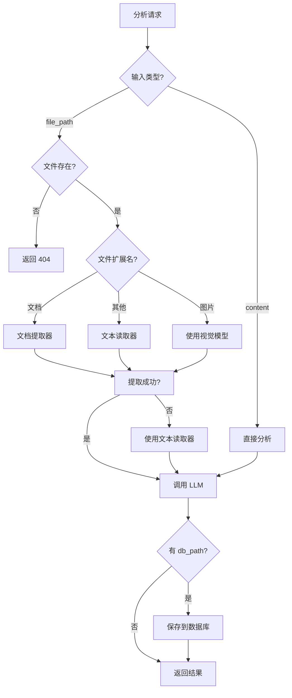
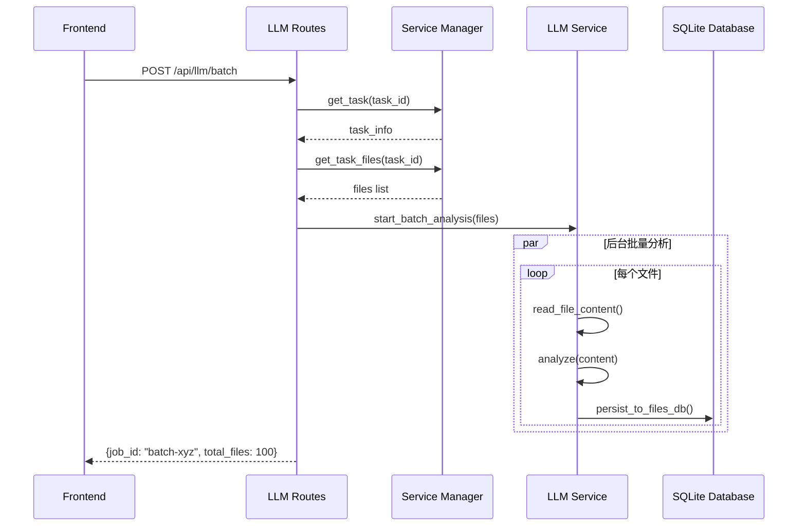
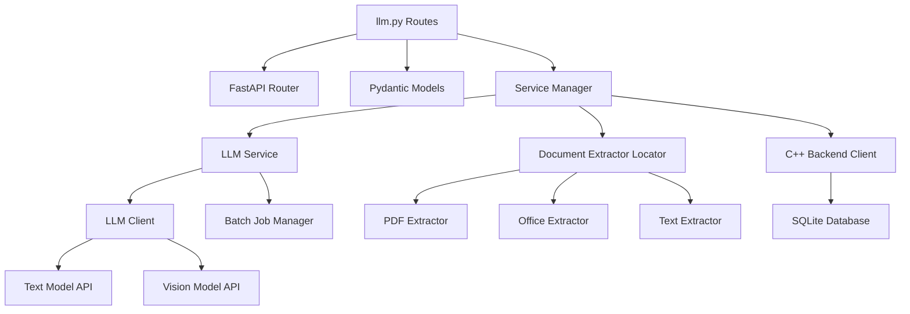
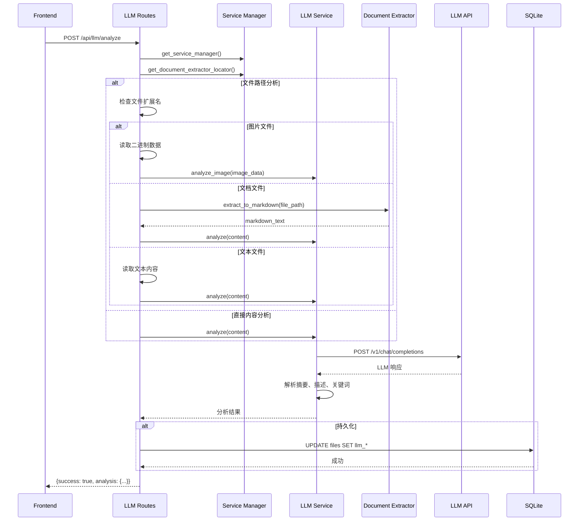
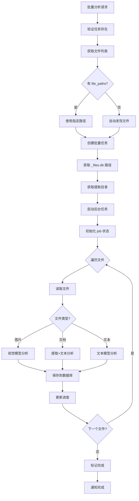

# LLM Analysis Routes 模块文档

## 1. 模块背景

### 业务背景

在数字取证分析中，大量文件内容需要人工审查，这既耗时又容易遗漏。LLM（Large Language Model）分析路由模块通过 AI 自动化文件内容分析，实现：

1. **智能文件分析**: 使用 LLM 自动生成文件摘要、描述和关键词
2. **批量处理**: 对整个取证任务的文件进行批量分析
3. **多模态支持**: 支持文本文件和图像文件的智能分析
4. **文档提取**: 自动提取 Office、PDF 等格式文档内容
5. **证据相关性标记**: 允许调查员标记文件描述是否与案件相关

**典型应用场景**：

```
场景 1: 磁盘镜像初步筛选
1. 分析所有文件的 LLM 摘要
2. 搜索"恶意"、"可疑"、"密码"等关键词
3. 快速定位需要人工审查的重点文件

场景 2: 图像内容识别
1. 对所有图片文件进行视觉分析
2. 识别截图、二维码、人脸等敏感内容
3. 生成可搜索的文字描述

场景 3: 报告生成
1. 筛选相关文件描述
2. 按 LLM 关键词分组
3. 生成证据清单
```

### 技术背景

**OpenAI 兼容 API**：

模块使用 OpenAI 兼容的 API 接口，支持多种 LLM 后端：
- **LM Studio**: 本地运行的开源模型
- **Ollama**: 本地模型服务器
- **vLLM**: 高性能推理引擎
- **Azure OpenAI**: 云端企业级服务
- **OpenAI**: GPT-4、GPT-3.5 等官方模型

**多模态分析**：

```python
# 文本模型
text_model = "llama-3-8b-instruct"  # Meta Llama 3
base_url = "http://localhost:1234/v1"

# 视觉模型
vision_model = "llava-v1.6-7b"     # LLaVA 多模态模型
vision_base_url = "http://localhost:1234/v1"
```

**文档自动提取**：

支持的文档格式通过 `document_extractor_locator`：
- **Office**: `.docx`, `.xlsx`, `.pptx` (DuckX/OpenPyXL)
- **PDF**: `.pdf` (PyPDF2/pdfplumber)
- **文本文档**: `.txt`, `.md`, `.csv`, `.json`, `.xml`, `.html`
- **代码文件**: `.py`, `.js`, `.java`, `.cpp`, 等

**LLM 分析结果持久化**：

分析结果自动存储到 C++ SQLite `_files.db`：

```sql
-- LLM 分析字段
ALTER TABLE files ADD COLUMN llm_summary TEXT;
ALTER TABLE files ADD COLUMN llm_description TEXT;
ALTER TABLE files ADD COLUMN llm_keywords TEXT;
ALTER TABLE files ADD COLUMN llm_analyzed_at TIMESTAMP;
ALTER TABLE files ADD COLUMN llm_model_used TEXT;
ALTER TABLE files ADD COLUMN llm_is_relevant BOOLEAN DEFAULT TRUE;
```

---

## 2. 模块功能

### 核心功能

| 功能 | 端点 | 描述 |
|------|------|------|
| **内容分析** | `POST /api/llm/analyze` | 分析文件路径或直接内容 |
| **文件上传分析** | `POST /api/llm/analyze/file` | 分析上传的文件 |
| **批量分析** | `POST /api/llm/batch` | 启动批量分析任务 |
| **批量状态** | `GET /api/llm/batch/{job_id}` | 查询批量任务状态 |
| **模型列表** | `GET /api/llm/models` | 列出可用模型 |
| **服务状态** | `GET /api/llm/status` | LLM 服务状态 |
| **相关性标记** | `POST /api/llm/toggle-relevance` | 标记文件相关性 |

### 功能详解

#### 1. 内容分析 (`/api/llm/analyze`)

**请求参数**:
```python
{
    "file_path": "/path/to/extracted/file.txt",    # 可选：文件路径
    "content": "直接要分析的内容",                   # 可选：直接内容
    "db_file_path": "/original/path/in/db",        # 可选：数据库中的原始路径
    "model_type": "text",                          # "text" 或 "vision"
    "prompt": "自定义分析提示",                      # 可选
    "max_tokens": 1000,                            # 可选：最大响应 token
    "temperature": 0.7,                            # 可选：温度参数
    "files_db_path": "/path/to/_files.db"          # 可选：持久化路径
}
```

**自动检测逻辑**:



**自动检测规则**:

```python
# 图片扩展名列表
IMAGE_EXTENSIONS = {
    '.jpg', '.jpeg', '.png', '.gif', '.bmp', '.webp',
    '.tiff', '.tif', '.svg', '.ico', '.heic', '.heif',
    '.raw', '.cr2', '.nef', '.arw'
}

# 文档提取器支持格式
DOCUMENT_FORMATS = {
    # Office
    '.docx', '.xlsx', '.pptx', '.doc', '.xls', '.ppt',
    # PDF
    '.pdf',
    # 文本
    '.txt', '.md', '.csv', '.json', '.xml', '.html',
    # 代码
    '.py', '.js', '.java', '.cpp', '.c', '.h', '.css', '.sql'
}
```

**响应示例**:
```json
{
  "success": true,
  "analysis": {
    "summary": "这是一个包含用户凭证的配置文件",
    "description": "文件包含数据库连接字符串、API 密钥和用户凭证。敏感信息包括：生产数据库密码、AWS 访问密钥、管理员用户名密码。",
    "keywords": ["凭证", "密码", "API密钥", "敏感信息", "数据库"]
  },
  "model_used": "llama-3-8b-instruct",
  "tokens_used": 856,
  "processing_time_ms": 2341.5,
  "timestamp": "2026-03-16T10:30:00Z"
}
```

#### 2. 文件上传分析 (`/api/llm/analyze/file`)

支持通过 HTTP multipart 上传文件进行分析：

```bash
curl -X POST "http://localhost:8090/api/llm/analyze/file?model_type=text&prompt=分析此文件" \
  -F "file=@/path/to/document.pdf"
```

**处理流程**:

1. 接收文件上传
2. 根据 `Content-Type` 或扩展名判断文件类型
3. 图片 → 视觉模型
4. 文档 → 提取器 + 文本模型
5. 其他 → 文本模型

#### 3. 批量分析 (`/api/llm/batch`)

对整个取证任务的文件进行批量分析：

**请求参数**:
```python
{
    "task_id": "abc-123-def",              # 任务 ID
    "file_types": ["documents", "images"], # 可选：过滤文件类型
    "file_paths": [                        # 可选：指定文件列表
        "/path/to/file1.pdf",
        "/path/to/file2.txt"
    ],
    "limit": 100,                          # 最大文件数
    "model_type": "text"                   # 模型类型
}
```

**后台执行**:



**批量状态查询**:

```bash
# 查询批量任务状态
GET /api/llm/batch/batch-xyz-789

# 响应
{
  "success": true,
  "job_id": "batch-xyz-789",
  "status": "running",        # pending, running, completed, failed
  "progress": 0.65,           # 65% 完成
  "files_processed": 65,
  "files_total": 100,
  "errors": [
    "Failed to analyze /path/to/corrupt.pdf: Invalid PDF format"
  ],
  "results": [
    {
      "file_path": "/path/to/file1.txt",
      "status": "completed",
      "summary": "...",
      "description": "..."
    }
  ]
}
```

#### 4. 模型管理

**列出可用模型**:

```bash
GET /api/llm/models

{
  "success": true,
  "models": [
    {
      "name": "llama-3-8b-instruct",
      "type": "text",
      "base_url": "http://localhost:1234/v1",
      "max_tokens": 4096,
      "temperature": 0.7,
      "status": "available"
    },
    {
      "name": "llava-v1.6-7b",
      "type": "vision",
      "base_url": "http://localhost:1234/v1",
      "max_tokens": 2048,
      "temperature": 0.5,
      "status": "available"
    }
  ]
}
```

**服务状态检查**:

```bash
GET /api/llm/status

{
  "status": "healthy",
  "text_model": {
    "model": "llama-3-8b-instruct",
    "available": true,
    "base_url": "http://localhost:1234/v1"
  },
  "vision_model": {
    "model": "llava-v1.6-7b",
    "available": true,
    "base_url": "http://localhost:1234/v1"
  }
}
```

#### 5. 证据相关性标记

允许调查员标记文件描述是否与案件相关：

```bash
POST /api/llm/toggle-relevance

{
  "task_id": "abc-123-def",
  "file_path": "/path/to/file.txt",
  "is_relevant": false
}

# 响应
{
  "success": true,
  "message": "File relevance updated to false"
}
```

使用场景：
- 排除系统文件、无关文档
- 聚焦真正相关的证据
- 为最终报告筛选内容

### 边界与限制

| 限制 | 说明 | 缓解措施 |
|------|------|----------|
| **文件大小** | LLM 上下文窗口限制 | 自动截断或分块处理 |
| **图像尺寸** | 视觉模型分辨率限制 | 自动缩放到合适尺寸 |
| **批量性能** | 串行分析较慢 | 使用后台任务和进度回调 |
| **模型可用性** | 依赖外部 LLM 服务 | 优雅降级，缓存结果 |
| **文档提取** | 部分格式可能失败 | 回退到纯文本提取 |

---

## 3. 模块使用的库

### 依赖库清单

| 库名 | 版本 | 用途 |
|------|------|------|
| **fastapi** | ^0.104.0 | Web 框架 |
| **pydantic** | ^2.5.0 | 数据验证 |
| **httpx** | ^0.25.0 | 异步 HTTP 客户端（LLM API） |
| **python-multipart** | ^0.0.6 | 文件上传支持 |
| **document-extractors** | 自定义 | 文档内容提取 |

### 依赖关系图



### 核心代码依赖

**LLMService** (`services/llm_service.py`):

```python
class LLMService:
    def __init__(self, settings: Settings):
        self.text_client = LLMClient(
            base_url=settings.llm_text_base_url,
            model=settings.llm_text_model,
            max_tokens=settings.llm_text_max_tokens,
            temperature=settings.llm_text_temperature
        )
        self.vision_client = LLMClient(
            base_url=settings.llm_vision_base_url,
            model=settings.llm_vision_model,
            max_tokens=settings.llm_vision_max_tokens,
            temperature=settings.llm_vision_temperature
        )
        self.batch_jobs: Dict[str, BatchJob] = {}

    async def analyze(self, content: str, model_type: str = "text", **kwargs) -> Dict:
        """分析内容"""
        client = self.text_client if model_type == "text" else self.vision_client
        return await client.chat(
            content=content,
            prompt=kwargs.get("prompt"),
            max_tokens=kwargs.get("max_tokens"),
            temperature=kwargs.get("temperature")
        )

    async def analyze_image(self, image_data: bytes, prompt: Optional[str] = None) -> Dict:
        """分析图像"""
        return await self.vision_client.vision_chat(
            image_data=image_data,
            prompt=prompt or "Analyze this image in detail"
        )

    async def start_batch_analysis(
        self,
        files: List[Dict],
        model_type: str,
        files_db_path: Optional[str],
        extraction_dir: Optional[str]
    ) -> str:
        """启动批量分析"""
        job_id = f"batch-{uuid4()}"

        job = BatchJob(
            job_id=job_id,
            files=files,
            model_type=model_type,
            files_db_path=files_db_path,
            extraction_dir=extraction_dir,
            status="pending"
        )

        self.batch_jobs[job_id] = job

        # 后台执行
        asyncio.create_task(self._run_batch_job(job))

        return job_id

    def persist_to_files_db(
        self,
        db_path: str,
        file_path: str,
        description: str,
        summary: str,
        keywords: str,
        model_used: str
    ) -> bool:
        """持久化分析结果到 _files.db"""
        import sqlite3

        try:
            conn = sqlite3.connect(db_path)
            cursor = conn.cursor()

            cursor.execute("""
                UPDATE files
                SET llm_description = ?,
                    llm_summary = ?,
                    llm_keywords = ?,
                    llm_analyzed_at = CURRENT_TIMESTAMP,
                    llm_model_used = ?
                WHERE path = ?
            """, (description, summary, keywords, model_used, file_path))

            conn.commit()
            return True
        except Exception as e:
            logger.error(f"Failed to persist LLM analysis: {e}")
            return False
        finally:
            conn.close()
```

**Document Extractor Locator**:

```python
class DocumentExtractorLocator:
    """文档提取器定位器"""

    def __init__(self):
        self.extractors = {
            # Office
            '.docx': WordExtractor(),
            '.xlsx': ExcelExtractor(),
            '.pptx': PowerPointExtractor(),
            # PDF
            '.pdf': PDFExtractor(),
            # 代码和文本（使用通用文本读取器）
            '.py': TextExtractor(),
            '.js': TextExtractor(),
            # ... 更多格式
        }

    def get_extractor(self, file_path: str) -> Optional[BaseExtractor]:
        """根据文件扩展名获取提取器"""
        ext = Path(file_path).suffix.lower()
        return self.extractors.get(ext)
```

---

## 4. 模块实现方式

### 架构设计



### 核心类说明

#### 1. 请求/响应模型

```python
class AnalyzeRequest(BaseModel):
    """分析请求"""
    file_path: Optional[str] = None
    content: Optional[str] = None
    db_file_path: Optional[str] = None        # 数据库中的原始路径
    model_type: str = "text"
    prompt: Optional[str] = None
    max_tokens: Optional[int] = Field(None, ge=1, le=8192)
    temperature: Optional[float] = Field(None, ge=0.0, le=2.0)
    files_db_path: Optional[str] = None

class AnalyzeResponse(BaseModel):
    """分析响应"""
    success: bool
    analysis: Dict[str, Any]   # {summary, description, keywords}
    model_used: str
    tokens_used: int
    processing_time_ms: float

class BatchAnalyzeRequest(BaseModel):
    """批量分析请求"""
    task_id: str
    file_types: Optional[List[str]] = None
    file_paths: Optional[List[str]] = None
    limit: int = Field(default=100, ge=1, le=1000)
    model_type: str = "text"

class BatchStatusResponse(BaseModel):
    """批量状态响应"""
    success: bool
    job_id: str
    status: str               # pending, running, completed, failed
    progress: float
    files_processed: int
    files_total: int
    errors: List[str]
    results: List[Dict[str, Any]]
```

#### 2. 文件类型自动检测

```python
async def analyze_content(request: AnalyzeRequest, settings: Settings = Depends(get_settings)):
    """分析内容（支持自动检测）"""
    from ..services import get_service_manager, get_document_extractor_locator

    service_manager = get_service_manager()
    doc_locator = get_document_extractor_locator()

    # 图片扩展名列表
    IMAGE_EXTENSIONS = {
        '.jpg', '.jpeg', '.png', '.gif', '.bmp', '.webp', '.tiff',
        '.tif', '.svg', '.ico', '.heic', '.heif', '.raw', '.cr2'
    }

    result = None

    # 处理文件路径
    if request.file_path:
        # 检查文件存在
        if not Path(request.file_path).exists():
            raise HTTPException(
                status_code=404,
                detail=f"File not found: {request.file_path}\n"
                       f"Files must be extracted from the disk image first."
            )

        file_ext = Path(request.file_path).suffix.lower()
        is_image = file_ext in IMAGE_EXTENSIONS

        if is_image:
            # 使用视觉模型
            with open(request.file_path, 'rb') as f:
                image_data = f.read()
            result = await service_manager.llm_service.analyze_image(
                image_data=image_data,
                prompt=request.prompt,
            )
        else:
            # 尝试文档提取器
            extractor = doc_locator.get_extractor(request.file_path)

            if extractor:
                # 提取文档内容
                content = await extractor.extract_to_markdown(request.file_path)
                result = await service_manager.llm_service.analyze(
                    content=content,
                    model_type="text",
                    prompt=request.prompt,
                    max_tokens=request.max_tokens,
                    temperature=request.temperature,
                )
            else:
                # 读取为纯文本
                content = await service_manager.llm_service.read_file_content(request.file_path)
                result = await service_manager.llm_service.analyze(
                    content=content,
                    model_type="text",
                    prompt=request.prompt,
                    max_tokens=request.max_tokens,
                    temperature=request.temperature,
                )
    else:
        # 直接内容分析
        result = await service_manager.llm_service.analyze(
            content=request.content,
            model_type=request.model_type,
            prompt=request.prompt,
            max_tokens=request.max_tokens,
            temperature=request.temperature,
        )

    # 持久化到数据库
    if request.files_db_path and (request.db_file_path or request.file_path):
        analysis = result.get("analysis", {})
        service_manager.llm_service.persist_to_files_db(
            db_path=request.files_db_path,
            file_path=request.db_file_path or request.file_path,
            description=analysis.get("description", ""),
            summary=analysis.get("summary", ""),
            keywords=", ".join(analysis.get("keywords", [])),
            model_used=result.get("model", "unknown")
        )

    return AnalyzeResponse(
        success=True,
        analysis=result.get("analysis", {}),
        model_used=result.get("model", "unknown"),
        tokens_used=result.get("tokens_used", 0),
        processing_time_ms=result.get("processing_time_ms", 0),
    )
```

### 关键流程

#### 批量分析流程



**实现代码**:

```python
async def _run_batch_job(self, job: BatchJob):
    """执行批量分析任务（后台运行）"""
    try:
        job.status = "running"
        job.files_processed = 0

        for file_record in job.files:
            try:
                # 构建完整文件路径
                file_path = file_record["path"]

                # 如果是相对路径，添加提取目录前缀
                if job.extraction_dir and not Path(file_path).is_absolute():
                    full_path = Path(job.extraction_dir) / file_path.lstrip("/")
                else:
                    full_path = Path(file_path)

                # 检查文件是否存在
                if not full_path.exists():
                    job.errors.append(f"File not found: {file_path}")
                    continue

                # 根据文件扩展名选择分析方式
                if full_path.suffix.lower() in IMAGE_EXTENSIONS:
                    # 图像分析
                    with open(full_path, 'rb') as f:
                        image_data = f.read()
                    result = await self.analyze_image(image_data=image_data)
                else:
                    # 文本分析
                    content = await self.read_file_content(str(full_path))
                    result = await self.analyze(
                        content=content,
                        model_type=job.model_type
                    )

                # 保存到数据库
                if job.files_db_path:
                    self.persist_to_files_db(
                        db_path=job.files_db_path,
                        file_path=file_path,
                        description=result["analysis"].get("description", ""),
                        summary=result["analysis"].get("summary", ""),
                        keywords=", ".join(result["analysis"].get("keywords", [])),
                        model_used=result.get("model", "unknown")
                    )

                # 更新进度
                job.files_processed += 1
                job.progress = job.files_processed / job.files_total

                # 保存结果
                job.results.append({
                    "file_path": file_path,
                    "status": "completed",
                    "summary": result["analysis"].get("summary", ""),
                    "description": result["analysis"].get("description", ""),
                    "keywords": result["analysis"].get("keywords", [])
                })

            except Exception as e:
                job.errors.append(f"Failed to analyze {file_path}: {str(e)}")
                job.results.append({
                    "file_path": file_path,
                    "status": "failed",
                    "error": str(e)
                })

        job.status = "completed"

    except Exception as e:
        job.status = "failed"
        job.errors.append(f"Batch job failed: {str(e)}")
```

### 数据结构

#### LLM 分析结果结构

```python
{
    "summary": "简短摘要（1-2 句话）",
    "description": "详细描述（3-5 句话）",
    "keywords": ["关键词1", "关键词2", "关键词3"]
}
```

#### 批量任务状态结构

```python
class BatchJob:
    job_id: str
    files: List[Dict]           # 文件列表
    model_type: str             # "text" 或 "vision"
    files_db_path: Optional[str] # 数据库路径
    extraction_dir: Optional[str] # 提取目录
    status: str                 # pending, running, completed, failed
    files_processed: int = 0
    files_total: int = 0
    progress: float = 0.0
    errors: List[str] = []
    results: List[Dict] = []
```

---

## 5. API 调用

### REST API

#### 1. 分析文件路径

**请求**:
```http
POST /api/llm/analyze HTTP/1.1
Host: localhost:8090
Content-Type: application/json

{
  "file_path": "/extracted/files/document.pdf",
  "db_file_path": "/original/path/in/image/document.pdf",
  "model_type": "text",
  "prompt": "请分析这个文件是否包含敏感信息",
  "files_db_path": "/path/to/case_files.db"
}
```

**响应**:
```http
HTTP/1.1 200 OK
Content-Type: application/json

{
  "success": true,
  "analysis": {
    "summary": "这是一个包含用户凭证的配置文件",
    "description": "文件包含数据库连接字符串、API 密钥和用户凭证。敏感信息包括：生产数据库密码（mysql_prod_pass）、AWS 访问密钥（AKIAIOSFF...）、管理员用户名（admin）和密码。建议立即更换这些凭证并检查是否有未授权访问。",
    "keywords": ["凭证", "密码", "API密钥", "敏感信息", "数据库", "AWS", "安全风险"]
  },
  "model_used": "llama-3-8b-instruct",
  "tokens_used": 856,
  "processing_time_ms": 2341.5
}
```

**curl 示例**:
```bash
curl -X POST http://localhost:8090/api/llm/analyze \
  -H "Content-Type: application/json" \
  -d '{
    "file_path": "/extracted/files/config.ini",
    "files_db_path": "/data/case_files.db",
    "prompt": "分析这个文件的安全风险"
  }' | jq
```

#### 2. 分析上传文件

**请求**:
```http
POST /api/llm/analyze/file?model_type=text&prompt=分析此文档
Host: localhost:8090
Content-Type: multipart/form-data

file=@/path/to/report.pdf
```

**curl 示例**:
```bash
# 分析 PDF 文档
curl -X POST "http://localhost:8090/api/llm/analyze/file" \
  -F "file=@report.pdf" \
  -F "model_type=text"

# 分析图片
curl -X POST "http://localhost:8090/api/llm/analyze/file" \
  -F "file=@screenshot.png" \
  -F "model_type=vision" \
  -F "prompt=描述这张图片的内容"
```

#### 3. 批量分析

**请求**:
```http
POST /api/llm/batch HTTP/1.1
Host: localhost:8090
Content-Type: application/json

{
  "task_id": "abc-123-def",
  "file_types": ["documents", "images"],
  "limit": 100,
  "model_type": "text"
}
```

**响应**:
```http
HTTP/1.1 200 OK
Content-Type: application/json

{
  "success": true,
  "task_id": "abc-123-def",
  "job_id": "batch-xyz-789",
  "message": "Batch analysis started in background",
  "total_files": 150,
  "timestamp": "2026-03-16T10:30:00.123456"
}
```

**curl 示例**:
```bash
# 启动批量分析
curl -X POST http://localhost:8090/api/llm/batch \
  -H "Content-Type: application/json" \
  -d '{
    "task_id": "abc-123-def",
    "file_types": ["documents"],
    "limit": 100
  }' | jq

# 查询批量任务状态
curl -X GET http://localhost:8090/api/llm/batch/batch-xyz-789 | jq
```

#### 4. 列出模型

**请求**:
```http
GET /api/llm/models HTTP/1.1
Host: localhost:8090
```

**响应**:
```http
HTTP/1.1 200 OK
Content-Type: application/json

{
  "success": true,
  "models": [
    {
      "name": "llama-3-8b-instruct",
      "type": "text",
      "base_url": "http://localhost:1234/v1",
      "max_tokens": 4096,
      "temperature": 0.7,
      "status": "available"
    },
    {
      "name": "llava-v1.6-7b",
      "type": "vision",
      "base_url": "http://localhost:1234/v1",
      "max_tokens": 2048,
      "temperature": 0.5,
      "status": "available"
    }
  ]
}
```

#### 5. 切换文件相关性

**请求**:
```http
POST /api/llm/toggle-relevance HTTP/1.1
Host: localhost:8090
Content-Type: application/json

{
  "task_id": "abc-123-def",
  "file_path": "/path/to/system.log",
  "is_relevant": false
}
```

**响应**:
```http
HTTP/1.1 200 OK
Content-Type: application/json

{
  "success": true,
  "message": "File relevance updated to false"
}
```

**curl 示例**:
```bash
# 标记为不相关
curl -X POST http://localhost:8090/api/llm/toggle-relevance \
  -H "Content-Type: application/json" \
  -d '{
    "task_id": "abc-123-def",
    "file_path": "/Windows/System32/drivers/etc/hosts",
    "is_relevant": false
  }'

# 标记为相关
curl -X POST http://localhost:8090/api/llm/toggle-relevance \
  -H "Content-Type: application/json" \
  -d '{
    "task_id": "abc-123-def",
    "file_path": "/Users/Documents/suspicious.docx",
    "is_relevant": true
  }'
```

---

## 6. 二次开发

### 扩展点

#### 1. 自定义分析提示词

**场景**: 针对特定取证场景定制分析提示

```python
class ForensicsPrompts:
    """取证专用提示词模板"""

    MALWARE_ANALYSIS = """
    你是数字取证专家。请分析以下文件内容，重点关注：
    1. 恶意软件特征（可疑URL、Base64编码、PowerShell命令）
    2. 数据泄露风险（敏感文件路径、外发连接）
    3. 攻击者工具（Mimikatz、Cobalt Strike等）

    文件内容：
    {content}

    请返回JSON格式：
    {{
      "summary": "简要总结",
      "description": "详细分析",
      "keywords": ["关键词列表"],
      "risk_level": "low/medium/high",
      "indicators": ["可疑指标列表"]
    }}
    """

    PHISHING_ANALYSIS = """
    分析此文件是否为钓鱼邮件或钓鱼页面：
    {content}

    返回JSON：
    {{
      "is_phishing": true/false,
      "confidence": 0.95,
      "target_brand": "银行/服务商名称",
      "suspicious_urls": ["可疑URL"],
      "description": "分析说明"
    }}
    """

# 使用自定义提示词
result = await llm_service.analyze(
    content=file_content,
    prompt=ForensicsPrompts.MALWARE_ANALYSIS.format(content=file_content[:5000])
)
```

#### 2. 添加新的文件类型支持

**场景**: 支持 `.7z` 压缩包内容分析

```python
# 1. 创建新的提取器
import py7zr

class SevenZipExtractor(BaseExtractor):
    """7z 压缩包提取器"""

    async def extract_to_markdown(self, file_path: str) -> str:
        """提取 7z 内容为 Markdown"""
        content_parts = []

        with py7zr.SevenZipFile(file_path, mode='r') as archive:
            # 获取文件列表
            file_list = archive.getnames()

            content_parts.append(f"# 7z Archive: {Path(file_path).name}\n")
            content_parts.append(f"**Total files**: {len(file_list)}\n\n")

            # 读取前 10 个文件的内容
            for filename in file_list[:10]:
                try:
                    with archive.open(filename) as f:
                        file_content = f.read().decode('utf-8', errors='ignore')
                        content_parts.append(f"## {filename}\n")
                        content_parts.append(f"```\n{file_content[:1000]}\n```\n\n")
                except:
                    content_parts.append(f"## {filename}\n[Binary or encrypted]\n\n")

            if len(file_list) > 10:
                content_parts.append(f"\n... and {len(file_list) - 10} more files\n")

        return "\n".join(content_parts)

# 2. 注册提取器
extractor_locator = get_document_extractor_locator()
extractor_locator.register('.7z', SevenZipExtractor())
```

#### 3. 实现智能优先级队列

**场景**: 优先分析重要文件

```python
class PriorityBatchAnalyzer:
    """优先级批量分析器"""

    def calculate_priority(self, file_record: Dict) -> int:
        """计算文件分析优先级（0-100）"""
        priority = 50  # 默认优先级

        # 文件类型加分
        if file_record.get('extension') in ['.exe', '.dll', '.bat', '.ps1']:
            priority += 30  # 可执行文件高优先级
        elif file_record.get('extension') in ['.doc', '.docx', '.pdf', '.xls', '.xlsx']:
            priority += 20  # 文档中等优先级

        # 路径特征加分
        path = file_record.get('path', '').lower()
        if any(keyword in path for keyword in ['download', 'temp', 'appdata']):
            priority += 15  # 可疑路径

        # 文件大小加分
        size = file_record.get('size', 0)
        if 0 < size < 1024 * 1024:  # 1MB 以下
            priority += 10  # 小文件快速分析

        # 删除状态加分
        if file_record.get('is_deleted'):
            priority += 10  # 已删除文件

        return min(priority, 100)

    async def priority_batch_analyze(self, files: List[Dict], **kwargs):
        """按优先级批量分析"""
        # 计算优先级
        for f in files:
            f['_priority'] = self.calculate_priority(f)

        # 排序
        files.sort(key=lambda x: x['_priority'], reverse=True)

        # 分批执行
        high_priority = [f for f in files if f['_priority'] >= 80]
        medium_priority = [f for f in files if 50 <= f['_priority'] < 80]
        low_priority = [f for f in files if f['_priority'] < 50]

        # 先分析高优先级
        if high_priority:
            await llm_service.start_batch_analysis(high_priority, **kwargs)

        # 然后分析中等优先级
        if medium_priority:
            await llm_service.start_batch_analysis(medium_priority, **kwargs)

        # 最后分析低优先级
        if low_priority:
            await llm_service.start_batch_analysis(low_priority, **kwargs)
```

### 添加新功能的步骤

#### 步骤 1: 定义新的分析类型

```python
class SentimentAnalysisRequest(BaseModel):
    """情感分析请求"""
    content: str
    file_path: Optional[str] = None

class SentimentAnalysisResponse(BaseModel):
    """情感分析响应"""
    sentiment: str      # positive, negative, neutral
    confidence: float
    emotional_keywords: List[str]
```

#### 步骤 2: 实现分析逻辑

```python
@router.post("/api/llm/sentiment")
async def analyze_sentiment(request: SentimentAnalysisRequest):
    """分析文件内容的情感倾向"""

    prompt = f"""
    分析以下文本的情感倾向：
    {request.content[:2000]}

    返回JSON格式：
    {{
      "sentiment": "positive/negative/neutral",
      "confidence": 0.95,
      "emotional_keywords": ["愤怒", "焦虑", "威胁"]
    }}
    """

    result = await llm_service.analyze(content=request.content, prompt=prompt)

    # 解析 LLM 响应
    import json
    sentiment_data = json.loads(result.get("analysis", {}).get("description", "{}"))

    return {
        "sentiment": sentiment_data.get("sentiment", "neutral"),
        "confidence": sentiment_data.get("confidence", 0.5),
        "emotional_keywords": sentiment_data.get("emotional_keywords", [])
    }
```

#### 步骤 3: 添加到批量分析

```python
# 扩展批量分析支持情感分析
class ExtendedBatchRequest(BaseModel):
    """扩展批量分析请求"""
    task_id: str
    analysis_types: List[str] = ["summary"]  # summary, sentiment, pii

# 执行多种分析
for file in files:
    if "summary" in request.analysis_types:
        await analyze_summary(file)

    if "sentiment" in request.analysis_types:
        await analyze_sentiment(file)

    if "pii" in request.analysis_types:
        await analyze_pii(file)
```

### 代码示例

#### 示例 1: PII（个人身份信息）检测

```python
@router.post("/api/llm/detect-pii")
async def detect_pii(file_path: str):
    """检测文件中的个人身份信息"""

    prompt = """
    你是数据隐私专家。请仔细分析以下内容，识别所有个人身份信息（PII）。

    检测以下类型：
    - 身份证号、护照号、驾照号
    - 银行卡号、信用卡号
    - 电子邮箱
    - 电话号码
    - 家庭住址
    - 社会安全号码（SSN）

    内容：
    {content}

    返回JSON：
    {
      "has_pii": true,
      "confidence": 0.95,
      "pii_types": ["email", "phone", "ssn"],
      "pii_count": 5,
      "findings": [
        {"type": "email", "value": "user@example.com", "position": 123}
      ]
    }
    """

    content = await read_file_content(file_path)
    result = await llm_service.analyze(content=content, prompt=prompt.format(content=content[:3000]))

    return result
```

#### 示例 2: 批量进度 WebSocket 推送

```python
from fastapi import WebSocket

@router.websocket("/api/llm/batch/{job_id}/progress")
async def batch_progress_websocket(websocket: WebSocket, job_id: str):
    """批量任务进度 WebSocket 推送"""
    await websocket.accept()

    try:
        while True:
            # 获取最新进度
            job = await llm_service.get_batch_job(job_id)

            if not job:
                await websocket.send_json({"error": "Job not found"})
                break

            # 发送进度更新
            await websocket.send_json({
                "job_id": job_id,
                "status": job.status,
                "progress": job.progress,
                "files_processed": job.files_processed,
                "files_total": job.files_total,
                "current_file": job.results[-1]["file_path"] if job.results else None
            })

            # 如果完成，退出
            if job.status in ["completed", "failed"]:
                break

            # 等待 1 秒
            await asyncio.sleep(1)

    except WebSocketDisconnect:
        logger.info(f"WebSocket disconnected for job {job_id}")
```

---

## 7. 其他

### 测试

#### 单元测试

```python
import pytest
from httpx import AsyncClient

@pytest.mark.asyncio
async def test_analyze_content(client: AsyncClient, mock_llm_service):
    """测试内容分析"""
    mock_llm_service.analyze.return_value = {
        "analysis": {
            "summary": "测试摘要",
            "description": "测试描述",
            "keywords": ["测试"]
        },
        "model": "llama-3-8b",
        "tokens_used": 100
    }

    response = await client.post("/api/llm/analyze", json={
        "content": "这是测试内容",
        "model_type": "text"
    })

    assert response.status_code == 200
    data = response.json()
    assert data["success"] == True
    assert "analysis" in data

@pytest.mark.asyncio
async def test_batch_analyze(client: AsyncClient):
    """测试批量分析"""
    response = await client.post("/api/llm/batch", json={
        "task_id": "test-task",
        "limit": 10
    })

    assert response.status_code == 200
    data = response.json()
    assert "job_id" in data
```

#### 集成测试

```python
@pytest.mark.integration
async def test_full_batch_workflow():
    """测试完整批量分析流程"""
    # 1. 创建任务并提取文件
    # 2. 启动批量分析
    # 3. 监控进度
    # 4. 验证数据库结果
    # 5. 检查相关性标记
    pass
```

### 配置

#### LLM 服务配置

```bash
# .env 配置
LLM_TEXT_BASE_URL=http://localhost:1234/v1
LLM_TEXT_MODEL=llama-3-8b-instruct
LLM_TEXT_MAX_TOKENS=4096
LLM_TEXT_TEMPERATURE=0.7

LLM_VISION_BASE_URL=http://localhost:1234/v1
LLM_VISION_MODEL=llava-v1.6-7b
LLM_VISION_MAX_TOKENS=2048
LLM_VISION_TEMPERATURE=0.5

# 批量分析配置
LLM_BATCH_SIZE=50
LLM_CONCURRENT_REQUESTS=5
LLM_REQUEST_TIMEOUT=300
```

### 故障排查

#### 常见问题

| 问题 | 可能原因 | 解决方法 |
|------|----------|----------|
| **分析失败** | LLM 服务未启动 | 检查 `http://localhost:1234/v1/models` |
| **文件未找到** | 文件未提取 | 先使用文件提取功能 |
| **PDF 解析失败** | 加密或损坏 PDF | 尝试其他 PDF 工具 |
| **批量任务卡住** | 网络超时 | 增加超时时间，使用重试 |
| **数据库写入失败** | _files.db 路径错误 | 验证数据库路径和权限 |

#### 调试技巧

**1. 查看 LLM 原始响应**:

```python
# 添加调试日志
logger.debug(f"LLM request: {prompt[:100]}...")
logger.debug(f"LLM response: {response}")

# 保存原始响应
with open("/tmp/llm_debug.json", "w") as f:
    json.dump(response, f, indent=2)
```

**2. 测试文件提取**:

```python
@router.get("/api/llm/test-extract")
async def test_document_extraction(file_path: str):
    """测试文档提取"""
    extractor = get_document_extractor_locator().get_extractor(file_path)

    if not extractor:
        return {"error": "No extractor found"}

    content = await extractor.extract_to_markdown(file_path)

    return {
        "file_path": file_path,
        "content_length": len(content),
        "content_preview": content[:500]
    }
```

**3. 批量任务诊断**:

```python
@router.get("/api/llm/batch/{job_id}/diagnostics")
async def batch_diagnostics(job_id: str):
    """批量任务诊断信息"""
    job = await llm_service.get_batch_job(job_id)

    if not job:
        raise HTTPException(404, "Job not found")

    return {
        "job_id": job_id,
        "status": job.status,
        "progress": job.progress,
        "files_processed": job.files_processed,
        "files_total": job.files_total,
        "error_count": len(job.errors),
        "errors": job.errors[-10:],  # 最近 10 个错误
        "avg_time_per_file": job.total_time / max(job.files_processed, 1),
        "estimated_remaining": (
            (job.files_total - job.files_processed) *
            (job.total_time / max(job.files_processed, 1))
        )
    }
```

### 相关模块

- **LLMClient** (`docs/modules/cpp/integration/LLMClient.md`): C++ LLM 客户端
- **FileAnalyzer** (`docs/modules/cpp/integration/FileAnalyzer.md`): C++ 文件分析器
- **Database Routes** (`docs/modules/python/httpserver/routes/Database.md`): 数据库路由

### 参考资源

- **OpenAI API 文档**: https://platform.openai.com/docs/api-reference
- **LM Studio**: https://lmstudio.ai/
- **Ollama**: https://ollama.ai/
- **FastAPI 文件上传**: https://fastapi.tiangolo.com/tutorial/request-files/

### 变更历史

| 版本 | 日期 | 变更说明 | 作者 |
|------|------|----------|------|
| 1.0.0 | 2026-03-16 | 初始版本，实现分析、批量、模型管理端点 | Claude Code |

---

**文档完成日期**: 2026-03-16
**文档版本**: 1.0.0
**维护者**: ymj68520
