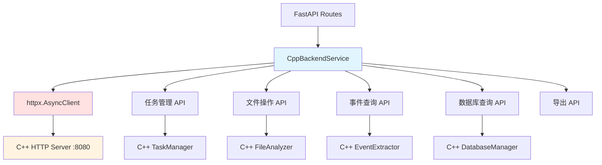

# CppBackendClient 模块文档（Python）

## 1. 模块背景

### 业务背景

Python HTTP 服务需要与 C++ HTTP 服务（端口 8080）通信以获取取证分析数据。CppBackendClient 提供类型安全的异步 HTTP 客户端。

**核心需求**：
- **异步通信**：使用 httpx 异步客户端
- **类型安全**：强类型的请求和响应
- **错误处理**：自动重试和异常转换
- **连接管理**：连接池和超时控制

**解决挑战**：
- **API 兼容性**：处理 C++ API 的 HTML 错误响应
- **网络容错**：自动重试失败的请求
- **序列化**：JSON 请求和响应处理
- **日志记录**：详细的请求/响应日志

### 技术背景

**通信架构**：
```
Python HTTP (8090)
    ↓ HTTP
C++ HTTP (8080)
    ↓
取证数据库和 C++ 核心功能
```

**httpx 特性**：
- 异步 I/O（async/await）
- 连接池（复用 TCP 连接）
- HTTP/2 支持
- 超时和重试配置

## 2. 模块功能

### 核心功能

#### 1. 健康检查

```python
from httpserver.services.cpp_backend import CppBackendService
from httpserver.config import Settings

settings = Settings()
cpp_backend = CppBackendService(settings)

await cpp_backend.initialize()

# 健康检查
is_healthy = await cpp_backend.health_check()
print(f"C++ Backend Healthy: {is_healthy}")
```

#### 2. 任务管理

```python
# 列出所有任务
tasks = await cpp_backend.list_tasks(
    status="RUNNING",  # 可选：PENDING, RUNNING, COMPLETED, FAILED
    page=1,
    page_size=50
)

print(f"Total tasks: {len(tasks)}")
for task in tasks:
    print(f"  - {task['id']}: {task['status']}")

# 获取特定任务
task = await cpp_backend.get_task("task_abc123")
print(f"Task: {task['image_name']}")

# 检查任务是否存在
exists = await cpp_backend.check_task_exists("task_abc123")
print(f"Task exists: {exists}")

# 获取任务数据库
databases = await cpp_backend.get_task_databases("task_abc123")
for db in databases:
    print(f"  - {db['type']}: {db['path']}")
```

#### 3. 文件操作

```python
# 获取任务文件（分页）
files_data = await cpp_backend.get_task_files_paginated(
    task_id="task_abc123",
    file_type="documents",  # 可选：过滤文件类型
    extension=".pdf",       # 可选：过滤扩展名
    deleted_only=False,     # 可选：仅已删除文件
    include_llm=True,      # 包含 LLM 分析
    page=1,
    page_size=50
)

files = files_data["files"]
total_count = files_data["total_count"]

print(f"Found {total_count} files")

for file in files[:10]:  # 显示前 10 个
    print(f"  - {file['path']}")
    if file.get("llm_summary"):
        print(f"    Summary: {file['llm_summary'][:50]}...")
```

#### 4. 事件查询

```python
# 获取时间线事件
events_data = await cpp_backend.get_task_events(
    task_id="task_abc123",
    event_type="MODIFIED",     # 可选：CREATED, MODIFIED, ACCESSED, etc.
    start_time="2024-01-01",   # 可选：开始时间
    end_time="2024-12-31",     # 可选：结束时间
    page=1,
    page_size=50
)

events = events_data["events"]
total_count = events_data["total_count"]

for event in events:
    print(f"{event['timestamp']}: {event['event_type']} - {event['file_path']}")
```

#### 5. 数据库查询

```python
# 执行自定义 SQL 查询
result = await cpp_backend.execute_query(
    task_id="task_abc123",
    database_type="files",  # raw, events, files
    table="files",           # 可选：表名
    sql="SELECT * FROM files WHERE size > 1048576 ORDER BY size DESC LIMIT 10",
    limit=100
)

columns = result["columns"]
rows = result["rows"]

print(f"Columns: {columns}")
for row in rows:
    print(f"  {dict(zip(columns, row))}")
```

#### 6. 文件提取

```python
# 提取文件到本地
result = await cpp_backend.extract_files(
    task_id="task_abc123",
    file_paths=["/evidence/file1.pdf", "/evidence/file2.txt"],
    output_dir="/output/extracted",
    overwrite=False
)

job_id = result.get("job_id")
print(f"Extraction job: {job_id}")

# 查询提取状态
status = await cpp_backend.get_extraction_status(job_id)
print(f"Status: {status['status']}")
print(f"Progress: {status['progress']}")
```

#### 7. 数据导出

```python
# 导出 TOON 格式
toon_data = await cpp_backend.export_toon(
    task_id="task_abc123",
    include_llm=True  # 包含 LLM 分析字段
)

print(toon_data[:500])  # 显示前 500 字符

# 导出 JSON 格式
json_data = await cpp_backend.export_json(
    task_id="task_abc123",
    database_type="files",
    include_llm=True
)

# 获取流式 TOON（分批处理）
stream = await cpp_backend.get_files_toon_stream(
    task_id="task_abc123",
    batch_size=100,
    include_llm=True
)

schema = stream["schema"]
lines = stream["data_lines"]

print(f"TOON Schema: {schema}")
print(f"Total files: {stream['total_files']}")

# 分批处理
for i in range(0, len(lines), 100):
    batch = lines[i:i+100]
    process_batch(batch)
```

### 边界与限制

**功能边界**：
- ❌ 不支持 WebSocket（仅 HTTP）
- ❌ 不支持文件上传（通过 C++ 端点）
- ❌ 不支持流式响应（需分页获取）

**已知限制**：
| 限制 | 影响 | 缓解方法 |
|------|------|----------|
| HTML 错误响应 | C++ 返回 HTML 而非 JSON | 自动检测和处理 |
| 连接池耗尽 | 高并发时连接不足 | 增加最大连接数 |
| 超时限制 | 长时间操作超时 | 增加超时配置 |

**性能指标**：
- **请求延迟**：<50ms（本地网络）
- **并发连接**：最多 20 个并发
- **连接复用**：最多 10 个 keepalive 连接

## 3. 模块使用的库

### 依赖库清单

| 库名称 | 版本 | 用途 | 许可证 |
|--------|------|------|--------|
| **httpx** | 0.24+ | 异步 HTTP 客户端 | BSD |
| **FastAPI** | 0.100+ | Web 框架 | MIT |

### 架构图



## 4. 模块实现方式

### 核心类

```python
class CppBackendService:
    """C++ 后端服务客户端"""

    def __init__(self, settings: Settings):
        self.settings = settings
        self.base_url = settings.cpp_backend_url
        self._client: Optional[httpx.AsyncClient] = None
        self._initialized = False

    async def initialize(self):
        """初始化 HTTP 客户端"""
        if self._initialized:
            return

        self._client = httpx.AsyncClient(
            base_url=self.base_url,
            timeout=httpx.Timeout(30.0),
            limits=httpx.Limits(
                max_keepalive_connections=10,
                max_connections=20
            ),
        )
        self._initialized = True

    async def shutdown(self):
        """关闭 HTTP 客户端"""
        if self._client:
            await self._client.aclose()
            self._client = None
            self._initialized = False

    @property
    def client(self) -> httpx.AsyncClient:
        """获取 HTTP 客户端（懒加载）"""
        if self._client is None:
            self._client = httpx.AsyncClient(
                base_url=self.base_url,
                timeout=httpx.Timeout(30.0),
            )
        return self._client

    async def _request(
        self,
        method: str,
        path: str,
        **kwargs,
    ) -> Dict[str, Any]:
        """执行 HTTP 请求（带重试和日志）"""
        payload_preview = kwargs.get('json') or kwargs.get('params')
        logger.info(f"C++ Request: {method} {path} - Payload: {payload_preview}")

        max_retries = 3
        for attempt in range(max_retries):
            try:
                response = await self.client.request(method, path, **kwargs)

                # 检查 HTML 响应（通常表示 404 或错误）
                content_type = response.headers.get("Content-Type", "").lower()
                if "text/html" in content_type:
                    logger.error(f"C++ API returned HTML! Status: {response.status_code}")
                    return {"success": False, "error": "Backend returned HTML", "status": response.status_code}

                if response.status_code >= 400:
                    logger.error(f"C++ API Error ({response.status_code}): {response.text}")
                    return {"success": False, "error": response.text, "status": response.status_code}

                if not response.content:
                    return {}

                result = response.json()
                logger.info(f"C++ Response from {path}: {str(result)[:200]}...")
                return result

            except Exception as e:
                if attempt == max_retries - 1:
                    logger.error(f"C++ backend request failed after {max_retries} attempts: {e}")
                    return {"success": False, "error": str(e)}
                await asyncio.sleep(1)

        return {"success": False, "error": "Max retries exceeded"}
```

### 请求方法实现

```python
# 任务管理
async def list_tasks(
    self,
    status: Optional[str] = None,
    page: int = 1,
    page_size: int = 50,
) -> Dict[str, Any]:
    """列出所有任务"""
    params = {"page": page, "page_size": page_size}
    if status:
        params["status"] = status

    return await self._request("GET", "/api/tasks/list", params=params)

async def get_task(self, task_id: str) -> Optional[Dict[str, Any]]:
    """获取特定任务"""
    try:
        result = await self.list_tasks(page_size=1000)
        tasks = result.get("tasks", [])
        for task in tasks:
            if task.get("id") == task_id:
                # 兼容性处理
                if "image_path" in task and "image_name" not in task:
                    task["image_name"] = task["image_path"]
                return task
        return None
    except httpx.HTTPStatusError as e:
        if e.response.status_code == 404:
            return None
        raise

# 文件操作
async def get_task_files_paginated(
    self,
    task_id: str,
    file_type: Optional[str] = None,
    extension: Optional[str] = None,
    deleted_only: bool = False,
    include_llm: bool = True,
    page: int = 1,
    page_size: int = 50,
) -> Dict[str, Any]:
    """分页获取任务文件"""
    params = {
        "page": page,
        "page_size": page_size,
        "include_llm": include_llm,
    }
    if file_type:
        params["file_type"] = file_type
    if extension:
        params["extension"] = extension
    if deleted_only:
        params["deleted_only"] = True

    result = await self._request("GET", f"/api/forensics/files/{task_id}", params=params)
    return {
        "files": result.get("data", {}).get("files", []),
        "total_count": result.get("data", {}).get("total_count", 0),
    }

# 数据库查询
async def execute_query(
    self,
    task_id: str,
    database_type: str,
    table: Optional[str] = None,
    sql: Optional[str] = None,
    parameters: Optional[Dict[str, Any]] = None,
    limit: int = 1000,
) -> Dict[str, Any]:
    """执行 SQL 查询"""
    payload = {
        "task_id": task_id,
        "database_type": database_type,
        "limit": limit,
    }
    if table:
        payload["table"] = table
    if sql:
        payload["sql"] = sql
    if parameters:
        payload["parameters"] = parameters

    result = await self._request("POST", "/api/database/query", json=payload)
    return {
        "columns": result.get("columns", []),
        "rows": result.get("rows", []),
    }

# 导出操作
async def export_toon(
    self,
    task_id: str,
    include_llm: bool = True,
) -> str:
    """导出 TOON 格式"""
    params = {"include_llm": include_llm}
    response = await self.client.get(
        f"/api/forensics/export/toon",
        params={"task_id": task_id, **params},
    )
    response.raise_for_status()
    return response.text
```

## 5. API 调用

### Python API

```python
from httpserver.services.cpp_backend import CppBackendService
from httpserver.config import Settings

async def main():
    # 1. 创建客户端
    settings = Settings()
    cpp_backend = CppBackendService(settings)
    await cpp_backend.initialize()

    # 2. 列出任务
    tasks = await cpp_backend.list_tasks(status="COMPLETED")
    print(f"Found {len(tasks)} completed tasks")

    if tasks:
        task_id = tasks[0]["id"]

        # 3. 获取文件
        files_data = await cpp_backend.get_task_files_paginated(
            task_id=task_id,
            file_type="documents",
            page_size=20
        )

        print(f"Files: {files_data['total_count']}")

        # 4. 获取事件
        events_data = await cpp_backend.get_task_events(
            task_id=task_id,
            limit=50
        )

        print(f"Events: {len(events_data['events'])}")

        # 5. 导出 TOON
        toon_data = await cpp_backend.export_toon(task_id)
        print(f"TOON export: {len(toon_data)} bytes")

    # 6. 关闭客户端
    await cpp_backend.shutdown()

asyncio.run(main())
```

### FastAPI 路由集成

```python
from fastapi import APIRouter, Depends, HTTPException
from httpserver.services.service_manager import get_service_manager

router = APIRouter(prefix="/api/case", tags=["Case Analysis"])

@router.get("/tasks/{task_id}/files")
async def get_task_files(
    task_id: str,
    file_type: Optional[str] = None,
    limit: int = 100,
    manager = Depends(get_service_manager)
):
    """获取任务文件"""
    cpp_backend = manager.cpp_backend

    # 验证任务存在
    if not await cpp_backend.check_task_exists(task_id):
        raise HTTPException(status_code=404, detail="Task not found")

    # 获取文件
    files_data = await cpp_backend.get_task_files_paginated(
        task_id=task_id,
        file_type=file_type,
        page_size=limit
    )

    return {
        "task_id": task_id,
        "files": files_data["files"],
        "total_count": files_data["total_count"],
        "page": 1,
        "page_size": limit
    }

@router.get("/tasks/{task_id}/export/toon")
async def export_task_toon(
    task_id: str,
    include_llm: bool = True,
    manager = Depends(get_service_manager)
):
    """导出任务为 TOON 格式"""
    cpp_backend = manager.cpp_backend

    # 验证任务存在
    if not await cpp_backend.check_task_exists(task_id):
        raise HTTPException(status_code=404, detail="Task not found")

    # 导出 TOON
    toon_data = await cpp_backend.export_toon(
        task_id=task_id,
        include_llm=include_llm
    )

    return Response(
        content=toon_data,
        media_type="text/plain",
        headers={
            "Content-Disposition": f"attachment; filename={task_id}.toon"
        }
    )
```

## 6. 二次开发

### 扩展点

#### 1. 添加请求缓存

```python
class CachedCppBackendService(CppBackendService):
    """带缓存的 C++ 后端客户端"""

    def __init__(self, settings):
        super().__init__(settings)
        self._cache = {}
        self._cache_ttl = 60  # 缓存 60 秒

    async def get_task(self, task_id: str, use_cache: bool = True):
        """带缓存的任务获取"""
        cache_key = f"task:{task_id}"

        # 检查缓存
        if use_cache and cache_key in self._cache:
            cached, timestamp = self._cache[cache_key]
            if time.time() - timestamp < self._cache_ttl:
                logger.debug(f"Cache hit: {cache_key}")
                return cached

        # 调用父类方法
        task = await super().get_task(task_id)

        # 更新缓存
        if task:
            self._cache[cache_key] = (task, time.time())

        return task
```

#### 2. 添加请求重试策略

```python
from tenacity import retry, stop_after_attempt, wait_exponential

class RetryCppBackendService(CppBackendService):
    """带指数退避重试的客户端"""

    @retry(
        stop=stop_after_attempt(5),
        wait=wait_exponential(multiplier=1, min=1, max=10)
    )
    async def _request(self, method: str, path: str, **kwargs):
        """带重试的请求"""
        return await super()._request(method, path, **kwargs)
```

#### 3. 添加熔断器

```python
from circuitbreaker import circuit

class CircuitBreakerCppBackendService(CppBackendService):
    """带熔断器的客户端"""

    def __init__(self, settings):
        super().__init__(settings)
        self._circuit_breaker = circuit.CircuitBreaker(
            failure_threshold=5,
            recovery_timeout=60,
        )

    async def _request(self, method: str, path: str, **kwargs):
        """带熔断的请求"""
        with self._circuit_breaker:
            return await super()._request(method, path, **kwargs)
```

### 添加新功能的步骤

#### 完整示例：添加批量文件提取

```python
class BatchCppBackendService(CppBackendService):
    """支持批量操作的 C++ 后端客户端"""

    async def extract_files_batch(
        self,
        task_id: str,
        file_paths: List[str],
        batch_size: int = 10,
        output_dir: str = "extracted_files",
    ) -> Dict[str, Any]:
        """批量提取文件"""
        results = {
            "total": len(file_paths),
            "success": 0,
            "failed": 0,
            "jobs": []
        }

        # 分批处理
        for i in range(0, len(file_paths), batch_size):
            batch = file_paths[i:i + batch_size]

            try:
                result = await self.extract_files(
                    task_id=task_id,
                    file_paths=batch,
                    output_dir=output_dir,
                    overwrite=False
                )

                results["success"] += len(batch)
                results["jobs"].append(result.get("job_id"))

            except Exception as e:
                results["failed"] += len(batch)
                logger.error(f"Batch extraction failed: {e}")

        return results

    async def extract_files_with_progress(
        self,
        task_id: str,
        file_paths: List[str],
        progress_callback: Callable[[int, int], None],
    ):
        """带进度的文件提取"""
        total = len(file_paths)
        results = []

        for i, file_path in enumerate(file_paths):
            try:
                result = await self.extract_files(
                    task_id=task_id,
                    file_paths=[file_path],
                )

                results.append({
                    "path": file_path,
                    "status": "success",
                    "job_id": result.get("job_id")
                })

            except Exception as e:
                results.append({
                    "path": file_path,
                    "status": "failed",
                    "error": str(e)
                })

            # 更新进度
            if progress_callback:
                progress_callback(i + 1, total)

        return results
```

## 7. 其他

### 测试

```bash
cd python_service/httpserver

# 运行测试
pytest tests/test_cpp_backend.py -v

# 测试特定方法
pytest tests/test_cpp_backend.py::TestCppBackendService::test_health_check -v

# 集成测试
pytest tests/test_cpp_backend.py::TestCppBackendIntegration -v
```

### 配置

```python
class Settings(BaseSettings):
    # C++ 后端配置
    cpp_backend_url: str = "http://localhost:8080"
    cpp_backend_timeout: int = 30  # 超时时间（秒）

    # 连接池配置
    cpp_max_keepalive_connections: int = 10
    cpp_max_connections: int = 20

    # 重试配置
    cpp_max_retries: int = 3
    cpp_retry_delay: float = 1.0
```

### 故障排查

| 问题 | 可能原因 | 解决方法 |
|------|----------|----------|
| **连接失败** | C++ 服务未运行 | 检查 C++ 服务状态 |
| **HTML 响应** | API 端点不存在 | 检查路由配置 |
| **超时** | 请求时间过长 | 增加超时时间 |
| **连接池耗尽** | 并发过高 | 增加最大连接数 |

### 最佳实践

1. **连接复用**：使用 `AsyncClient` 复用连接
2. **错误处理**：检查响应中的 `success` 字段
3. **日志记录**：使用 `_request` 方法的日志功能
4. **超时配置**：根据操作类型设置合理超时
5. **资源清理**：记得调用 `shutdown()` 关闭连接

### 相关模块

- **[ServiceManager](./ServiceManager.md)** - 服务管理器
- **[GraphitiService](./GraphitiService.md)** - Graphiti 服务
- **[LLMService](./LLMService.md)** - LLM 服务

### 参考资源

- [httpx 文档](https://www.python-httpx.org/)
- [FastAPI 文档](https://fastapi.tiangolo.com/)
- [C++ HTTP Server 文档](../../../../docs/modules/cpp/network/HTTPServer.md)

---

**最后更新**: 2026-03-11
**维护者**: ymj68520
