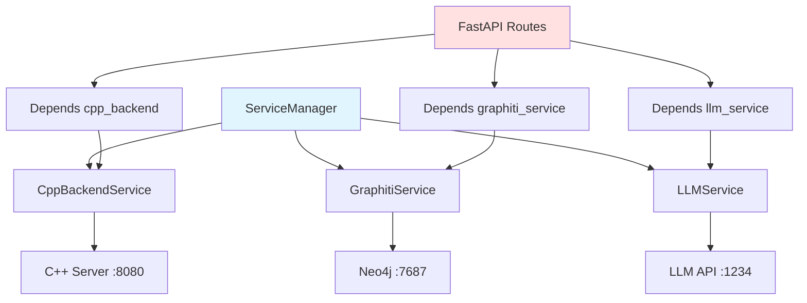

# ServiceManager 模块文档（Python）

## 1. 模块背景

### 业务背景

Python HTTP 服务需要协调多个后台服务（C++ 后端、Graphiti、LLM），ServiceManager 提供统一的服务生命周期管理。

**核心需求**：
- **服务编排**：按正确顺序初始化和关闭服务
- **依赖管理**：处理服务间的依赖关系
- **健康检查**：监控所有服务的健康状态
- **错误容忍**：单个服务失败不影响整体

**解决挑战**：
- **启动顺序**：某些服务必须在其他服务之前启动
- **依赖注入**：Route 和 Service 之间的依赖注入
- **优雅关闭**：确保服务正确释放资源
- **状态同步**：跟踪服务的初始化状态

### 技术背景

**服务架构**：
```
FastAPI App
    ↓
ServiceManager (协调器)
    ↓
┌──────────┬────────────┬─────────────┐
│ C++Backend│ GraphitiSvc │  LLMSvc    │
│  Service  │   Service   │  Service   │
└──────────┴────────────┴─────────────┘
```

**设计模式**：
- **Singleton Pattern**：全局唯一的 ServiceManager 实例
- **Service Locator Pattern**：通过名称获取服务
- **Dependency Injection**：通过 `Depends()` 注入服务到路由

## 2. 模块功能

### 核心功能

#### 1. 服务初始化

```python
from httpserver.services.service_manager import ServiceManager, get_service_manager

# 创建服务管理器
manager = ServiceManager()

# 初始化所有服务
await manager.initialize()

# 初始化顺序：
# 1. CppBackendService (必需)
# 2. GraphitiService (可选，失败不阻塞)
# 3. LLMService (可选，失败不阻塞)
```

#### 2. 服务访问

```python
# 属性访问
cpp_backend = manager.cpp_backend
graphiti_service = manager.graphiti_service
llm_service = manager.llm_service

# 调用服务方法
tasks = await cpp_backend.list_tasks()
is_healthy = await cpp_backend.health_check()
```

#### 3. 健康检查

```python
# 检查所有服务
health = await manager.health_check()

print(health)
# {
#     "overall": "healthy",
#     "services": {
#         "cpp_backend": {"status": "healthy"},
#         "graphiti": {"status": "healthy"},
#         "llm": {"status": "healthy"}
#     }
# }
```

#### 4. 优雅关闭

```python
# 关闭所有服务
await manager.shutdown()

# 关闭顺序：
# 1. LLMService
# 2. GraphitiService
# 3. CppBackendService
```

#### 5. 全局访问

```python
# 获取全局实例
manager = get_service_manager()

# 首次访问时自动初始化
await manager.initialize()
```

### 边界与限制

**功能边界**：
- ❌ 不支持动态服务注册（启动后固定）
- ❌ 不支持服务热重载（需重启服务）
- ❌ 不支持服务级别隔离（所有服务共享进程）

**已知限制**：
| 限制 | 影响 | 缓解方法 |
|------|------|----------|
| 单例模式 | 测试时状态污染 | 每次测试创建新实例 |
| 同步初始化 | 阻塞启动 | 使用异步初始化 |
| 无服务发现 | 需要硬编码配置 | 实现服务注册机制 |

**性能指标**：
- **初始化时间**：<1 秒
- **健康检查**：<100ms
- **内存占用**：约 50MB

## 3. 模块使用的库

### 依赖库清单

| 库名称 | 版本 | 用途 | 许可证 |
|--------|------|------|--------|
| **FastAPI** | 0.100+ | Web 框架 | MIT |
| **httpx** | 0.24+ | HTTP 客户端 | BSD |

### 架构图



## 4. 模块实现方式

### 核心类

```python
class ServiceManager:
    """服务管理器"""

    def __init__(self, settings: Optional[Settings] = None):
        self.settings = settings or get_settings()
        self._cpp_backend: Optional["CppBackendService"] = None
        self._graphiti_service: Optional["GraphitiService"] = None
        self._llm_service: Optional["LLMService"] = None
        self._initialized = False

    async def initialize(self):
        """初始化所有服务"""
        if self._initialized:
            return

        logger.info("Initializing services...")

        # 1. C++ 后端（必需）
        from .cpp_backend import CppBackendService
        self._cpp_backend = CppBackendService(self.settings)
        await self._cpp_backend.initialize()

        # 2. Graphiti（可选）
        try:
            from .graphiti_service import GraphitiService
            self._graphiti_service = GraphitiService(self.settings)
            await self._graphiti_service.initialize()
        except Exception as e:
            logger.warning(f"Graphiti service initialization failed: {e}")

        # 3. LLM（可选）
        try:
            from .llm_service import LLMService
            self._llm_service = LLMService(self.settings)
            await self._llm_service.initialize()
        except Exception as e:
            logger.warning(f"LLM service initialization failed: {e}")

        self._initialized = True
        logger.info("All services initialized successfully")

    async def shutdown(self):
        """关闭所有服务"""
        logger.info("Shutting down services...")

        if self._llm_service:
            await self._llm_service.shutdown()

        if self._graphiti_service:
            await self._graphiti_service.shutdown()

        if self._cpp_backend:
            await self._cpp_backend.shutdown()

        self._initialized = False
        logger.info("All services shut down")

    @property
    def cpp_backend(self) -> "CppBackendService":
        """获取 C++ 后端服务（懒加载）"""
        if self._cpp_backend is None:
            from .cpp_backend import CppBackendService
            self._cpp_backend = CppBackendService(self.settings)
        return self._cpp_backend

    @property
    def graphiti_service(self) -> "GraphitiService":
        """获取 Graphiti 服务（懒加载）"""
        if self._graphiti_service is None:
            from .graphiti_service import GraphitiService
            self._graphiti_service = GraphitiService(self.settings)
        return self._graphiti_service

    @property
    def llm_service(self) -> "LLMService":
        """获取 LLM 服务（懒加载）"""
        if self._llm_service is None:
            from .llm_service import LLMService
            self._llm_service = LLMService(self.settings)
        return self._llm_service

    async def health_check(self) -> dict:
        """检查所有服务健康状态"""
        result = {
            "overall": "healthy",
            "services": {},
        }

        # C++ 后端
        try:
            cpp_healthy = await self.cpp_backend.health_check()
            result["services"]["cpp_backend"] = {
                "status": "healthy" if cpp_healthy else "unhealthy",
            }
        except Exception as e:
            result["services"]["cpp_backend"] = {
                "status": "error",
                "error": str(e),
            }
            result["overall"] = "degraded"

        # Graphiti（可选）
        if self._graphiti_service:
            try:
                graphiti_healthy = await self._graphiti_service.health_check()
                result["services"]["graphiti"] = {
                    "status": "healthy" if graphiti_healthy else "unhealthy",
                }
            except Exception as e:
                result["services"]["graphiti"] = {
                    "status": "unavailable",
                    "error": str(e),
                }

        # LLM（可选）
        if self._llm_service:
            try:
                llm_healthy = await self._llm_service.health_check()
                result["services"]["llm"] = {
                    "status": "healthy" if llm_healthy else "unhealthy",
                }
            except Exception as e:
                result["services"]["llm"] = {
                    "status": "unavailable",
                    "error": str(e),
                }

        return result


# 全局实例
_service_manager: Optional[ServiceManager] = None


def get_service_manager() -> ServiceManager:
    """获取全局服务管理器实例"""
    global _service_manager
    if _service_manager is None:
        _service_manager = ServiceManager()
    return _service_manager
```

### FastAPI 集成

```python
# main.py
from fastapi import FastAPI
from contextlib import asynccontextmanager

@asynccontextmanager
async def lifespan(app: FastAPI):
    """应用生命周期管理"""
    # 启动
    service_manager = get_service_manager()
    await service_manager.initialize()

    yield

    # 关闭
    await service_manager.shutdown()


def create_app() -> FastAPI:
    app = FastAPI(lifespan=lifespan)
    return app
```

### 依赖注入

```python
# routes/example.py
from fastapi import APIRouter, Depends
from httpserver.services.service_manager import get_service_manager

router = APIRouter()

@router.get("/tasks")
async def list_tasks(
    cpp_backend = Depends(get_cpp_backend_service)
):
    """使用依赖注入获取服务"""
    tasks = await cpp_backend.list_tasks()
    return {"tasks": tasks}


def get_cpp_backend_service():
    """C++ 后端服务依赖"""
    manager = get_service_manager()
    return manager.cpp_backend
```

## 5. API 调用

### Python API

```python
from httpserver.services.service_manager import (
    ServiceManager,
    get_service_manager
)

# 1. 直接使用
async def main():
    manager = ServiceManager()
    await manager.initialize()

    # 访问服务
    cpp_backend = manager.cpp_backend
    health = await cpp_backend.health_check()
    print(f"C++ Backend Healthy: {health}")

    # 关闭
    await manager.shutdown()

asyncio.run(main())

# 2. 全局访问
async def app_handler():
    manager = get_service_manager()
    return await manager.health_check()

# 3. 在路由中使用
@router.get("/health")
async def health_endpoint():
    manager = get_service_manager()
    return await manager.health_check()
```

### FastAPI 路由集成

```python
from fastapi import APIRouter, Depends
from httpserver.services.service_manager import get_service_manager

router = APIRouter(prefix="/api/case", tags=["Case Analysis"])

# 方法 1：直接注入 ServiceManager
@router.post("/ingest")
async def ingest_to_graphiti(
    task_id: str,
    manager = Depends(get_service_manager)
):
    """摄取到知识图谱"""
    graphiti_service = manager.graphiti_service
    job_id = await graphiti_service.ingest(task_id)
    return {"job_id": job_id}

# 方法 2：注入特定服务
def get_graphiti_service():
    """Graphiti 服务依赖"""
    manager = get_service_manager()
    return manager.graphiti_service

@router.post("/analyze")
async def analyze_files(
    task_id: str,
    graphiti_service = Depends(get_graphiti_service)
):
    """使用 Graphiti 服务"""
    results = await graphiti_service.search(task_id, "malware")
    return {"results": results}
```

## 6. 二次开发

### 扩展点

#### 1. 添加新服务

```python
class CustomServiceManager(ServiceManager):
    """扩展服务管理器"""

    def __init__(self, settings: Optional[Settings] = None):
        super().__init__(settings)
        self._custom_service: Optional["CustomService"] = None

    async def initialize(self):
        """初始化所有服务"""
        # 先初始化父类服务
        await super().initialize()

        # 再初始化自定义服务
        try:
            from .custom_service import CustomService
            self._custom_service = CustomService(self.settings)
            await self._custom_service.initialize()
        except Exception as e:
            logger.warning(f"Custom service initialization failed: {e}")

    async def shutdown(self):
        """关闭所有服务"""
        if self._custom_service:
            await self._custom_service.shutdown()

        # 关闭父类服务
        await super().shutdown()

    @property
    def custom_service(self) -> "CustomService":
        """获取自定义服务"""
        if self._custom_service is None:
            from .custom_service import CustomService
            self._custom_service = CustomService(self.settings)
        return self._custom_service

    async def health_check(self) -> dict:
        """扩展健康检查"""
        result = await super().health_check()

        # 添加自定义服务健康检查
        if self._custom_service:
            try:
                custom_healthy = await self._custom_service.health_check()
                result["services"]["custom"] = {
                    "status": "healthy" if custom_healthy else "unhealthy",
                }
            except Exception as e:
                result["services"]["custom"] = {
                    "status": "error",
                    "error": str(e),
                }

        return result
```

#### 2. 添加服务监控

```python
class MonitoredServiceManager(ServiceManager):
    """带监控的服务管理器"""

    def __init__(self, settings: Optional[Settings] = None):
        super().__init__(settings)
        self._metrics = {
            "initialization_time": None,
            "service_health_history": {},
        }

    async def initialize(self):
        """记录初始化时间"""
        import time
        start_time = time.time()

        await super().initialize()

        self._metrics["initialization_time"] = time.time() - start_time
        logger.info(f"Initialization took {self._metrics['initialization_time']:.2f}s")

    async def health_check(self) -> dict:
        """带历史的健康检查"""
        result = await super().health_check()

        # 记录健康检查历史
        timestamp = datetime.now().isoformat()
        for service_name, service_health in result["services"].items():
            if service_name not in self._metrics["service_health_history"]:
                self._metrics["service_health_history"][service_name] = []

            self._metrics["service_health_history"][service_name].append({
                "timestamp": timestamp,
                "status": service_health["status"],
            })

        # 添加历史数据
        for service_name, history in self._metrics["service_health_history"].items():
            result["services"][service_name]["history"] = history[-10:]  # 最近 10 次

        return result
```

#### 3. 添加服务依赖

```python
class DependencyAwareServiceManager(ServiceManager):
    """支持服务依赖的管理器"""

    SERVICE_DEPENDENCIES = {
        "graphiti_service": ["cpp_backend"],
        "llm_service": [],
        "analysis_service": ["llm_service", "cpp_backend"],
    }

    async def initialize(self):
        """按依赖顺序初始化服务"""
        # 拓扑排序初始化
        for service_name in self._topological_sort():
            await self._initialize_service(service_name)

    async def _initialize_service(self, service_name: str):
        """初始化单个服务"""
        if service_name == "cpp_backend":
            from .cpp_backend import CppBackendService
            self._cpp_backend = CppBackendService(self.settings)
            await self._cpp_backend.initialize()

        elif service_name == "graphiti_service":
            from .graphiti_service import GraphitiService
            self._graphiti_service = GraphitiService(self.settings)
            await self._graphiti_service.initialize()

        # ... 其他服务

    def _topological_sort(self) -> list[str]:
        """拓扑排序服务初始化顺序"""
        # 实现拓扑排序算法
        pass
```

### 添加新功能的步骤

#### 完整示例：添加服务降级

```python
class ResilientServiceManager(ServiceManager):
    """支持服务降级的管理器"""

    async def initialize(self):
        """带重试和降级的初始化"""
        # 1. C++ 后端（必需，重试 3 次）
        for attempt in range(3):
            try:
                from .cpp_backend import CppBackendService
                self._cpp_backend = CppBackendService(self.settings)
                await self._cpp_backend.initialize()
                break
            except Exception as e:
                if attempt == 2:
                    raise  # 最后一次重试失败，抛出异常
                await asyncio.sleep(1)

        # 2. Graphiti（可选，降级到无功能模式）
        try:
            from .graphiti_service import GraphitiService
            self._graphiti_service = GraphitiService(self.settings)
            await self._graphiti_service.initialize()
        except Exception as e:
            logger.warning(f"Graphiti unavailable, using degraded mode: {e}")
            # 创建降级服务（空实现）
            from .graphiti_service import DegradedGraphitiService
            self._graphiti_service = DegradedGraphitiService()

        # 3. LLM（可选，降级到模拟模式）
        try:
            from .llm_service import LLMService
            self._llm_service = LLMService(self.settings)
            await self._llm_service.initialize()
        except Exception as e:
            logger.warning(f"LLM unavailable, using mock mode: {e}")
            # 创建模拟服务
            from .llm_service import MockLLMService
            self._llm_service = MockLLMService()

        self._initialized = True
```

## 7. 其他

### 测试

```bash
cd python_service/httpserver

# 运行测试
pytest tests/test_service_manager.py -v

# 测试健康检查
pytest tests/test_service_manager.py::test_health_check -v
```

### 配置

ServiceManager 从 `Settings` 读取配置：

```python
class Settings(BaseSettings):
    # C++ 后端
    cpp_backend_url: str = "http://localhost:8080"

    # Neo4j
    neo4j_uri: str = "neo4j://localhost:7687"
    neo4j_user: str = "neo4j"
    neo4j_password: str = "password"

    # LLM
    llm_text_base_url: str = "http://localhost:1234"
    llm_text_model: str = "qwen2.5:7b"
```

### 故障排查

| 问题 | 可能原因 | 解决方法 |
|------|----------|----------|
| **C++ 后端连接失败** | C++ 服务未运行 | 启动 C++ 服务 |
| **Graphiti 初始化失败** | Neo4j 未运行 | 检查 Neo4j 服务 |
| **LLM 服务不可用** | LLM API 配置错误 | 检查 LLM_BASE_URL |
| **健康检查超时** | 服务响应慢 | 增加超时时间 |

### 最佳实践

1. **全局访问**：使用 `get_service_manager()` 获取实例
2. **依赖注入**：通过 `Depends()` 注入服务到路由
3. **优雅关闭**：在 `lifespan` 中调用 `shutdown()`
4. **错误容忍**：可选服务失败不阻塞启动
5. **懒加载**：服务按需创建，减少启动时间

### 相关模块

- **[CppBackendClient](./CppBackendClient.md)** - C++ 后端通信
- **[GraphitiService](./GraphitiService.md)** - Graphiti 服务封装
- **[LLMService](./LLMService.md)** - LLM 服务封装

---

**最后更新**: 2026-03-11
**维护者**: ymj68520
