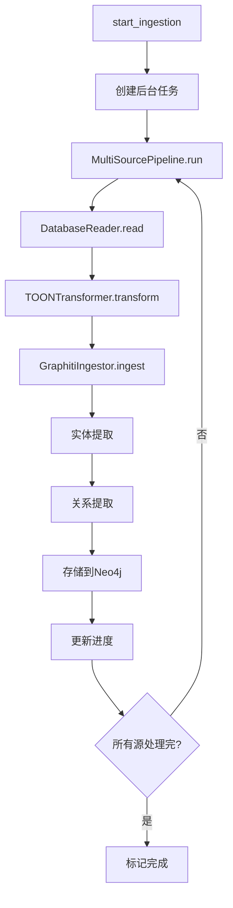
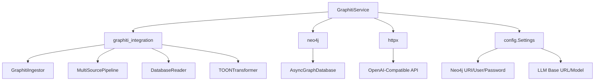
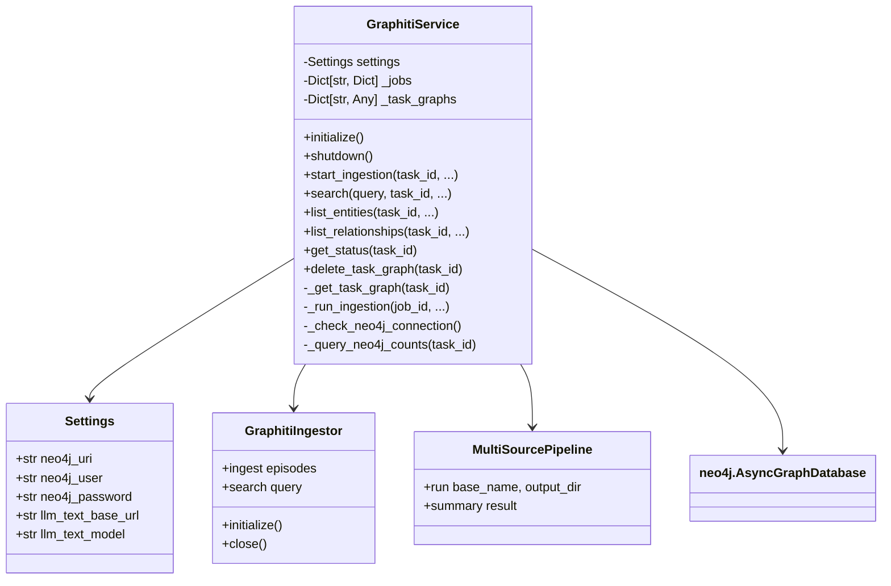
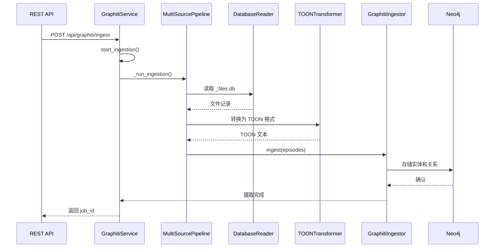
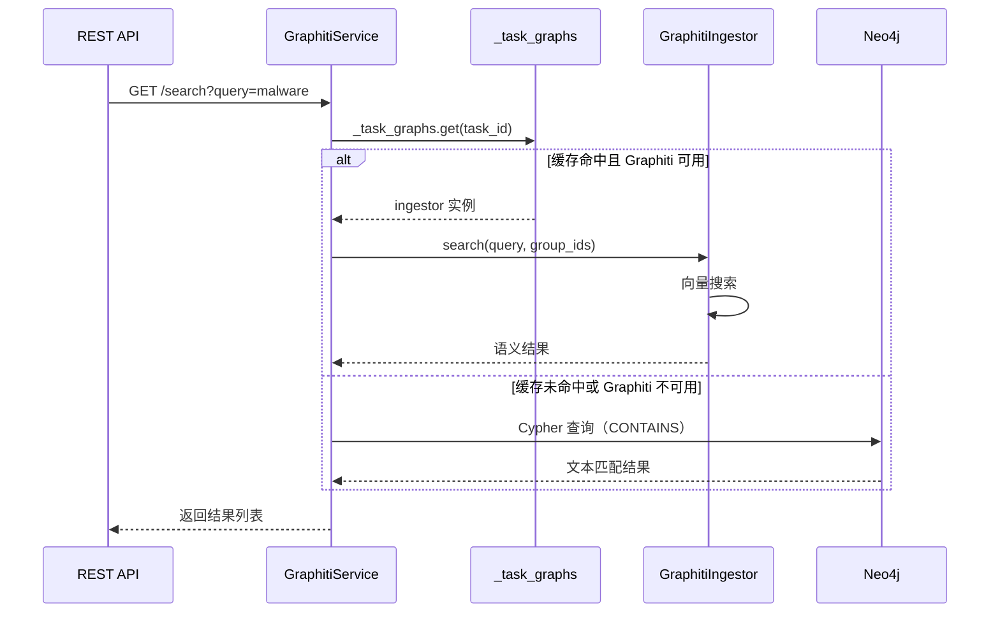

# GraphitiService 服务模块文档

## 1. 模块背景

### 业务背景

在数字取证分析中，数据之间的关系往往比单个数据点更重要：

**核心需求**：
- **实体关系挖掘**：从文件元数据、时间线事件中提取实体（人、组织、设备等）及其关系
- **跨数据源关联**：将不同来源（文件系统、应用数据库、日志）的数据关联起来
- **任务级隔离**：每个取证任务（磁盘镜像分析）的知识图谱相互独立
- **自然语言查询**：支持用自然语言搜索实体和关系

**知识图谱的优势**：
- **可视化分析**：直观展示证据之间的关系
- **模式发现**：自动识别隐藏的关联模式
- **证据链构建**：快速建立证据之间的时间、空间关系
- **案情推理**：辅助分析师发现可疑行为模式

### 技术背景

**Graphiti 框架**：
- 由 **Briand Vu** 和 **MIT** 团队开发的知识图谱框架
- 基于 **Neo4j** 图数据库
- 支持从非结构化文本中提取实体和关系
- 内置 LLM 驱动的实体解析和关系推理

**架构特点**：
- **Episodic Memory**：将每个数据摄取事件存储为 Episode
- **Entity Resolution**：自动合并相同实体的不同提及
- **Relationship Extraction**：从文本中提取实体间关系
- **Vector Search**：支持语义搜索

**任务级隔离**：
```python
# 每个任务使用独立的 group_id
config = GraphitiConfig(
    group_id=task_id,  # 如 "task_12345"
    # 所有此任务的数据都存储在带此 group_id 的节点上
)
```

**关键技术栈**：
- **Neo4j 5.x**：图数据库，ACID 事务保证
- **Graphiti**：Python 知识图谱框架
- **OpenAI-Compatible APIs**：LLM 集成
- **asyncio**：异步 I/O 处理

---

## 2. 模块功能

### 核心功能

| 功能 | 方法 | 描述 |
|------|------|------|
| **服务初始化** | `initialize()` | 建立 Neo4j 连接，加载 Graphiti 类 |
| **任务图管理** | `_get_task_graph()` | 为每个任务创建独立图命名空间 |
| **数据摄取** | `start_ingestion()` | 后台摄取取证数据库数据 |
| **实体搜索** | `search()` | 在任务图中搜索实体 |
| **实体列表** | `list_entities()` | 分页列出任务实体 |
| **关系列表** | `list_relationships()` | 分页列出实体关系 |
| **图数据导出** | `get_graph_data()` | 导出节点和边用于可视化 |
| **状态查询** | `get_status()` | 获取图统计信息 |
| **健康检查** | `health_check()` | 检查 Neo4j 连接状态 |
| **任务图清理** | `delete_task_graph()` | 删除任务的所有图数据 |

### 功能详解

#### 1. 任务级图隔离

```python
# 每个任务有独立的知识图
service = GraphitiService(settings)
await service.initialize()

# 任务 A 的数据
await service.start_ingestion(task_id="task_abc", ...)

# 任务 B 的数据（完全隔离）
await service.start_ingestion(task_id="task_xyz", ...)

# 查询时指定 task_id
results = await service.search("malware", task_id="task_abc")
```

**实现原理**：
- 所有 Neo4j 节点都带有 `group_id` 属性
- 查询时通过 `WHERE group_id = $task_id` 过滤
- 删除时通过 `MATCH (n {group_id: $gid}) DETACH DELETE n` 清理

#### 2. 数据摄取流程



**数据源**：
- `_files.db`：分类文件，包含 LLM 分析结果
- `_events.db`：时间线事件
- `_raw.db`：原始文件系统元数据
- `_android.db` / `_windows.db` / `_linux.db`：平台特定数据

#### 3. 搜索功能

```python
# Graphiti 语义搜索（高级）
results = await service.search(
    query="suspicious communication with external server",
    task_id="task_123",
    limit=50
)

# Neo4j 文本搜索（回退）
results = await service._neo4j_text_search(
    query="malware",
    task_id="task_123",
    limit=50
)
```

**搜索策略**：
1. 优先使用 Graphiti 的向量搜索（语义理解）
2. 失败时回退到 Neo4j CONTAINS 查询（文本匹配）
3. 都在任务范围内搜索（`group_id = task_id`）

#### 4. 实体和关系查询

```python
# 列出所有实体（分页）
entities, total = await service.list_entities(
    task_id="task_123",
    entity_type="Person",  # 可选：过滤类型
    page=1,
    page_size=50
)

# 列出关系（带过滤）
rels, total = await service.list_relationships(
    task_id="task_123",
    relationship_type="COMMUNICATED_WITH",  # 可选
    source_id="entity-uuid",  # 可选
    target_id="entity-uuid",  # 可选
    page=1,
    page_size=50
)
```

#### 5. 图数据导出

```python
# 获取可视化数据
nodes, links = await service.get_graph_data(
    task_id="task_123",
    max_nodes=200
)

# 返回格式：
# nodes: [{"id": "...", "name": "...", "label": "Person", "summary": "..."}]
# links: [{"source": "...", "target": "...", "label": "RELATES_TO"}]
```

### 边界与限制

| 限制 | 说明 | 缓解措施 |
|------|------|----------|
| **Neo4j 依赖** | 需要 Neo4j 实例运行 | Docker Compose 快速部署 |
| **LLM 调用成本** | 实体提取需要 LLM API 调用 | 批量处理，本地 LLM 降低成本 |
| **摄取时间** | 大型数据库可能需要数小时 | 进度回调，后台任务 |
| **内存使用** | Neo4j 需要足够内存 | 配置合理的 Neo4j JVM 堆大小 |
| **图复杂度** | 过多节点导致可视化困难 | 限制最大节点数（200） |

---

## 3. 模块使用的库

### 依赖库清单

| 库名/框架 | 用途 |
|----------|------|
| **graphiti_integration** | 知识图谱摄取和搜索 |
| **neo4j** (Python Driver) | 异步 Neo4j 数据库驱动 |
| **httpx** | HTTP 客户端（用于 LLM API） |
| **asyncio** | 异步 I/O 处理 |
| **uuid** | 生成唯一作业 ID |
| **logging** | 日志记录 |

### 依赖关系图



### 配置依赖

```python
# from config.py
class Settings(BaseSettings):
    # Neo4j 配置
    neo4j_uri: str = "bolt://localhost:7687"
    neo4j_user: str = "neo4j"
    neo4j_password: str = "password"

    # LLM 配置
    llm_text_base_url: str = "http://localhost:1234"
    llm_text_model: str = "local-model"
    llm_api_key: Optional[str] = None

    # Graphiti 特定配置
    graphiti_batch_size: int = 50
    graphiti_max_retries: int = 3
    graphiti_use_local_llm: bool = True
    db_output_dir: str = "./build/data/tasks"
```

---

## 4. 模块实现方式

### 架构设计



### 核心类说明

#### GraphitiService 类

**职责**：知识图谱服务的高级接口，管理任务级图隔离

```python
class GraphitiService:
    def __init__(self, settings: Settings):
        """初始化服务（不建立连接）"""
        self.settings = settings
        self._initialized = False
        self._jobs: Dict[str, Dict[str, Any]] = {}  # 后台任务跟踪
        self._task_graphs: Dict[str, Any] = {}      # 任务图缓存
```

**关键方法**：

1. **任务图获取**：
```python
async def _get_task_graph(self, task_id: str):
    """获取或创建任务专用图实例"""
    if task_id in self._task_graphs:
        return self._task_graphs[task_id]

    # 创建新配置，使用 task_id 作为 group_id
    config = GraphitiConfig(
        group_id=task_id,  # 关键：任务隔离
        neo4j_uri=self.settings.neo4j_uri,
        # ... 其他配置
    )

    ingestor = GraphitiIngestor(config)
    await ingestor.initialize()

    self._task_graphs[task_id] = {"config": config, "ingestor": ingestor}
    return self._task_graphs[task_id]
```

2. **数据摄取**：
```python
async def start_ingestion(
    self,
    task_id: str,
    include_llm_descriptions: bool = True,
    batch_size: int = 50,
) -> str:
    """启动后台摄取任务"""
    job_id = str(uuid.uuid4())

    self._jobs[job_id] = {
        "status": "running",
        "task_id": task_id,
        "progress": 0.0,
        "entities_created": 0,
        "errors": [],
    }

    # 创建后台任务
    asyncio.create_task(self._run_ingestion(
        job_id, task_id, include_llm_descriptions, batch_size
    ))

    return job_id
```

3. **搜索**：
```python
async def search(
    self,
    query: str,
    task_id: str,
    entity_types: Optional[List[str]] = None,
    limit: int = 100,
    include_relationships: bool = True,
) -> List[Dict[str, Any]]:
    """在任务图中搜索实体"""
    # 优先使用 Graphiti 搜索
    graph_entry = self._task_graphs.get(task_id)
    if graph_entry and "ingestor" in graph_entry:
        results = await graph_entry["ingestor"]._client.search(
            query=query,
            group_ids=[task_id],
            num_results=limit,
        )
        return [self._format_result(r) for r in results]

    # 回退到 Neo4j 文本搜索
    return await self._neo4j_text_search(query, task_id, limit)
```

### 关键流程

#### 数据摄取流程



#### 搜索流程



### 数据结构

#### 任务图缓存条目

```python
_task_graphs: Dict[str, Dict[str, Any]] = {
    "task_123": {
        "config": GraphitiConfig(...),
        "ingestor": GraphitiIngestor(...),
    }
}
```

#### 后台任务结构

```python
_jobs: Dict[str, Dict[str, Any]] = {
    "job-uuid": {
        "status": "running",  # running, completed, failed
        "task_id": "task_123",
        "progress": 0.5,
        "entities_created": 150,
        "relationships_created": 75,
        "sources_processed": 2,
        "summary": "...",
        "errors": [],
    }
}
```

#### Neo4j 节点结构

```cypher
// Episode 节点（Episodic）
(:Episodic {
    uuid: "uuid",
    group_id: "task_123",
    name: "episode name",
    summary: "episode summary",
    created_at: timestamp,
})

// Entity 节点
(:Entity {
    uuid: "uuid",
    name: "John Doe",
    summary: "Person of interest",
    entity_type: "Person",
})

// Relationship 边
(:Entity)-[:RELATES_TO {name: "COMMUNICATED_WITH"}]->(:Entity)
(:Episodic)-[:MENTIONS]->(:Entity)
```

---

## 5. API 调用

### Python API

#### 服务初始化

```python
from httpserver.services import GraphitiService
from httpserver.config import Settings

# 加载配置
settings = Settings()

# 创建服务
service = GraphitiService(settings)
await service.initialize()

# 检查健康状态
is_healthy = await service.health_check()
print(f"Graphiti healthy: {is_healthy}")
```

#### 数据摄取

```python
# 启动摄取任务
job_id = await service.start_ingestion(
    task_id="task_123",
    include_llm_descriptions=True,  # 包含 LLM 分析的文件
    batch_size=50,
)

print(f"Ingestion job started: {job_id}")

# 轮询任务状态
while True:
    job_status = await service.get_job_status(job_id)
    print(f"Progress: {job_status['progress']:.1%}")

    if job_status["status"] in ["completed", "failed"]:
        break

    await asyncio.sleep(5)

print(f"Result: {job_status['summary']}")
```

#### 实体搜索

```python
# 搜索实体
results = await service.search(
    query="malware communication",
    task_id="task_123",
    limit=50,
)

for result in results:
    print(f"Entity: {result['name']}")
    print(f"Type: {result['type']}")
    print(f"Score: {result['score']}")
    print()
```

#### 列出实体和关系

```python
# 列出所有实体（分页）
page = 1
while True:
    entities, total = await service.list_entities(
        task_id="task_123",
        page=page,
        page_size=50,
    )

    print(f"Page {page}/{(total + 49) // 50}")

    for entity in entities:
        print(f"  - {entity['name']} ({entity['type']})")

    if page * 50 >= total:
        break
    page += 1

# 列出关系
rels, total = await service.list_relationships(
    task_id="task_123",
    page=1,
    page_size=50,
)

for rel in rels:
    print(f"{rel['source_name']} --[{rel['type']}]--> {rel['target_name']}")
```

#### 获取图数据

```python
# 导出用于可视化
nodes, links = await service.get_graph_data(
    task_id="task_123",
    max_nodes=200,
)

print(f"Exported {len(nodes)} nodes, {len(links)} links")

# 可用于 D3.js、Cytoscape.js 等可视化库
import json
graph_data = {
    "nodes": nodes,
    "links": links,
}
with open("graph.json", "w") as f:
    json.dump(graph_data, f)
```

#### 任务管理

```python
# 列出所有有图数据的任务
task_ids = await service.list_task_graphs()
print(f"Tasks with graph data: {task_ids}")

# 删除任务的所有图数据
deleted = await service.delete_task_graph("task_123")
print(f"Deleted: {deleted}")
```

### REST API 集成

GraphitiService 通过 FastAPI 路由暴露 REST API：

```python
# routes/graphiti.py
@router.post("/ingest")
async def ingest_graph_data(
    task_id: str,
    include_llm_descriptions: bool = True,
):
    service = get_graphiti_service()
    job_id = await service.start_ingestion(
        task_id=task_id,
        include_llm_descriptions=include_llm_descriptions,
    )
    return {"job_id": job_id}


@router.get("/search")
async def search_graph(
    query: str,
    task_id: str,
    limit: int = 100,
):
    service = get_graphiti_service()
    results = await service.search(
        query=query,
        task_id=task_id,
        limit=limit,
    )
    return {"results": results}
```

---

## 6. 二次开发

### 扩展点

#### 1. 自定义实体提取器

**场景**：添加特定领域的实体类型（如加密货币地址、IP 地址）

```python
class CustomEntityExtractor:
    """自定义实体提取器"""

    def extract_entities(self, text: str) -> List[Dict[str, Any]]:
        """从文本中提取自定义实体"""
        entities = []

        # 提取比特币地址
        import re
        btc_pattern = r'\b[13][a-km-zA-HJ-NP-Z1-9]{25,34}\b'
        for match in re.finditer(btc_pattern, text):
            entities.append({
                "name": match.group(),
                "entity_type": "BitcoinAddress",
                "summary": "Cryptocurrency address",
                "confidence": 0.95,
            })

        # 提取 IP 地址
        ip_pattern = r'\b(?:\d{1,3}\.){3}\d{1,3}\b'
        for match in re.finditer(ip_pattern, text):
            entities.append({
                "name": match.group(),
                "entity_type": "IPAddress",
                "summary": "IPv4 address",
                "confidence": 0.90,
            })

        return entities


# 集成到 GraphitiService
class ExtendedGraphitiService(GraphitiService):
    async def _run_ingestion(self, job_id, task_id, ...):
        # 原有逻辑
        result = await pipeline.run(...)

        # 添加自定义实体提取
        extractor = CustomEntityExtractor()
        for episode in result.episodes:
            custom_entities = extractor.extract_entities(episode.content)
            # 将自定义实体添加到图
            await self._ingest_custom_entities(task_id, custom_entities)

        return result
```

#### 2. 自定义关系类型

**场景**：定义特定领域的关系（如 "FUNDED"、"ACCESSED"）

```python
class CustomRelationExtractor:
    """自定义关系提取器"""

    def extract_relations(self, text: str, entities: List[str]) -> List[Dict[str, Any]]:
        """提取自定义关系"""
        relations = []

        # 检测资金流向
        if any("transfer" in text.lower() or "payment" in text.lower()):
            for source, target in itertools.combinations(entities, 2):
                relations.append({
                    "source": source,
                    "target": target,
                    "relation_type": "FUNDED",
                    "confidence": 0.7,
                })

        # 检测访问关系
        if any("access" in text.lower() or "login" in text.lower()):
            for source, target in itertools.combinations(entities, 2):
                relations.append({
                    "source": source,
                    "target": target,
                    "relation_type": "ACCESSED",
                    "confidence": 0.8,
                })

        return relations
```

#### 3. 添加进度回调

**场景**：实时报告摄取进度

```python
class ProgressTrackingGraphitiService(GraphitiService):
    def __init__(self, settings: Settings):
        super().__init__(settings)
        self._progress_callbacks: Dict[str, List[Callable]] = {}

    def register_progress_callback(self, job_id: str, callback: Callable[[float], None]):
        """注册进度回调函数"""
        if job_id not in self._progress_callbacks:
            self._progress_callbacks[job_id] = []
        self._progress_callbacks[job_id].append(callback)

    def _notify_progress(self, job_id: str, progress: float):
        """通知所有回调"""
        if job_id in self._progress_callbacks:
            for callback in self._progress_callbacks[job_id]:
                try:
                    callback(progress)
                except Exception as e:
                    logger.warning(f"Progress callback failed: {e}")


# 使用
service = ProgressTrackingGraphitiService(settings)

def on_progress(progress: float):
    print(f"Progress: {progress:.1%}")

job_id = await service.start_ingestion("task_123")
service.register_progress_callback(job_id, on_progress)
```

#### 4. 添加图分析算法

**场景**：运行图算法（如最短路径、社区检测）

```python
class AnalyticalGraphitiService(GraphitiService):
    async def find_shortest_path(
        self,
        task_id: str,
        source_entity_name: str,
        target_entity_name: str,
    ) -> List[Dict[str, Any]]:
        """查找两个实体之间的最短路径"""
        from neo4j import AsyncGraphDatabase

        driver = AsyncGraphDatabase.driver(
            self.settings.neo4j_uri,
            auth=(self.settings.neo4j_user, self.settings.neo4j_password),
        )

        try:
            async with driver.session() as session:
                result = await session.run("""
                    MATCH (e1:Episodic {group_id: $gid})-[m1:MENTIONS]->(s:Entity)
                    WHERE s.name = $source
                    MATCH (e2:Episodic {group_id: $gid})-[m2:MENTIONS]->(t:Entity)
                    WHERE t.name = $target
                    MATCH path = shortestPath((s)-[*]-(t))
                    RETURN path
                """, gid=task_id, source=source_entity_name, target=target_entity_name)

                record = await result.single()
                if record and record["path"]:
                    path = record["path"]
                    return [
                        {
                            "entity": node["name"],
                            "type": node.get("entity_type", "Unknown"),
                        }
                        for node in path.nodes
                    ]
                return []
        finally:
            await driver.close()

    async def detect_communities(
        self,
        task_id: str,
    ) -> Dict[str, List[str]]:
        """检测实体社区（使用 Louvain 算法）"""
        from neo4j import AsyncGraphDatabase

        driver = AsyncGraphDatabase.driver(
            self.settings.neo4j_uri,
            auth=(self.settings.neo4j_user, self.settings.neo4j_password),
        )

        try:
            async with driver.session() as session:
                # 运行 Louvain 算法
                await session.run("""
                    CALL graphlite.community.louvain({
                        nodeProjection: 'Entity',
                        relationshipProjection: {
                            RELATES_TO: {
                                type: 'RELATES_TO'
                            }
                        }
                    })
                    YIELD nodeId, community
                    MATCH (e:Episodic {group_id: $gid})-[m:MENTIONS]->(n:Entity)
                    WHERE id(n) = nodeId
                    RETURN community, collect(n.name) AS members
                """, gid=task_id)

                communities = {}
                async for record in session.run("""
                    MATCH (e:Episodic {group_id: $gid})-[m:MENTIONS]->(n:Entity)
                    WHERE n.community IS NOT NULL
                    RETURN n.community AS community, collect(n.name) AS members
                """, gid=task_id):
                    communities[record["community"]] = record["members"]

                return communities
        finally:
            await driver.close()
```

### 添加新功能的步骤

#### 步骤 1: 扩展配置

```python
# config.py
class Settings(BaseSettings):
    # 现有配置...

    # 新增：图分析配置
    enable_graph_algorithms: bool = True
    max_path_length: int = 5
    community_detection_resolution: float = 1.0
```

#### 步骤 2: 添加服务方法

```python
# services/graphiti_service.py
class GraphitiService:
    # 现有方法...

    async def run_graph_algorithm(
        self,
        task_id: str,
        algorithm: str,
        **kwargs,
    ) -> Dict[str, Any]:
        """运行图算法"""
        if algorithm == "shortest_path":
            return await self._find_shortest_path(task_id, **kwargs)
        elif algorithm == "community_detection":
            return await self._detect_communities(task_id, **kwargs)
        else:
            raise ValueError(f"Unknown algorithm: {algorithm}")
```

#### 步骤 3: 添加 REST 端点

```python
# routes/graphiti.py
@router.post("/algorithms/{algorithm}")
async def run_graph_algorithm(
    task_id: str,
    algorithm: str,
    params: Dict[str, Any] = {},
):
    service = get_graphiti_service()
    result = await service.run_graph_algorithm(
        task_id=task_id,
        algorithm=algorithm,
        **params,
    )
    return result
```

### 代码示例

#### 示例 1: 完整的摄取和搜索流程

```python
import asyncio
from httpserver.services import GraphitiService
from httpserver.config import Settings

async def main():
    # 初始化
    settings = Settings()
    service = GraphitiService(settings)
    await service.initialize()

    # 摄取数据
    job_id = await service.start_ingestion(
        task_id="evidence_001",
        include_llm_descriptions=True,
        batch_size=100,
    )

    # 等待完成
    while True:
        status = await service.get_job_status(job_id)
        if status["status"] != "running":
            break
        print(f"Progress: {status['progress']:.1%}")
        await asyncio.sleep(2)

    # 搜索
    results = await service.search(
        query="suspicious executable",
        task_id="evidence_001",
        limit=20,
    )

    # 打印结果
    for r in results:
        print(f"{r['name']} ({r['type']}) - score: {r['score']:.2f}")

    # 清理
    await service.shutdown()

asyncio.run(main())
```

#### 示例 2: 图数据导出到可视化库

```python
import asyncio
import json
from httpserver.services import GraphitiService
from httpserver.config import Settings

async def export_for_d3():
    settings = Settings()
    service = GraphitiService(settings)
    await service.initialize()

    # 获取图数据
    nodes, links = await service.get_graph_data(
        task_id="evidence_001",
        max_nodes=500,
    )

    # 转换为 D3.js 格式
    d3_data = {
        "nodes": [
            {
                "id": n["id"],
                "name": n["name"],
                "group": n["label"],
                "radius": 5 + len(n.get("summary", "")) // 50,
            }
            for n in nodes
        ],
        "links": [
            {
                "source": l["source"],
                "target": l["target"],
                "value": 1,
            }
            for l in links
        ],
    }

    # 保存到文件
    with open("graph_d3.json", "w") as f:
        json.dump(d3_data, f, indent=2)

    print(f"Exported {len(nodes)} nodes and {len(links)} links")

    await service.shutdown()

asyncio.run(export_for_d3())
```

#### 示例 3: 批量处理多个任务

```python
import asyncio
from httpserver.services import GraphitiService
from httpserver.config import Settings

async def batch_ingest(task_ids: List[str]):
    settings = Settings()
    service = GraphitiService(settings)
    await service.initialize()

    # 并发摄取所有任务
    jobs = []
    for task_id in task_ids:
        job_id = await service.start_ingestion(
            task_id=task_id,
            include_llm_descriptions=True,
        )
        jobs.append((task_id, job_id))

    # 等待所有任务完成
    results = {}
    for task_id, job_id in jobs:
        while True:
            status = await service.get_job_status(job_id)
            if status["status"] != "running":
                results[task_id] = status
                break
            await asyncio.sleep(1)

    # 打印摘要
    for task_id, status in results.items():
        print(f"{task_id}: {status['status']} - {status.get('entities_created', 0)} entities")

    await service.shutdown()

# 使用
asyncio.run(batch_ingest(["task_1", "task_2", "task_3"]))
```

---

## 7. 其他

### 测试

#### 单元测试

```python
# tests/test_graphiti_service.py
import pytest
from httpserver.services import GraphitiService
from httpserver.config import Settings

@pytest.mark.asyncio
async def test_graphiti_initialization():
    """测试服务初始化"""
    settings = Settings()
    service = GraphitiService(settings)
    await service.initialize()
    assert service._initialized is True
    await service.shutdown()

@pytest.mark.asyncio
async def test_health_check():
    """测试健康检查"""
    settings = Settings()
    service = GraphitiService(settings)
    await service.initialize()

    is_healthy = await service.health_check()
    assert isinstance(is_healthy, bool)

    await service.shutdown()

@pytest.mark.asyncio
async def test_search():
    """测试搜索功能"""
    settings = Settings()
    service = GraphitiService(settings)
    await service.initialize()

    # 假设已有数据
    results = await service.search(
        query="test",
        task_id="test_task",
        limit=10,
    )

    assert isinstance(results, list)
    await service.shutdown()
```

#### 集成测试

```bash
# 启动 Neo4j（Docker）
docker run -d \
    --name neo4j \
    -p 7474:7474 -p 7687:7687 \
    -e NEO4J_AUTH=neo4j/test_password \
    neo4j:5.15

# 运行测试
pytest tests/test_graphiti_service.py -v
```

### 配置

#### Neo4j 配置

```yaml
# docker-compose.yml
version: '3.8'
services:
  neo4j:
    image: neo4j:5.15
    ports:
      - "7474:7474"  # HTTP
      - "7687:7687"  # Bolt
    environment:
      - NEO4J_AUTH=neo4j/your_password
      - NEO4J_dbms_memory_heap_max__size=2G
      - NEO4J_dbms_memory_pagecache_size=1G
    volumes:
      - neo4j_data:/data
      - neo4j_logs:/logs

volumes:
  neo4j_data:
  neo4j_logs:
```

#### 环境变量

```bash
# .env
NEO4J_URI=bolt://localhost:7687
NEO4J_USER=neo4j
NEO4J_PASSWORD=your_password

# LLM 配置（用于实体提取）
LLM_TEXT_BASE_URL=http://localhost:1234
LLM_TEXT_MODEL=local-model
LLM_API_KEY=optional-key

# Graphiti 特定配置
GRAPHITI_BATCH_SIZE=50
GRAPHITI_MAX_RETRIES=3
GRAPHITI_USE_LOCAL_LLM=true
```

### 故障排查

| 问题 | 可能原因 | 解决方法 |
|------|----------|----------|
| **Neo4j 连接失败** | Neo4j 未运行或端口错误 | 检查 `docker ps`，验证 URI 配置 |
| **摄取任务卡住** | LLM API 超时或无响应 | 检查 LLM 服务状态，增加超时时间 |
| **内存不足** | Neo4j JVM 堆太小 | 增加 `NEO4J_dbms_memory_heap_max__size` |
| **搜索无结果** | 数据未摄取或 group_id 错误 | 验证 task_id 与摄取时一致 |
| **实体提取失败** | LLM API 配额或错误 | 检查 API 密钥，查看日志 |

### 调试技巧

**1. 检查 Neo4j 数据**

```bash
# 连接到 Neo4j
cypher-shell -u neo4j -p your_password

# 查询任务数据
MATCH (n:Episodic {group_id: 'task_123'})
RETURN n;

# 统计实体数量
MATCH (e:Episodic {group_id: 'task_123'})-[m:MENTIONS]->(n:Entity)
RETURN count(DISTINCT n) AS entity_count;
```

**2. 启用详细日志**

```python
import logging
logging.basicConfig(level=logging.DEBUG)
```

**3. 监控摄取进度**

```python
while True:
    status = await service.get_job_status(job_id)
    print(f"Progress: {status['progress']:.1%}, Entities: {status.get('entities_created', 0)}")
    if status["status"] != "running":
        break
    await asyncio.sleep(5)
```

### 最佳实践

1. **任务隔离**：始终使用 `task_id` 作为 `group_id`，确保数据隔离
2. **批量处理**：设置合理的 `batch_size`（默认 50），平衡速度和内存
3. **错误处理**：后台任务失败时检查 `errors` 字段
4. **资源清理**：完成分析后调用 `delete_task_graph()` 释放空间
5. **进度监控**：使用回调函数或轮询任务状态
6. **本地 LLM**：生产环境建议使用本地 LLM 降低成本

### 相关模块

- **[GraphitiIntegration](../graphiti/GraphitiIntegration.md)** - Graphiti 框架集成详细文档
- **[GraphitiIngestor](../graphiti_integration/GraphitiIngestor.md)** - 数据摄取引擎
- **[TOONTransformer](../graphiti_integration/TOONTransformer.md)** - TOON 格式转换器
- **[DatabaseReader](../graphiti_integration/DatabaseReader.md)** - 数据库读取器
- **[DatabaseRoutes](../httpserver/routes/Database.md)** - 数据库查询路由

### 参考资源

- **Graphiti GitHub**: https://github.com/getndazn/graphiti
- **Neo4j 文档**: https://neo4j.com/docs/
- **Neo4j Python Driver**: https://neo4j.com/docs/python-manual/current/
- **图数据库概念**: https://neo4j.com/developer/graph-data-model/

### 变更历史

| 版本 | 日期 | 变更说明 | 作者 |
|------|------|----------|------|
| 1.0.0 | 2026-03-16 | 初始版本 | Claude Code |

---

**文档完成日期**: 2026-03-16
**文档版本**: 1.0.0
**维护者**: ymj68520
