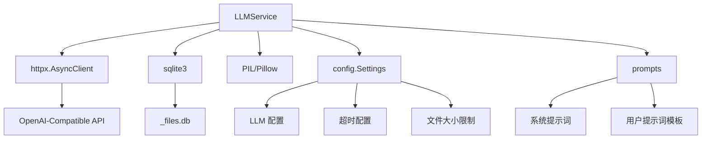
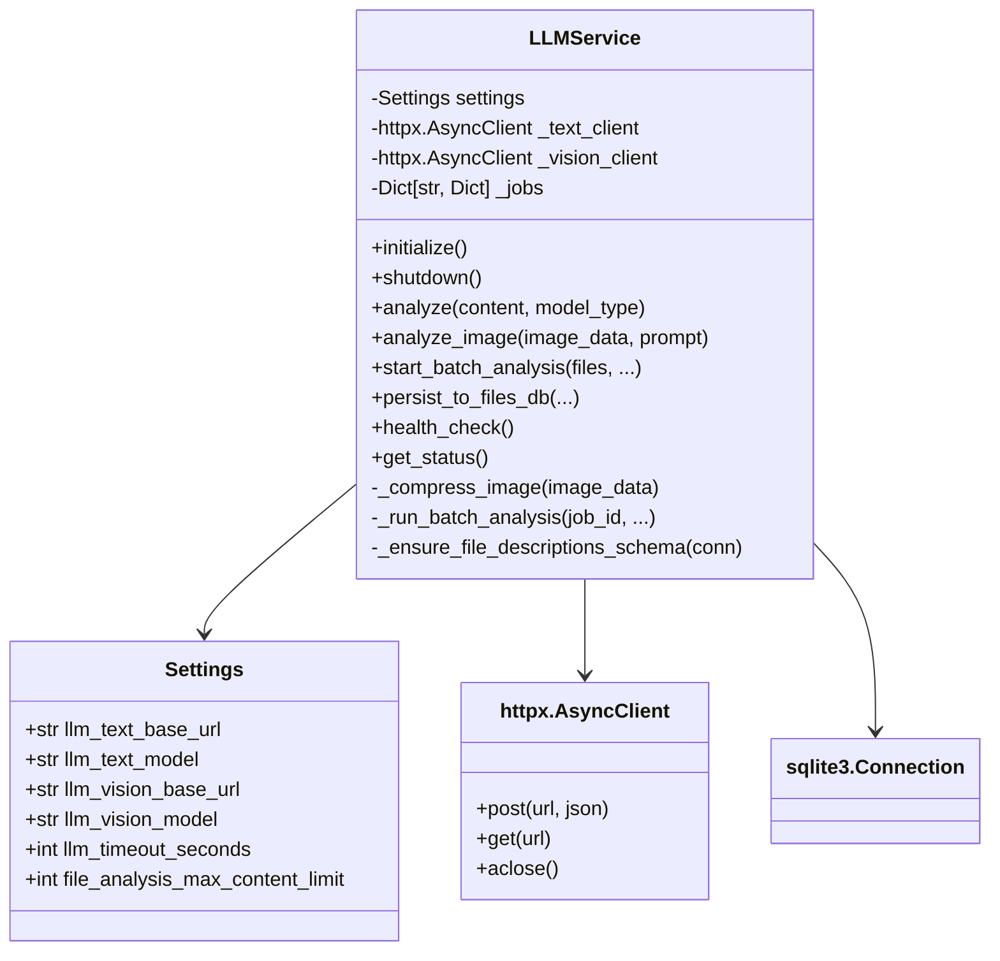
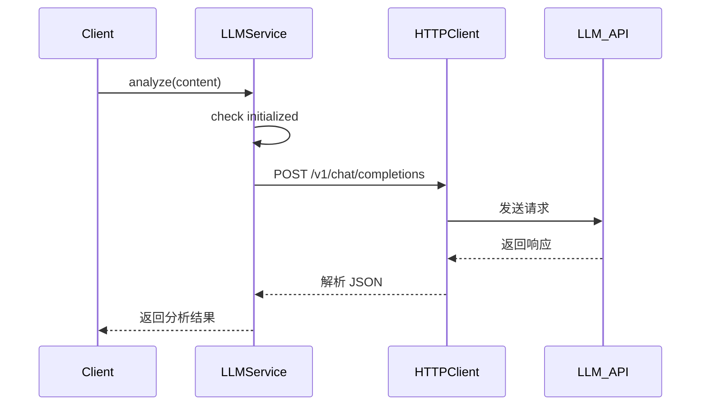
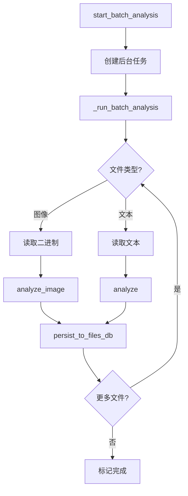

# LLMService 服务模块文档

## 1. 模块背景

### 业务背景

在现代数字取证中，AI 辅助分析已成为关键能力：

**核心需求**：
- **文件内容理解**：自动分析文档、脚本、配置文件的内容
- **图像分析**：从截图、图片中提取文字和场景信息
- **批量处理**：高效处理大量文件的 AI 分析
- **结果持久化**：将 AI 分析结果保存到 C++ 数据库
- **多模态支持**：同时支持文本和图像分析

**AI 分析的价值**：
- **快速证据发现**：自动识别可疑文件、恶意代码模式
- **上下文理解**：理解文件的用途和意义
- **关键词提取**：自动生成便于搜索的关键词
- **报告生成**：为案件报告提供证据描述

### 技术背景

**OpenAI 兼容 API**：
- 标准化的 REST API 接口
- 支持 Chat Completions 格式
- 可使用多种后端（OpenAI、LM Studio、LocalAI）

**模型类型**：
- **Text Models**：处理文本内容（代码、文档、日志）
- **Vision Models**：处理图像（截图、照片、扫描件）

**异步架构**：
- 使用 `asyncio` 进行异步 I/O
- `httpx.AsyncClient` 进行 HTTP 通信
- 后台任务处理批量分析

**数据持久化**：
- 直接写入 C++ 的 `_files.db` SQLite 数据库
- 与 C++ `LLMAnalysisService` 保持兼容
- 支持 `file_descriptions` 表和主 `files` 表同步更新

---

## 2. 模块功能

### 核心功能

| 功能 | 方法 | 描述 |
|------|------|------|
| **服务初始化** | `initialize()` | 创建 HTTP 客户端（text/vision） |
| **服务关闭** | `shutdown()` | 关闭 HTTP 客户端 |
| **文本分析** | `analyze()` | 使用 LLM 分析文本内容 |
| **图像分析** | `analyze_image()` | 使用视觉模型分析图像 |
| **批量分析** | `start_batch_analysis()` | 启动后台批量分析任务 |
| **模型状态检查** | `check_model_status()` | 检查模型可用性 |
| **健康检查** | `health_check()` | 检查整体服务健康 |
| **结果持久化** | `persist_to_files_db()` | 将分析结果写入 SQLite |
| **文件相关性** | `set_file_relevance()` | 标记文件相关性 |
| **服务状态** | `get_status()` | 获取模型配置和状态 |

### 功能详解

#### 1. 文本分析

```python
# 分析文本内容
result = await service.analyze(
    content="file content here...",
    model_type="text",
    prompt="Analyze this file for suspicious activity",
    max_tokens=2000,
    temperature=0.3,
)

# 返回格式：
{
    "analysis": {
        "description": "This file appears to be...",
        "model_type": "text",
    },
    "model": "local-model",
    "tokens_used": 1234,
}
```

**提示词模板**：
- **System Prompt**：定义分析角色和目标
- **User Prompt**：包含文件内容和分析指令

#### 2. 图像分析

```python
# 读取图像
with open("screenshot.png", "rb") as f:
    image_data = f.read()

# 分析图像
result = await service.analyze_image(
    image_data=image_data,
    prompt="Describe what you see in this image",
)

# 返回格式：
{
    "analysis": {
        "description": "The image shows...",
        "model_type": "vision",
    },
    "model": "vision-model",
    "tokens_used": 567,
}
```

**图像处理**：
- 自动压缩超过 20MB 的图像
- Base64 编码传输
- 支持 JPEG、PNG、GIF、BMP 等格式
- 自动检测并处理 RGBA/灰度图像

#### 3. 批量分析

```python
# 准备文件列表
files = [
    {"path": "/path/to/file1.txt"},
    {"path": "/path/to/file2.jpg"},
    {"path": "/path/to/file3.py"},
]

# 启动批量分析
job_id = await service.start_batch_analysis(
    files=files,
    model_type="text",  # 会自动检测图像文件
    files_db_path="/path/to/_files.db",
    extraction_dir="/path/to/extracted",
)

# 监控进度
while True:
    status = await service.get_batch_status(job_id)
    print(f"Progress: {status['progress']:.1%}")
    print(f"Processed: {status['files_processed']}/{status['files_total']}")

    if status["status"] in ["completed", "failed"]:
        break

    await asyncio.sleep(2)
```

**自动检测**：
- 根据文件扩展名自动选择模型
- 图像文件使用视觉模型
- 其他文件使用文本模型

#### 4. 结果持久化

```python
# 将分析结果写入 C++ 数据库
service.persist_to_files_db(
    db_path="/path/to/_files.db",
    file_path="/path/to/file.txt",
    description="Full AI-generated description...",
    summary="Short summary...",
    keywords="malware, suspicious, executable",
    model_used="local-model",
)
```

**写入位置**：
- **主表**：`files` 表的 `llm_summary`、`llm_description`、`llm_keywords` 列
- **辅助表**：`file_descriptions` 表（包含 `is_relevant` 标志）

**匹配策略**：
1. 精确路径匹配
2. 文件名匹配（basename）
3. 后缀匹配（LIKE pattern）

### 边界与限制

| 限制 | 说明 | 缓解措施 |
|------|------|----------|
| **文件大小** | 文本内容默认限制 100KB | 可配置 `file_analysis_max_content_limit` |
| **图像大小** | 图像超过 20MB 自动压缩 | 调整 `max_image_size` 阈值 |
| **API 限流** | LLM API 可能有速率限制 | 实现重试机制，批量处理控制速率 |
| **Base64 大小** | Base64 后图像不超过 10MB | 使用低分辨率（detail="low"） |
| **超时** | 默认超时可能不够 | 调整 `llm_timeout_seconds` |
| **上下文窗口** | 模型有最大 token 限制 | 截断过长内容，使用分段处理 |

---

## 3. 模块使用的库

### 依赖库清单

| 库名/框架 | 用途 |
|----------|------|
| **httpx** | 异步 HTTP 客户端 |
| **asyncio** | 异步 I/O 和任务管理 |
| **sqlite3** | 数据库持久化 |
| **base64** | 图像 Base64 编码 |
| **PIL (Pillow)** | 图像压缩（可选） |
| **uuid** | 生成唯一作业 ID |
| **logging** | 日志记录 |

### 依赖关系图



### 配置依赖

```python
# from config.py
class Settings(BaseSettings):
    # LLM API 配置
    llm_text_base_url: str = "http://localhost:1234"
    llm_text_model: str = "local-model"
    llm_text_max_tokens: int = 4096
    llm_text_temperature: float = 0.7

    llm_vision_base_url: str = "http://localhost:1234"
    llm_vision_model: str = "vision-model"
    llm_vision_max_tokens: int = 2048
    llm_vision_temperature: float = 0.5

    llm_endpoint: str = "/v1/chat/completions"
    llm_api_key: Optional[str] = None
    llm_timeout_seconds: int = 120
    llm_context_length: int = 8192

    # 文件分析配置
    file_analysis_max_content_limit: int = 100 * 1024  # 100KB
```

### 提示词模板

```python
# from prompts.py
TEXT_ANALYSIS_SYSTEM = """You are a forensic file analyst...
分析文件时关注：
1. 文件用途和功能
2. 可疑内容和模式
3. 潜在的安全风险
4. 相关的技术细节
"""

TEXT_ANALYSIS_USER_TEMPLATE = """Analyze the following file content:

{content}

Provide:
- Description: Detailed analysis
- Summary: Brief overview (first 200 chars)
- Keywords: Comma-separated relevant terms
"""

VISION_ANALYSIS_SYSTEM = """You are a forensic image analyst...
描述图像中的：
1. 可见的内容和元素
2. 文字和标签
3. 异常或可疑之处
4. 技术细节（如窗口、工具栏）
"""

VISION_ANALYSIS_USER_DEFAULT = """Describe this image in detail for forensic analysis."""
```

---

## 4. 模块实现方式

### 架构设计



### 核心类说明

#### LLMService 类

**职责**：LLM 分析服务的高级接口，管理模型调用和结果持久化

```python
class LLMService:
    def __init__(self, settings: Settings):
        """初始化服务（不建立连接）"""
        self.settings = settings
        self._text_client: Optional[httpx.AsyncClient] = None
        self._vision_client: Optional[httpx.AsyncClient] = None
        self._initialized = False
        self._jobs: Dict[str, Dict[str, Any]] = {}
```

**关键方法**：

1. **初始化**：
```python
async def initialize(self):
    """初始化 HTTP 客户端"""
    if self._initialized:
        return

    # 文本模型客户端
    self._text_client = httpx.AsyncClient(
        base_url=self.settings.llm_text_base_url,
        timeout=httpx.Timeout(self.settings.llm_timeout_seconds),
    )

    # 视觉模型客户端
    self._vision_client = httpx.AsyncClient(
        base_url=self.settings.llm_vision_base_url,
        timeout=httpx.Timeout(self.settings.llm_timeout_seconds),
    )

    self._initialized = True
```

2. **文本分析**：
```python
async def analyze(
    self,
    content: str,
    model_type: str = "text",
    prompt: Optional[str] = None,
    max_tokens: Optional[int] = None,
    temperature: Optional[float] = None,
) -> Dict[str, Any]:
    """使用 LLM 分析内容"""
    if not self._initialized:
        await self.initialize()

    # 选择客户端和模型
    client = self._text_client
    model = self.settings.llm_text_model

    # 构建请求
    system_prompt = TEXT_ANALYSIS_SYSTEM
    user_prompt = prompt or TEXT_ANALYSIS_USER_TEMPLATE.format(content=content)

    # 发送 API 请求
    response = await client.post(
        self.settings.llm_endpoint,
        json={
            "model": model,
            "messages": [
                {"role": "system", "content": system_prompt},
                {"role": "user", "content": user_prompt},
            ],
            "max_tokens": max_tokens or self.settings.llm_text_max_tokens,
            "temperature": temperature or self.settings.llm_text_temperature,
        },
    )

    response.raise_for_status()
    result = response.json()

    # 提取响应
    analysis_text = result["choices"][0]["message"]["content"]
    tokens_used = result.get("usage", {}).get("total_tokens", 0)

    return {
        "analysis": {
            "description": analysis_text,
            "model_type": model_type,
        },
        "model": model,
        "tokens_used": tokens_used,
    }
```

3. **图像分析**：
```python
async def analyze_image(
    self,
    image_data: bytes,
    prompt: Optional[str] = None,
) -> Dict[str, Any]:
    """分析图像"""
    # 压缩大图像
    if len(image_data) > 20 * 1024 * 1024:
        image_data = self._compress_image(image_data, max_size=3 * 1024 * 1024)

    # Base64 编码
    image_b64 = base64.b64encode(image_data).decode("utf-8")

    # 检查大小
    if len(image_b64) > 10 * 1024 * 1024:
        raise ValueError("Image too large after compression")

    # 构建请求
    response = await self._vision_client.post(
        self.settings.llm_endpoint,
        json={
            "model": self.settings.llm_vision_model,
            "messages": [
                {"role": "system", "content": VISION_ANALYSIS_SYSTEM},
                {
                    "role": "user",
                    "content": [
                        {"type": "text", "text": prompt or VISION_ANALYSIS_USER_DEFAULT},
                        {
                            "type": "image_url",
                            "image_url": {
                                "url": f"data:image/jpeg;base64,{image_b64}",
                                "detail": "low",
                            },
                        },
                    ],
                },
            ],
            "max_tokens": 2048,
            "temperature": self.settings.llm_vision_temperature,
        },
    )

    response.raise_for_status()
    result = response.json()

    analysis_text = result["choices"][0]["message"]["content"]
    tokens_used = result.get("usage", {}).get("total_tokens", 0)

    return {
        "analysis": {
            "description": analysis_text,
            "model_type": "vision",
        },
        "model": self.settings.llm_vision_model,
        "tokens_used": tokens_used,
    }
```

4. **结果持久化**：
```python
def persist_to_files_db(
    self,
    db_path: str,
    file_path: str,
    description: str,
    summary: str,
    keywords: str,
    model_used: str = "",
) -> bool:
    """将分析结果写入 SQLite"""
    # 检查数据库
    if not Path(db_path).exists():
        return False

    sql = """
        UPDATE files SET
            llm_summary = ?,
            llm_description = ?,
            llm_keywords = ?,
            llm_analyzed_at = ?,
            llm_model_used = ?
        WHERE path = ?
    """

    try:
        with sqlite3.connect(db_path, timeout=10) as conn:
            # 确保表结构
            self._ensure_file_descriptions_schema(conn)

            cur = conn.cursor()

            # 插入到 file_descriptions 表
            cur.execute("""
                INSERT INTO file_descriptions
                    (file_path, description, summary, keywords, model_used, is_relevant, created_at)
                VALUES (?, ?, ?, ?, ?, 1, ?)
                ON CONFLICT(file_path) DO UPDATE SET
                    description = excluded.description,
                    summary = excluded.summary,
                    keywords = excluded.keywords,
                    model_used = excluded.model_used,
                    created_at = excluded.created_at
            """, (file_path, description, summary, keywords, model_used, int(time.time())))

            # 更新主表
            cur.execute(sql, (summary, description, keywords, int(time.time()), model_used, file_path))
            conn.commit()

            return cur.rowcount > 0
    except Exception as e:
        logger.error(f"persist_to_files_db failed: {e}")
        return False
```

### 关键流程

#### 文本分析流程



#### 批量分析流程



### 数据结构

#### 后台任务结构

```python
_jobs: Dict[str, Dict[str, Any]] = {
    "job-uuid": {
        "status": "running",  # running, completed, failed
        "progress": 0.5,
        "files_processed": 5,
        "files_total": 10,
        "results": [
            {
                "file_path": "/path/to/file1.txt",
                "analysis": {
                    "description": "...",
                    "model_type": "text",
                },
            },
        ],
        "errors": [
            "Failed to analyze file2.txt: ...",
        ],
    }
}
```

#### file_descriptions 表结构

```sql
CREATE TABLE IF NOT EXISTS file_descriptions (
    id INTEGER PRIMARY KEY AUTOINCREMENT,
    file_path TEXT UNIQUE,
    description TEXT,
    summary TEXT,
    keywords TEXT,
    model_used TEXT,
    is_relevant INTEGER DEFAULT 1,
    created_at INTEGER
);
```

---

## 5. API 调用

### Python API

#### 服务初始化和健康检查

```python
from httpserver.services import LLMService
from httpserver.config import Settings

# 初始化
settings = Settings()
service = LLMService(settings)
await service.initialize()

# 健康检查
is_healthy = await service.health_check()
print(f"Service healthy: {is_healthy}")

# 检查模型状态
text_ok = await service.check_model_status("text")
vision_ok = await service.check_model_status("vision")
print(f"Text model: {text_ok}, Vision model: {vision_ok}")

# 获取详细状态
status = await service.get_status()
print(f"Status: {status}")
```

#### 单文件分析

```python
# 分析文本文件
content = await service.read_file_content("/path/to/file.txt")
result = await service.analyze(
    content=content,
    model_type="text",
)

print(f"Description: {result['analysis']['description']}")
print(f"Tokens used: {result['tokens_used']}")

# 持久化结果
service.persist_to_files_db(
    db_path="/path/to/_files.db",
    file_path="/path/to/file.txt",
    description=result['analysis']['description'],
    summary=result['analysis'].get('summary', '')[:200],
    keywords=", ".join(result['analysis'].get('keywords', [])),
    model_used=result['model'],
)
```

#### 图像分析

```python
# 分析图像
with open("screenshot.png", "rb") as f:
    image_data = f.read()

result = await service.analyze_image(
    image_data=image_data,
    prompt="Describe the UI elements visible in this screenshot",
)

print(f"Analysis: {result['analysis']['description']}")
```

#### 批量分析

```python
# 准备文件列表
files = [
    {"path": "/extracted/file1.txt"},
    {"path": "/extracted/file2.jpg"},
    {"path": "/extracted/file3.log"},
]

# 启动批量分析
job_id = await service.start_batch_analysis(
    files=files,
    model_type="text",
    files_db_path="/build/data/tasks/task_123/_files.db",
    extraction_dir="/extracted",
)

# 等待完成
while True:
    status = await service.get_batch_status(job_id)

    print(f"Progress: {status['progress']:.1%}")
    print(f"Processed: {status['files_processed']}/{status['files_total']}")

    for error in status['errors']:
        print(f"Error: {error}")

    if status['status'] in ["completed", "failed"]:
        break

    await asyncio.sleep(2)

# 获取结果
print(f"Results: {status['results']}")
```

#### 文件相关性标记

```python
# 标记文件为相关
service.set_file_relevance(
    db_path="/path/to/_files.db",
    file_path="/path/to/evidence.txt",
    is_relevant=True,
)

# 标记文件为不相关
service.set_file_relevance(
    db_path="/path/to/_files.db",
    file_path="/path/to/irrelevant.txt",
    is_relevant=False,
)
```

### REST API 集成

LLMService 通过 FastAPI 路由暴露 REST API：

```python
# routes/llm.py
@router.post("/analyze")
async def analyze_file(
    file_path: str,
    model_type: str = "text",
):
    service = get_llm_service()

    content = await service.read_file_content(file_path)
    result = await service.analyze(content, model_type)

    return result


@router.post("/batch-analyze")
async def batch_analyze_files(
    task_id: str,
    model_type: str = "text",
):
    service = get_llm_service()

    # 从 C++ 后端获取文件列表
    files = await service._get_files_for_task(task_id)

    job_id = await service.start_batch_analysis(
        files=files,
        model_type=model_type,
    )

    return {"job_id": job_id}


@router.get("/status")
async def get_llm_status():
    service = get_llm_service()
    return await service.get_status()
```

---

## 6. 二次开发

### 扩展点

#### 1. 自定义提示词

**场景**：针对特定文件类型优化分析

```python
class CustomPromptLLMService(LLMService):
    def __init__(self, settings: Settings):
        super().__init__(settings)
        self._custom_prompts = {
            ".py": {
                "system": "You are a Python code analyst...",
                "user": "Analyze this Python code for security issues:\n\n{content}",
            },
            ".js": {
                "system": "You are a JavaScript analyst...",
                "user": "Analyze this JavaScript code:\n\n{content}",
            },
        }

    async def analyze(
        self,
        content: str,
        file_path: str = "",
        **kwargs
    ):
        # 根据文件扩展名选择提示词
        ext = Path(file_path).suffix.lower() if file_path else ""

        if ext in self._custom_prompts:
            custom = self._custom_prompts[ext]
            # 使用自定义提示词
            # ...
            pass

        # 否则使用默认提示词
        return await super().analyze(content, **kwargs)
```

#### 2. 添加文件预处理

**场景**：对特定文件类型进行预处理

```python
class PreprocessingLLMService(LLMService):
    async def read_file_content(self, file_path: str) -> str:
        """读取文件内容，带预处理"""
        content = await super().read_file_content(file_path)

        # PDF 文件提取文本
        if file_path.endswith(".pdf"):
            content = self._extract_pdf_text(file_path)

        # Office 文档提取文本
        elif file_path.endswith((".docx", ".xlsx", ".pptx")):
            content = self._extract_office_text(file_path)

        # 压缩文件列出内容
        elif file_path.endswith((".zip", ".tar", ".gz")):
            content = self._list_archive_contents(file_path)

        return content

    def _extract_pdf_text(self, file_path: str) -> str:
        """提取 PDF 文本"""
        # 使用 PyPDF2 或 pdfplumber
        # ...
        pass

    def _extract_office_text(self, file_path: str) -> str:
        """提取 Office 文档文本"""
        # 使用 python-docx、openpyxl 等
        # ...
        pass
```

#### 3. 添加缓存机制

**场景**：缓存分析结果避免重复调用

```python
from functools import lru_cache
import hashlib

class CachedLLMService(LLMService):
    def __init__(self, settings: Settings):
        super().__init__(settings)
        self._cache: Dict[str, Dict[str, Any]] = {}

    def _get_cache_key(self, content: str, model_type: str) -> str:
        """生成缓存键"""
        content_hash = hashlib.md5(content.encode()).hexdigest()
        return f"{model_type}:{content_hash}"

    async def analyze(self, content: str, model_type: str = "text", **kwargs):
        """带缓存的分析"""
        cache_key = self._get_cache_key(content, model_type)

        if cache_key in self._cache:
            logger.info(f"Cache hit for {cache_key}")
            return self._cache[cache_key]

        # 缓存未命中，调用 API
        result = await super().analyze(content, model_type, **kwargs)

        # 保存到缓存
        self._cache[cache_key] = result

        return result

    def clear_cache(self):
        """清空缓存"""
        self._cache.clear()
```

#### 4. 添加重试机制

**场景**：处理 API 临时故障

```python
import asyncio
from typing import Callable

class RetryableLLMService(LLMService):
    async def analyze_with_retry(
        self,
        content: str,
        model_type: str = "text",
        max_retries: int = 3,
        retry_delay: float = 1.0,
        **kwargs,
    ):
        """带重试的分析"""
        last_error = None

        for attempt in range(max_retries + 1):
            try:
                return await self.analyze(content, model_type, **kwargs)
            except httpx.HTTPStatusError as e:
                last_error = e
                if attempt < max_retries:
                    logger.warning(f"Attempt {attempt + 1} failed, retrying...")
                    await asyncio.sleep(retry_delay * (2 ** attempt))  # 指数退避
                else:
                    raise
            except Exception as e:
                # 其他错误不重试
                raise

        raise last_error
```

### 添加新功能的步骤

#### 步骤 1: 扩展配置

```python
# config.py
class Settings(BaseSettings):
    # 现有配置...

    # 新增：缓存配置
    enable_llm_cache: bool = True
    llm_cache_ttl: int = 3600  # 1 hour

    # 新增：重试配置
    llm_max_retries: int = 3
    llm_retry_delay: float = 1.0

    # 新增：预处理配置
    enable_pdf_extraction: bool = True
    enable_office_extraction: bool = True
```

#### 步骤 2: 添加服务方法

```python
# services/llm_service.py
class LLMService:
    # 现有方法...

    async def analyze_with_cache(
        self,
        content: str,
        model_type: str = "text",
        use_cache: bool = True,
        **kwargs,
    ) -> Dict[str, Any]:
        """带可选缓存的分析"""
        if use_cache and self.settings.enable_llm_cache:
            cache_key = self._get_cache_key(content, model_type)
            cached = self._load_from_cache(cache_key)
            if cached:
                return cached

        result = await self.analyze(content, model_type, **kwargs)

        if use_cache and self.settings.enable_llm_cache:
            self._save_to_cache(cache_key, result)

        return result
```

#### 步骤 3: 添加 REST 端点

```python
# routes/llm.py
@router.post("/analyze-with-cache")
async def analyze_file_cached(
    file_path: str,
    model_type: str = "text",
    use_cache: bool = True,
):
    service = get_llm_service()

    content = await service.read_file_content(file_path)
    result = await service.analyze_with_cache(
        content=content,
        model_type=model_type,
        use_cache=use_cache,
    )

    return result
```

### 代码示例

#### 示例 1: 完整的文件分析流程

```python
import asyncio
from httpserver.services import LLMService
from httpserver.config import Settings

async def analyze_file_workflow(
    file_path: str,
    db_path: str,
):
    # 初始化
    settings = Settings()
    service = LLMService(settings)
    await service.initialize()

    # 检查模型状态
    if not await service.check_model_status("text"):
        print("Text model not available")
        return

    # 读取文件
    content = await service.read_file_content(file_path)

    # 分析
    result = await service.analyze(
        content=content,
        model_type="text",
    )

    # 提取信息
    description = result["analysis"]["description"]
    model_used = result["model"]

    # 简单解析（实际应根据 LLM 返回格式）
    summary = description[:200]
    keywords = "forensic, evidence, analysis"

    # 持久化
    success = service.persist_to_files_db(
        db_path=db_path,
        file_path=file_path,
        description=description,
        summary=summary,
        keywords=keywords,
        model_used=model_used,
    )

    print(f"Analysis saved: {success}")
    print(f"Description: {description}")

    # 清理
    await service.shutdown()

# 使用
asyncio.run(analyze_file_workflow(
    file_path="/path/to/suspicious.exe",
    db_path="/build/data/tasks/task_123/_files.db",
))
```

#### 示例 2: 批量分析带进度报告

```python
import asyncio
from httpserver.services import LLMService
from httpserver.config import Settings

async def batch_analyze_with_progress(
    files: list,
    db_path: str,
):
    settings = Settings()
    service = LLMService(settings)
    await service.initialize()

    # 启动批量分析
    job_id = await service.start_batch_analysis(
        files=files,
        model_type="text",
        files_db_path=db_path,
    )

    # 进度条
    import time
    start_time = time.time()

    while True:
        status = await service.get_batch_status(job_id)

        elapsed = time.time() - start_time
        progress = status["progress"]
        processed = status["files_processed"]
        total = status["files_total"]

        # 计算速度
        if processed > 0:
            files_per_sec = processed / elapsed
            remaining = (total - processed) / files_per_sec if files_per_sec > 0 else 0
            eta_str = f"{int(remaining // 60)}m {int(remaining % 60)}s"
        else:
            eta_str = "..."

        # 打印进度
        print(f"\r[{processed}/{total}] {progress:.1%} - ETA: {eta_str}", end="")

        if status["status"] in ["completed", "failed"]:
            print()  # 换行
            break

        await asyncio.sleep(1)

    # 打印结果摘要
    print(f"Status: {status['status']}")
    print(f"Errors: {len(status['errors'])}")

    await service.shutdown()

# 使用
files = [
    {"path": "/extracted/file1.txt"},
    {"path": "/extracted/file2.jpg"},
    # ... 更多文件
]

asyncio.run(batch_analyze_with_progress(
    files=files,
    db_path="/build/data/tasks/task_123/_files.db",
))
```

#### 示例 3: 自定义分析提示词

```python
import asyncio
from httpserver.services import LLMService
from httpserver.config import Settings

class CustomAnalysisService(LLMService):
    """自定义分析服务"""

    async def analyze_malware(self, file_path: str) -> dict:
        """专门分析恶意软件"""
        content = await self.read_file_content(file_path)

        # 自定义提示词
        custom_prompt = """Analyze this file as a potential malware:
1. Identify suspicious patterns
2. Check for obfuscation
3. Look for network communication
4. Identify persistence mechanisms

File content:
{content}
"""

        result = await self.analyze(
            content=content,
            prompt=custom_prompt.format(content=content),
            temperature=0.2,  # 降低温度以获得更一致的结果
        )

        return result

# 使用
async def main():
    settings = Settings()
    service = CustomAnalysisService(settings)
    await service.initialize()

    result = await service.analyze_malware("/path/to/suspicious.exe")
    print(result["analysis"]["description"])

    await service.shutdown()

asyncio.run(main())
```

---

## 7. 其他

### 测试

#### 单元测试

```python
# tests/test_llm_service.py
import pytest
from httpserver.services import LLMService
from httpserver.config import Settings

@pytest.mark.asyncio
async def test_service_initialization():
    """测试服务初始化"""
    settings = Settings()
    service = LLMService(settings)
    await service.initialize()
    assert service._initialized is True
    await service.shutdown()

@pytest.mark.asyncio
async def test_model_status_check():
    """测试模型状态检查"""
    settings = Settings()
    service = LLMService(settings)
    await service.initialize()

    text_ok = await service.check_model_status("text")
    assert isinstance(text_ok, bool)

    await service.shutdown()

@pytest.mark.asyncio
async def test_persist_to_db(tmp_path):
    """测试数据库持久化"""
    # 创建临时数据库
    import sqlite3
    db_path = tmp_path / "test_files.db"

    conn = sqlite3.connect(db_path)
    conn.execute("""
        CREATE TABLE files (
            path TEXT PRIMARY KEY,
            llm_summary TEXT,
            llm_description TEXT,
            llm_keywords TEXT,
            llm_analyzed_at INTEGER,
            llm_model_used TEXT
        )
    """)
    conn.commit()
    conn.close()

    # 测试持久化
    settings = Settings()
    service = LLMService(settings)

    success = service.persist_to_files_db(
        db_path=str(db_path),
        file_path="/test/file.txt",
        description="Test description",
        summary="Test summary",
        keywords="test, keyword",
        model_used="test-model",
    )

    assert success is True

    # 验证数据
    conn = sqlite3.connect(db_path)
    cur = conn.cursor()
    cur.execute("SELECT llm_description FROM files WHERE path = ?", ("/test/file.txt",))
    row = cur.fetchone()
    assert row is not None
    assert row[0] == "Test description"
    conn.close()
```

#### 集成测试

```bash
# 启动 LLM 服务器（LM Studio）
lm-studio &

# 运行测试
pytest tests/test_llm_service.py -v

# 带覆盖率的测试
pytest tests/test_llm_service.py --cov=httpserver.services.llm_service --cov-report=html
```

### 配置

#### LM Studio 配置

```bash
# 1. 安装 LM Studio
# https://lmstudio.ai/

# 2. 启动服务器
# 在 LM Studio 中：
# - 选择模型（如 llama-3-8b-instruct）
# - 启动本地服务器
# - 端口：1234
# - CORS：启用

# 3. 验证连接
curl http://localhost:1234/v1/models
```

#### 环境变量配置

```bash
# .env
# LLM API 配置
LLM_TEXT_BASE_URL=http://localhost:1234
LLM_TEXT_MODEL=lmstudio-community/Meta-Llama-3-8B-Instruct-GGUF
LLM_TEXT_MAX_TOKENS=4096
LLM_TEXT_TEMPERATURE=0.7

LLM_VISION_BASE_URL=http://localhost:1234
LLM_VISION_MODEL=vision-model
LLM_VISION_MAX_TOKENS=2048

LLM_ENDPOINT=/v1/chat/completions
LLM_API_KEY=  # 留空表示本地模型
LLM_TIMEOUT_SECONDS=120

# 文件分析配置
FILE_ANALYSIS_MAX_CONTENT_LIMIT=102400  # 100KB
```

### 故障排查

| 问题 | 可能原因 | 解决方法 |
|------|----------|----------|
| **连接失败** | LLM 服务未运行 | 启动 LM Studio 或远程 API |
| **超时错误** | 文件过大或模型慢 | 增加 `llm_timeout_seconds` |
| **图像太大** | 超过模型限制 | 压缩图像或使用更小分辨率 |
| **数据库写入失败** | 路径错误或权限问题 | 检查数据库路径和权限 |
| **API 限流** | 请求过于频繁 | 实现重试和退避机制 |
| **模型无响应** | 模型崩溃或内存不足 | 重启 LLM 服务，检查 GPU 内存 |

### 调试技巧

**1. 检查 LLM 服务状态**

```bash
# 测试 API 可用性
curl http://localhost:1234/v1/models

# 测试聊天完成
curl -X POST http://localhost:1234/v1/chat/completions \
  -H "Content-Type: application/json" \
  -d '{
    "model": "local-model",
    "messages": [{"role": "user", "content": "Hello"}]
  }'
```

**2. 启用详细日志**

```python
import logging
logging.basicConfig(
    level=logging.DEBUG,
    format='%(asctime)s - %(name)s - %(levelname)s - %(message)s'
)
```

**3. 测试单个文件分析**

```python
# test_single_file.py
import asyncio
from httpserver.services import LLMService
from httpserver.config import Settings

async def main():
    settings = Settings()
    service = LLMService(settings)
    await service.initialize()

    content = "Test file content"
    result = await service.analyze(content)

    print(f"Result: {result}")
    await service.shutdown()

asyncio.run(main())
```

### 最佳实践

1. **本地优先**：优先使用本地 LLM 降低成本和延迟
2. **批量处理**：使用批量分析 API 提高效率
3. **缓存策略**：缓存重复文件的分析结果
4. **错误处理**：实现重试机制处理临时故障
5. **资源限制**：设置合理的超时和大小限制
6. **结果验证**：验证 LLM 返回格式和数据完整性
7. **成本控制**：监控 token 使用量，控制成本

### 相关模块

- **[LLMAnalysisService](../../cpp/network/LLMAnalysisService.md)** - C++ LLM 分析服务
- **[FileAnalyzer](../../cpp/integration/FileAnalyzer.md)** - C++ 文件分析器
- **[LLMRoutes](../httpserver/routes/LLM.md)** - LLM REST API 路由
- **[DatabaseRoutes](../httpserver/routes/Database.md)** - 数据库查询和导出
- **[CppBackendClient](../CppBackendClient.md)** - C++ 后端通信客户端

### 参考资源

- **OpenAI API 文档**: https://platform.openai.com/docs/api-reference
- **LM Studio**: https://lmstudio.ai/
- **LocalAI**: https://localai.io/
- **httpx 文档**: https://www.python-httpx.org/
- **Pillow 文档**: https://pillow.readthedocs.io/

### 变更历史

| 版本 | 日期 | 变更说明 | 作者 |
|------|------|----------|------|
| 1.0.0 | 2026-03-16 | 初始版本 | Claude Code |

---

**文档完成日期**: 2026-03-16
**文档版本**: 1.0.0
**维护者**: ymj68520
