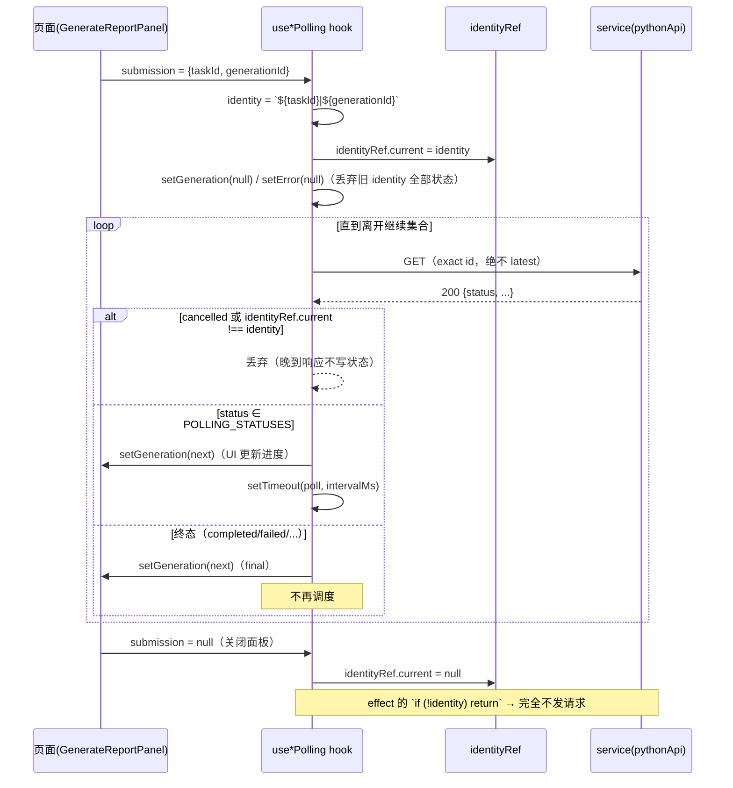

# 自定义 Hooks

## 为什么要有这篇文档

`web/src/hooks/` 有 16 个文件，其中 5 个"轮询/防陈旧"hooks 实现了同一套经过测试反复
打磨的不变量（exact 身份绑定、瞬时错误不终止轮询、终态停止调度），是前端最精密的
部分；同时也有 5 个 hooks **没有任何消费者**（页面后来内联重写了逻辑）。分清"活的
hooks"与"死 hooks"、看懂 identity 模式，是改这块代码的前提。

## 代码位置

`web/src/hooks/`：useTaskPolling、useTaskAutoTrigger、useFileExtraction、
useFileLLMAnalysis、useFilesData、useFileSelection、useReportGenerationPolling、
useSecondaryAnalysisPolling、useEventRefreshPolling、useReportCategory、useReportSearch、
useReportVersion、useStaleResource、useInvestigationGraph、useTranslation、useWebSocket。
（另有页面局部 hooks：`pages/Investigation/hooks/` 8 个、`pages/WeChatGraph/hooks/` 1 个，
文末简表。）

## 核心概念：三个反复出现的模式

1. **requestId 防陈旧**：单调递增计数器 + key ref，旧 key 的晚到响应（成功或失败）
   一律丢弃。代表：`useStaleResource`、`useInvestigationGraph`、`useReportSearch`。
2. **identity 轮询**：把轮询对象的多元组拼成字符串 identity（如
   `` `${taskId}|${generationId}` ``），identity 变化即丢弃全部旧状态；null identity
   完全不发请求。代表：三个 `use*Polling`。
3. **两类错误分离**：轮询 GET 的瞬时 HTTP 错误只 `setError` 不停轮询（下次成功清空）；
   业务终态（durable row 的 `status='failed'`）才停止调度。

## 走读

### 轮询 hooks 一览

| Hook | 默认间隔 | 继续轮询的状态 | 停止条件 | identity |
|---|---|---|---|---|
| useTaskPolling | 2000ms | 总是（直到任务 completed/failed） | `result.status` 终态（`useTaskPolling.js:33-36`） | taskId |
| useTaskAutoTrigger | 5000ms（可被 settings.refreshInterval 覆盖） | 总是 | `enabled`/`autoRefresh` 关闭 | 无（列表级） |
| useReportGenerationPolling | 2000ms | `admitted`/`running` | completed/failed（`useReportGenerationPolling.js:9`） | `taskId\|generationId` |
| useSecondaryAnalysisPolling | 2000ms | `queued`/`running` | review_pending/accepted/rejected/invalid/failed | `taskId\|evidenceKey\|analysisId` |
| useEventRefreshPolling | 2000ms | `queued`/`running` | completed/failed/行缺失 | `taskId\|eventId\|refreshId` |

### useTaskAutoTrigger — Tasks 页后台刷新（活）

`web/src/hooks/useTaskAutoTrigger.js:26-42`：

```js
const poll = useCallback(async () => {
  try {
    await dispatch(fetchTasksSilent(filters)).unwrap();
  } catch (err) {
    // Network errors during background poll are non-fatal
    console.warn('[useTaskAutoTrigger] Poll error:', err);
  }
}, [dispatch, filters]);

useEffect(() => {
  if (!enabled || !autoRefresh) return;
  poll();                                  // 立即一次
  const id = setInterval(poll, interval);   // 再按间隔
  return () => clearInterval(id);
}, [enabled, autoRefresh, interval, poll]);
```

头注释（5-12 行）说明它从 Tasks.jsx 拆出的原因：旧的 `fetchTasks` 会置
`status='loading'`，导致整页每轮重渲染；改用 `fetchTasksSilent`（Store.md）。
协作：store/tasks + store/settings；消费者：Tasks 页。

### useReportGenerationPolling — identity 轮询的样板（活）

`web/src/hooks/useReportGenerationPolling.js:36-44、60-66`：

```js
// identity 变化（含切换到 null）：丢弃旧 submission 的一切状态。
useEffect(() => {
  identityRef.current = identity;
  setGeneration(null);
  setError(null);
}, [identity]);
...
const next = await fetchGeneration(current.taskId, current.generationId);
if (cancelled || identityRef.current !== identity) return;
if (next) { setGeneration(next); setError(null); }
if (!next || !POLLING_STATUSES.includes(next.status)) {
  scheduleNext = false;   // completed / failed：停止。
}
```

返回 `{generation, error, active, identity}`，`active` 表示仍在排队/执行（或尚未取到
首个状态）。依赖注入：第二参 `{intervalMs, fetchGeneration}`，默认绑
`reportGenerationService.getReportGeneration`，测试里换假 fetcher（Testing.md）。
协作：reportGenerationService；消费者：GenerateReportPanel（`GenerateReportPanel.jsx:84-87`）。

`useSecondaryAnalysisPolling` 与它是同构实现（换成
`investigationService.getInvestigationAnalysis`）；`useEventRefreshPolling` 多一步：
后端没有 exact `GET /refreshes/{id}`，它轮询 `listInvestigationEventRefreshes` 的
history 并按 `refresh_id` 过滤（头注释 14-17 行），history 缺行按 fail-closed 停止。
**这两个 hooks 目前只被死代码页面 `pages/Investigation.jsx` 引用**——保留价值在于
其测试仍在守护契约。

### useTaskPolling / useFileExtraction / useFileLLMAnalysis / useFilesData / useFileSelection — 死 hooks（零导入方）

全仓库 `grep` 确认这五个 hooks 没有任何页面/组件导入（仅各自实现文件）：

- `useTaskPolling`：dispatch `fetchTaskProgress` 的 interval 轮询，本应配合任务详情页；
- `useFileExtraction`：包 `startExtraction` + `pollExtractionStatus`，维护
  mode/pattern/progress/message 本地 state——Files 页在页面内重写了一遍
  （`Files.jsx` 的提取控制块）；
- `useFileLLMAnalysis`：批量/单个 LLM 分析 + 自动续轮询。**注意它内含一个真实 bug**
  （`useFileLLMAnalysis.js:80-83`）：

```js
const result = await startBatchAnalysis({
  task_id: taskId,
  file_paths: selectedFilePaths
});
```

  而 `llmService.startBatchAnalysis` 的签名是 `(taskId, options)`（`llmService.js:76`），
  对象被当成第一个参数，实际发出的 payload 里 `file_paths` 恒为 undefined、`task_id`
  变成对象。幸而该 hook 无消费者；Files 页的正确调用是
  `startBatchAnalysis(taskId, {filePaths, modelType})`（`Files.jsx:493-496`）。
- `useFilesData` / `useFileSelection`：最大文件 + 扩展分析拉取 / `Set<string>` 选择器，
  均被 Files 页内联取代。

### useStaleResource — 通用只读加载（活）

`web/src/hooks/useStaleResource.js:31-57` 的不变量（头注释 8-11 行）："旧 key 的响应
（无论成功或失败）晚于新 key 返回时，绝不覆盖当前 key 的 data / error / loading"：

```js
const load = useCallback(async () => {
  const requestKey = key;
  if (!requestKey) return undefined;
  const requestId = ++requestRef.current;
  setLoading(true); setError(null);
  try {
    const result = await fetcherRef.current();
    if (requestRef.current !== requestId || keyRef.current !== requestKey) {
      return result;               // 已过期：只返回不落 state
    }
    setData(result);
    ...
```

`key` 是资源完整身份（`taskId`、`taskId:eventId`）；`fetcher` 通过 ref 保持最新，
`load` 即 `refresh`。`useInvestigationGraph`（81 行）是它的图谱特化版：多一个
`normalizeGraph` 把响应补齐为 `{task_id, base_graph_available, base_max_nodes, nodes,
links, warnings}`（`useInvestigationGraph.js:13-20`），消费方：死页面
InvestigationGraph / pages/Investigation.jsx 的 GraphTabPanel。

### useReportVersion — 报告版本状态机（活，429 行，最复杂）

服务端版本是 202 准入 + 异步生成（queued→generating→ready/failed），hook 要同时
维护：服务器快照、乐观"创建覆盖层"（createdOverlay）、进行中操作计数（operations）、
scope/intent 双重防陈旧。两个导出的纯函数是合并规则的核（`useReportVersion.js:25-46`）：

```js
export function mergeReportVersion(serverVersion, observedVersion) {
  if (!serverVersion) return observedVersion;
  if (!observedVersion) return serverVersion;
  const serverPhase = statusPhase(serverVersion);
  const observedPhase = statusPhase(observedVersion);
  if (serverPhase > observedPhase) return serverVersion;
  if (serverPhase < observedPhase) return observedVersion;
  if (serverVersion.status === 'generating' && observedVersion.status === 'generating') {
    return Number(serverVersion.progress || 0) > Number(observedVersion.progress || 0)
      ? serverVersion : observedVersion;
  }
  ...
```

状态阶段表 `STATUS_PHASE = {queued:0, generating:1, ready:2, failed:2}`（3-9 行）保证
"相位高者胜"，同相位 generating 比 progress。`createVersion`（354-408 行）在已有
generating 版本时直接复用它（避免对同一 scope 重复申请 202）。返回
`{versions, selectedVersion, manifest, loading, error, generating, selectVersion,
selectByReportId, createVersion, refresh}`。消费者：ForensicReportPage。

### useReportCategory / useReportSearch — 报告读面（活）

- `useReportCategory`（37 行）：按 `reportId::categoryId::page` 组合 key 拉
  `dataSource.getCategoryPage`；`state.key !== requestKey` 时渲染期返回占位
  （`useReportCategory.js:33-36`）防闪烁。
- `useReportSearch`（100 行）：提交搜索（limit 200）+ 命中列表游标导航
  （`next/previous` 循环取模，76-85 行）+ `activation` 计数供 UI 滚动定位；
  reportId 变化时整体复位（15-24 行）。

### useTranslation / useWebSocket — 基础设施（活）

`useTranslation.js:10-19`：读 `state.settings.language`，`t(key)` 从 `locales/en|zh`
查表，**查不到返回 key 本身**（这就是侧栏显示原始键名的机制，见 I18nTheming.md）：

```js
const t = (key) => {
    const currentLocale = locales[language] || locales.en;
    return currentLocale[key] || key;
};
```

`useWebSocket.js:41-52`：自动重连（指数退避 `interval * 2^min(retry,4)`，最多 5 次）、
按 `data.type` 路由到 handlers。**唯一消费者是 TerminalOutput，且传
`{enabled: !!taskId}`——Terminal 页渲染时不带 taskId，因此该 WebSocket 实际从不连接**
（见 I18nTheming.md 的日志通道分析）。

### 页面局部 hooks（简表）

| 位置 | Hook | 职责 |
|---|---|---|
| pages/Investigation/hooks | useInvestigationEvents | overview+bootstrap+events（/investigation 页主数据） |
| 同上 | useEventEvidence / useEvidenceAnalysis / useSemanticEventAnalysis | 事件证据/分析面板的局部加载 |
| 同上 | useFinalReportViewer | 报告列表+详情，requestId×3 重防陈旧（task/report/request 三元组，`useFinalReportViewer.js:44-50`） |
| 同上 | useReportTraceback / useFinalReportPublication / useFinalReportPresentation | 引用回溯 / 发布事实 / md-html-print 切换 |
| pages/WeChatGraph/hooks | useWeChatGraph | 图+时间线+社区+聊天记录的全部状态 |

## 二轮补充：identity 轮询的统一时序

三个 `use*Polling`（ReportGeneration / SecondaryAnalysis / EventRefresh）是同一骨架的
三次实例化，统一时序如下（以 useReportGenerationPolling 为例，`submission =
{taskId, generationId}`）：



三条不变量都画在图里：exact id 请求、晚到响应丢弃（成功与失败同权）、null identity
零请求。`useEventRefreshPolling` 多一步"history 中按 refresh_id 过滤，行缺失按停止
处理"（fail-closed）。

### identity 绑定代码并排对照

三个 hook 的 identity 构造与继续集合（逐字摘自源码头注释与常量）：

```js
// useReportGenerationPolling.js:9,31-33 —— R2c 冻结状态机
const POLLING_STATUSES = ['admitted', 'running'];
const identity = submission
    ? `${submission.taskId}|${submission.generationId}`
    : null;

// useSecondaryAnalysisPolling.js:9,30-33 —— C4b-2 冻结状态机
const POLLING_STATUSES = ['queued', 'running'];
const identity = submission
    ? `${submission.taskId}|${submission.evidenceKey}|${submission.analysisId}`
    : null;

// useEventRefreshPolling.js:9,36-39 —— C7c 冻结状态机
const POLLING_STATUSES = ['queued', 'running'];
const identity = submission
    ? `${submission.taskId}|${submission.eventId}|${submission.refreshId}`
    : null;
```

对照要点：

- identity 元组宽度 = 身份粒度：generation 只需二元组（scope 内唯一），analysis 需要
  三元组（evidence 可换），refresh 需要三元组（同一 event 可多次刷新）——**任何会把
  轮询对象换掉的维度都必须进 identity**，否则会出现"旧对象状态污染新对象"；
- 继续集合各不相同（`admitted/running` vs `queued/running`），但"停止条件 =
  `!next || !POLLING_STATUSES.includes(next.status)`"的结构一致——`!next`（404/空响应）
  也按停止处理，防止对已删除行无限轮询；
- 三者的测试用例（Testing.md 模式 B）都以这三个常量为断言对象，改动集合必须同步改
  测试。

### useFinalReportViewer — requestId×3 的最重防陈旧

页面局部 hooks 里防陈旧做得最狠的是报告查看器，
`web/src/pages/Investigation/hooks/useFinalReportViewer.js:44-69`（节选）：

```js
const response = await getFinalReport(requestTask, requestReport);
if (
  detailRequestRef.current !== requestId        // ① 本次请求序号仍是最新的
  || taskRef.current !== requestTask            // ② 任务没被切走
  || selectedReportRef.current !== requestReport // ③ 报告没被切走
) return;                                        // 任一失守：静默丢弃
setSelectedReport(response?.report || null);
```

- 三个 ref 分别绑定"第几次请求、哪个任务、哪份报告"——三元组任一维度变化都判过期；
  与全局轮询 hooks 的 identity 字符串相比，这里没有把三元组拼成字符串，而是逐个比较，
  语义相同、写法更直白；
- catch 分支与 finally 分支**各自再做一次三元组核对**——错误态和 loading 态同样不允许
  被旧请求写入（否则切走任务后页面会残留上一个任务的错误提示）；
- 这是"复制第三份 requestId 逻辑"警告（注意 2）的例外：报告查看器的三元组身份确实
  无法用 `useStaleResource` 的单 key 表达，属于合理特化。

## 与后端契约的对应

轮询 hooks 是 R/C 系列冻结契约在前端的"哨兵"，逐条对应
[ServiceContracts.md](../../reference/ServiceContracts.md)：

1. **202 + admitted 语义**：`useReportGenerationPolling` 的 `admitted` 继续状态对应
   `POST /api/reports/generate` 返回 202（admission，排队）而非 201 的设计
   （Python_REST_API.md §6.3）；轮询端点
   `GET /api/reports/generations/{generation_id}?task_id=` 是 exact 查询，服务端不提供
   latest 通道——hook 头注释"绝无 latest 回退"与契约两侧互相锁定。
2. **作业状态的跨服务大小写**：本组 hooks 轮询的 Python 域状态全小写
   （`queued/running/review_pending/...`）；而 Graphiti 作业（KnowledgeGraph 页的
   setInterval 轮询、C++ LLMPythonProxy）是大写 `COMPLETED/FAILED`——**同一个前端里
   两套字面量并存**，因为它们属于两个不同的后端契约（ServiceContracts.md §2 漂移
   点 4 只约定了 Graphiti 侧统一大写）。
3. **EventRefresh 无 exact 端点**：`useEventRefreshPolling` 头注释（14-17 行）明说
   后端没有 `GET /refreshes/{refresh_id}`，hook 改轮询
   `GET /api/investigation/events/{event_id}/refreshes` 列表并按 id 过滤——这是
   "契约缺口的前端侧补偿"，若后端将来补出 exact 端点，该 hook 可整体简化。
4. **fetchGeneration/fetchAnalysis 依赖注入**：第二参默认绑 service 方法，正是为了让
   测试不依赖网络契约（Testing.md）；生产代码不要绕过注入直接 import service 调用。
5. **瞬时错误 vs 业务终态分离**：503/网络错误只 setError 不断轮询，对应后端"job 行
   上的 `status=failed` 才是业务终态"的语义（Python_REST_API.md §8 的状态机）。

## 协作

- 轮询 hooks ↔ Services.md：`fetchGeneration`/`fetchAnalysis`/`listInvestigationEventRefreshes`
  均为依赖注入默认值，测试替换点。
- useTaskAutoTrigger ↔ Store.md：`fetchTasksSilent` 的静默语义。
- useReportVersion ↔ Components.md：ForensicReportPage / ReportWorkspace 的数据源。

## 注意

1. **改轮询间隔**：优先用 props/第二参注入（多数 hooks 已支持），不要改模块常量；
   Tasks 列表的间隔在 settingsSlice（`refreshInterval`）。
2. **新增"防陈旧"需求**：直接复用 `useStaleResource`，不要复制第三份 requestId 逻辑
   （useInvestigationGraph 已是复制出来的第二份）。
3. **死 hooks 清理候选**：useTaskPolling、useFileExtraction、useFileLLMAnalysis、
   useFilesData、useFileSelection（连同 useFileLLMAnalysis 的签名 bug 一并删除）。

## 验证

```bash
cd web && npx vitest run src/hooks/
# 9 个 hooks 测试文件；重点看 useReportGenerationPolling.test.js 的
# "task switch drops the late response" 与 "null submission never polls" 用例。
```

**最后更新**: 2026-08-24（二轮深化：补代码走读与契约对应）
