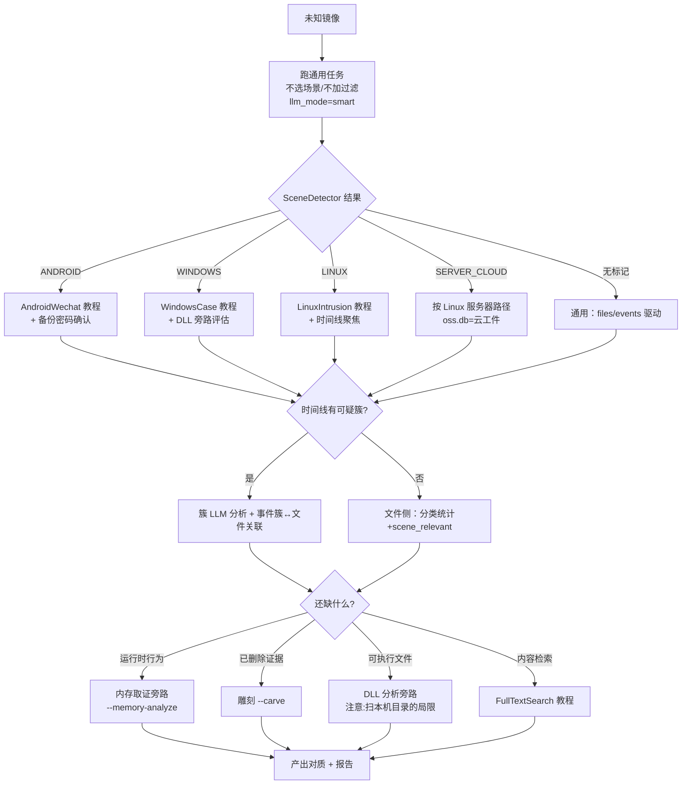

# 教程：未知镜像的 30 分钟初筛（分流决策树）

> 目标读者：拿到一块**不知道里面是什么**的镜像/备份、要快速决定"怎么查"的分析师。前置：环境已启动（run.sh）。本教程不追求挖出结论，只追求**选对入口**——每个入口的深度教程在文末链接。

## 场景设定

送检一块 500GB 的 DD 镜像，委托单只有一句"怀疑有问题"。直接全开（全场景+全 LLM）是最贵的路径；正确做法是先用 30 分钟回答四个问题：什么系统？什么场景？时间焦点在哪？要不要内存/雕刻？

## 决策树总览



## 第一步：通用任务探路（约 10 分钟机器时间，人工 2 分钟）

```bash
curl -X POST http://localhost:8666/api/tasks -H 'Content-Type: application/json' -d '{
  "image_path": "/evidence/unknown.dd",
  "case_description": "未知镜像初筛：先判断系统与场景",
  "llm_analyze": true, "llm_mode": "smart"
}'
```

要点：**不选 scenarios**（让 SceneDetector 说）、**不加 filter_profile**（避免把特征路径过滤掉——检测在过滤前，但初筛本来就不该过滤）、smart 模式控制成本。

任务完成后看三个地方：

1. **场景判定**：`GET /api/tasks/<id>/audit-log` 找 `SCENE_DETECTED`——它会告诉你检测到的平台和命中数（如 `linux=37, server_cloud=12`）。
2. **产出体检**：SqlCookbook [第 16 条](../reference/SqlCookbook.md)——分区/分类分布/事件量，一眼看出这是台式机还是服务器还是手机备份。
3. **时间线形状**：[第 12 条](../reference/SqlCookbook.md)的按小时分布——找异常安静段（清除痕迹？）和爆发段。

## 第二步：按判定结果选主入口

| 判定 | 主入口 | 入口前补一步 |
|------|--------|-------------|
| ANDROID | [Android/微信取证](AndroidWechat.md) | 确认是 MIUI 备份还是 data/ 提取（`--android-source` 四选一）；能否拿到备份密码 |
| WINDOWS | [Windows 取证](WindowsCase.md) | 评估要不要 DLL 旁路（记得它当前扫本机目录的局限） |
| LINUX | [Linux 入侵排查](LinuxIntrusion.md) | 用初筛的时间线聚焦可疑时段再深挖 |
| SERVER_CLOUD | 同 Linux 路径 | 记住它的 oss.db 是云/服务器工件（linux_* 表族），不是阿里云 OSS |
| 无标记 | 通用：/files 按分类与 scene_relevant 驱动 | 考虑过滤画像二次收窄后重跑 |

**要不要重跑？** 初筛是全量无过滤的；若判定场景明确且案情清晰，用对应 filter_profile（如电信诈骗）重跑一次能让 LLM 和你的注意力都聚焦（raw.db 不动，成本只是过滤+下游）。画像怎么选见 [FilterProfiles 教程](FilterProfiles.md)。

## 第三步：四种典型入场的推荐路径

| 案情 | 初筛后最先看 | 大概率要补的旁路 |
|------|-------------|-----------------|
| 疑似入侵 | linux_login_records 失败记录、持久化表、时间线爆发簇 | 内存取证（运行时进程/连接）、雕刻（被删工具） |
| 涉诈手机备份 | android.db 的 wechat_*/sms/call 时间窗 | 微信关系图（社区/枢纽联系人） |
| 数据泄露 | files.db 的 DOCUMENTS+scene_relevant、外发时段事件 | 全文搜索（关键词：名单/价格/合同）、USB 记录 |
| 完全未知 | 分类统计 Top + 时间线形状 + scene_relevant 抽样 | 逐个排除：先内容搜索、再行为表 |

## 第四步：决定要不要内存/雕刻/DLL

- **内存取证**：只有当你**另有内存镜像**（LiME/raw dump）时才可行（`--memory-analyze` 是对内存镜像的分析，不是从磁盘恢复内存）。价值：磁盘时间线说"文件存在过"，内存说"进程当时在跑"——对质利器。
- **雕刻**：时间线有删除簇、或分类统计显示"删除文件占比高"时开（任务参数 file_carving 或 CLI `--carve`）。29 种签名，产出进 carved_files/。
- **DLL/可执行分析**：注意当前实现扫的是**分析机本机目录**而非镜像内容（模块文档标注的局限）——对镜像内可疑 PE，更实际的做法是先提取再手动分析，或等该分析器接线镜像扫描。

## 排坑清单

1. **初筛别加过滤画像**——特征路径会被当噪音丢掉，场景判定受损（DataFlow 第二幕的顺序教训）。
2. **双状态大小写**：API 小写/tasks.json 大写，脚本比对别混（FAQ Q6）。
3. **空表 ≠ 异常**：先查 schema 文档的"已知边界"（如 windows 的四张恒空表）再怀疑分析坏了。
4. **smart 模式的取舍**：初筛够用；正式深挖该文件集时用 full 或定向重分析。
5. **时间戳口径**：events 表是 Unix 秒；审计库是毫秒——跨库对时间要换算（Troubleshooting §13 的关联法）。

## 延伸阅读

各入口的完整教程：[Linux 入侵](LinuxIntrusion.md) · [Windows](WindowsCase.md) · [Android/微信](AndroidWechat.md) · [内存](MemoryForensics.md) · [全文搜索](FullTextSearch.md) · [图谱与报告](KnowledgeGraphReports.md)。分流之后的通用深挖工具：[SqlCookbook](../reference/SqlCookbook.md)。

---

**最后更新**: 2026-08-24（新建：未知镜像初筛决策树）
